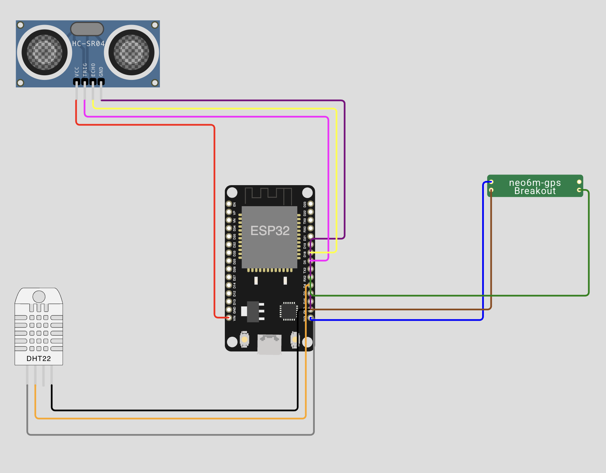
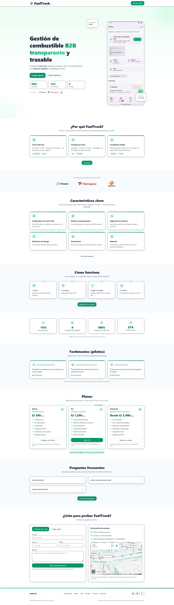
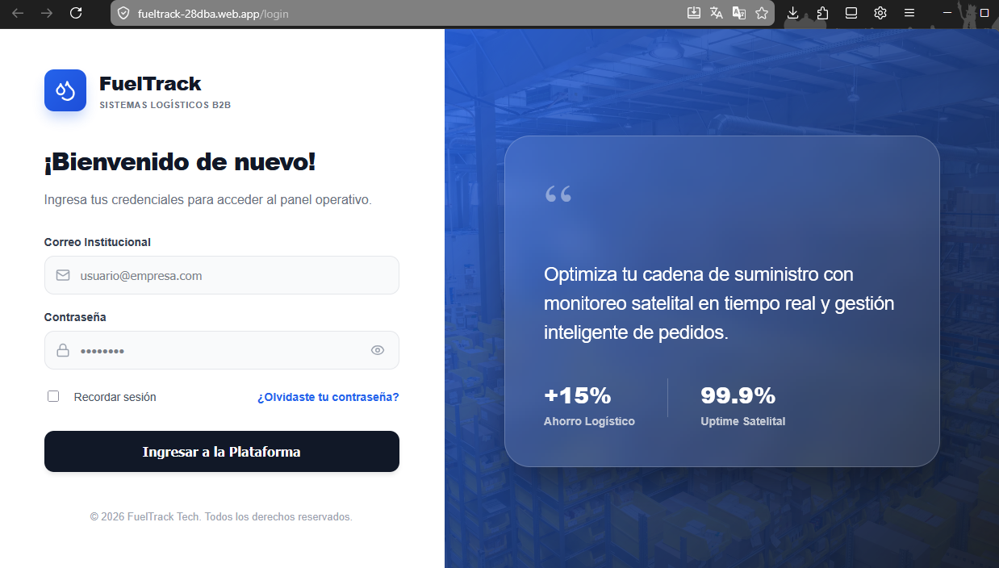
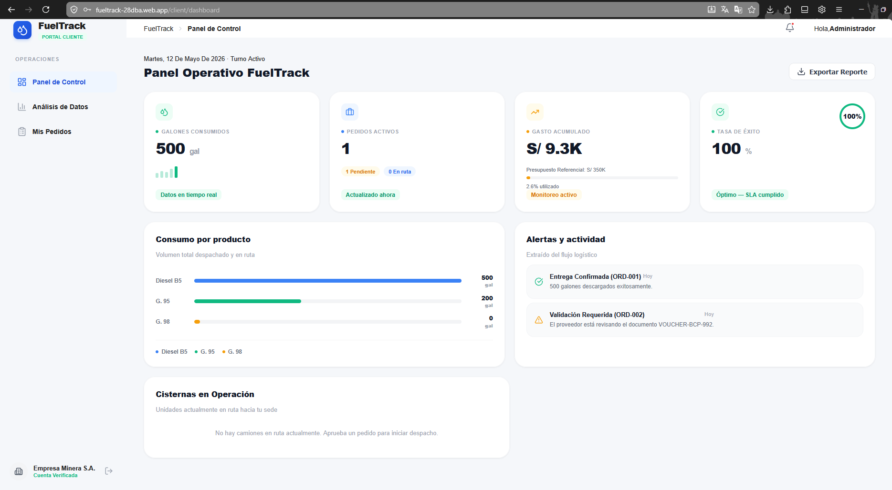
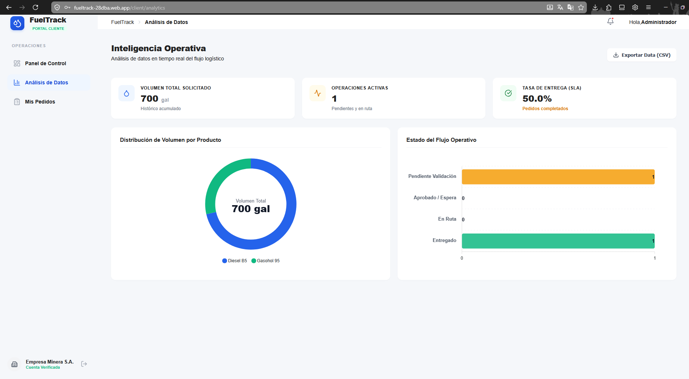
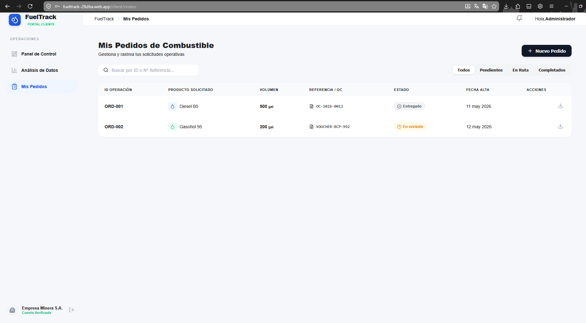

<div align="center">

# Universidad Peruana de Ciencias Aplicadas (UPC)
## Facultad de Ingeniería 


**Curso:** 1ASI0572 - Desarrollo de Soluciones IoT  
**NRC:** 6785  


**Profesor:** Marco Antonio Leon Baca

# Informe de Trabajo Final

**Nombre del grupo:** FuelTrack  
**Nombre del producto:** FuelTrack  

### Integrantes:

| Código | Apellidos y Nombres |
|---|---|
| U202310425 | AGUIRRE CASTILLO, Sergio Cesar |
| U20221G068 | ALMERCO ROJAS, Jocelyn Damaly |
| U202213278 | ESPEJO GAMARRA, Bryan Ronald |
| U202113111 | IPARRAGUIRRE RUEDA, Cristian Luis |
| U20221C275 | LUQUE MINAYA, Renzo Andrés |

### Lima – abril 2026

</div>

<br>

---

## Registro de Versiones del Informe
El objetivo de esta sección es resumir las modificaciones relevantes que se realizan al informe durante el ciclo de vida del proyecto.

<table>
  <thead>
    <tr>
      <th>Versión</th>
      <th>Fecha</th>
      <th>Autor</th>
      <th>Descripción</th>
    </tr>
  </thead>
  <tbody>
    <tr>
      <td rowspan="7" style="text-align: center; vertical-align: middle;"><b>TB1</b></td>
      <td>11/04/2026</td>
      <td>Aguirre Castillo, Sergio Cesar</td>
      <td>Desarrollo del capítulo 3</td>
    </tr>
    <tr>
      <td>14/04/2026</td>
      <td>Jocelyn Damaly Almerco almeroc Rojas</td>
      <td>Desarrollo puntos 2.1, 2.3, 2.3.1</td>
    </tr>
    <tr>
      <td>16/04/2026</td>
      <td>Iparraguirre Rueda, Cristian Luis</td>
      <td>Desarrollo el capítulo 1 y punto 3.2</td>
    </tr>
    <tr>
      <td>18/04/2026</td>
      <td>Aguirre Castillo, Sergio Cesar</td>
      <td>Desarrollo de los puntos 2.3.2 a 2.3.5</td>
    </tr>
    <tr>
      <td>20/04/2026</td>
      <td>Jocelyn Damaly Almerco almeroc Rojas</td>
      <td>Revisión general del documento</td>
    </tr>
    <tr>
      <td>20/04/2026</td>
      <td>Iparraguirre Rueda, Cristian Luis</td>
      <td>Desarrollo de conclusiones y recomendaciones del proyecto</td>
    </tr>
    <tr>
      <td>20/04/2026</td>
      <td>Bryan Ronald Espejo Gamarra</td>
      <td>Elaborar presentación tras revisión del documento</td>
    </tr>
    <tr>
     <table>
  <thead>

## Project Report Collaboration Insights
El repositorio para el Project Report en la organización de GitHub del equipo se encuentra en el siguiente enlace:
* **URL del Repositorio:** [https://github.com/UPC-pre-1ASI0572-2601-6785-Grupo5/report](https://github.com/UPC-pre-1ASI0572-2601-6785-Grupo5/report)

Durante la elaboración de esta entrega, el equipo colaboró utilizando GitFlow. *(Nota: Aquí se insertarán las capturas en imagen de los analíticos de colaboración y commits en GitHub antes de la entrega final)*.

## Contenido
 
- [Universidad Peruana de Ciencias Aplicadas (UPC)](#universidad-peruana-de-ciencias-aplicadas-upc)
  - [Facultad de Ingeniería](#facultad-de-ingeniería)
- [Informe de Trabajo Final](#informe-de-trabajo-final)
    - [Integrantes:](#integrantes)
    - [Lima – abril 2026](#lima--abril-2026)
  - [Registro de Versiones del Informe](#registro-de-versiones-del-informe)
  - [Project Report Collaboration Insights](#project-report-collaboration-insights)
  - [Contenido](#contenido)
  - [Student Outcome](#student-outcome)
- [Capítulo I: Introducción](#capítulo-i-introducción)
  - [1.1. Startup Profile](#11-startup-profile)
    - [1.1.1. Descripción de la Startup](#111-descripción-de-la-startup)
    - [1.1.2. Perfiles de integrantes del equipo](#112-perfiles-de-integrantes-del-equipo)
  - [1.2. Solution Profile](#12-solution-profile)
    - [1.2.1 Antecedentes y problemática](#121-antecedentes-y-problemática)
    - [1.2.2. Lean UX Process](#122-lean-ux-process)
      - [1.2.2.1. Lean UX Problem Statements](#1221-lean-ux-problem-statements)
      - [1.2.2.2. Lean UX Assumptions](#1222-lean-ux-assumptions)
      - [1.2.2.3. Lean UX Hypothesis Statements](#1223-lean-ux-hypothesis-statements)
      - [1.2.2.4. Lean UX Canvas](#1224-lean-ux-canvas)
  - [1.3. Segmentos objetivo](#13-segmentos-objetivo)
- [Capítulo II: Requirements Elicitation \& Analysis](#capítulo-ii-requirements-elicitation--analysis)
  - [2.1. Competidores](#21-competidores)
    - [2.1.1. Análisis competitivo](#211-análisis-competitivo)
    - [2.1.2. Estrategias y tácticas frente a competidores.](#212-estrategias-y-tácticas-frente-a-competidores)
  - [2.2. Entrevistas](#22-entrevistas)
    - [2.2.1. Diseño de entrevistas](#221-diseño-de-entrevistas)
      - [A. Segmento: Empresas Solicitantes (Clientes Corporativos / Operaciones en Campo)](#a-segmento-empresas-solicitantes-clientes-corporativos--operaciones-en-campo)
      - [B. Segmento: Proveedores de Combustible (Distribuidores / Mayoristas)](#b-segmento-proveedores-de-combustible-distribuidores--mayoristas)
    - [2.2.2. Registro de entrevistas](#222-registro-de-entrevistas)
    - [2.2.3. Análisis de entrevistas](#223-análisis-de-entrevistas)
      - [Análisis del Segmento 1: Cliente Corporativo (Demanda)](#análisis-del-segmento-1-cliente-corporativo-demanda)
      - [Análisis del Segmento 2: Proveedor / Distribuidor (Oferta)](#análisis-del-segmento-2-proveedor--distribuidor-oferta)
  - [2.3. Needfinding](#23-needfinding)
    - [2.3.1. User Personas](#231-user-personas)
    - [2.3.2. User Task Matrix](#232-user-task-matrix)
    - [2.3.3. User Journey Mapping](#233-user-journey-mapping)
    - [2.3.4. Empathy Mapping](#234-empathy-mapping)
  - [2.4. Big Picture EventStorming](#24-big-picture-eventstorming)
  - [2.5. Ubiquitous Language](#25-ubiquitous-language)
    - [3.1. User Stories](#31-user-stories)
    - [3.2. Impact Mapping](#32-impact-mapping)
    - [3.3. Product Backlog](#33-product-backlog)
- [Capítulo IV: Solution Software Design](#capítulo-iv-solution-software-design)
  - [4.1. Strategic-Level Domain-Driven Design](#41-strategic-level-domain-driven-design)
    - [4.1.1. Design-Level EventStorming](#411-design-level-eventstorming)
  - [Collect Domain Events](#collect-domain-events)
  - [Timeline](#timeline)
  - [Pain and Pivotal Points](#pain-and-pivotal-points)
      - [4.1.1.1 Candidate Context Discovery](#4111-candidate-context-discovery)
    - [4.1.1.2 Domain Message Flows Modeling](#4112-domain-message-flows-modeling)
    - [4.1.1.3 Bounded Context Canvases](#4113-bounded-context-canvases)
    - [4.1.2. Context Mapping](#412-context-mapping)
    - [4.1.3. Software Architecture](#413-software-architecture)
      - [4.1.3.1. Software Architecture System Landscape Diagram](#4131-software-architecture-system-landscape-diagram)
      - [4.1.3.2. Software Architecture Context Level Diagrams](#4132-software-architecture-context-level-diagrams)
      - [4.1.3.3. Software Architecture Container Level Diagrams](#4133-software-architecture-container-level-diagrams)
      - [4.1.3.4. Software Architecture Deployment Diagrams](#4134-software-architecture-deployment-diagrams)
  - [4.2. Tactical-Level Domain-Driven Design](#42-tactical-level-domain-driven-design)
    - [4.2.1. Bounded Context: Order \& Payment Context](#421-bounded-context-order--payment-context)
      - [4.2.1.1. Domain Layer](#4211-domain-layer)
      - [4.2.1.2. Interface Layer](#4212-interface-layer)
      - [4.2.1.3. Application Layer](#4213-application-layer)
      - [4.2.1.4. Infrastructure Layer](#4214-infrastructure-layer)
      - [4.2.1.5. Bounded Context Software Architecture Component Level Diagrams.](#4215-bounded-context-software-architecture-component-level-diagrams)
      - [4.2.1.6. Bounded Context Software Architecture Code Level Diagrams.](#4216-bounded-context-software-architecture-code-level-diagrams)
        - [4.2.1.6.1. Bounded Context Domain Layer Class Diagrams.](#42161-bounded-context-domain-layer-class-diagrams)
        - [4.2.1.6.2. Bounded Context Database Design Diagram.](#42162-bounded-context-database-design-diagram)
    - [4.2.2. Bounded Context: IoT \& Telemetry Context](#422-bounded-context-iot--telemetry-context)
      - [4.2.2.1. Domain Layer](#4221-domain-layer)
      - [4.2.2.2. Interface Layer](#4222-interface-layer)
      - [4.2.2.3. Application Layer](#4223-application-layer)
      - [4.2.2.4. Infrastructure Layer](#4224-infrastructure-layer)
      - [4.2.2.5. Bounded Context Software Architecture Component Level Diagrams.](#4225-bounded-context-software-architecture-component-level-diagrams)
      - [4.2.2.6. Bounded Context Software Architecture Code Level Diagrams.](#4226-bounded-context-software-architecture-code-level-diagrams)
        - [4.2.2.6.1. Bounded Context Domain Layer Class Diagrams.](#42261-bounded-context-domain-layer-class-diagrams)
        - [4.2.2.6.2. Bounded Context Database Design Diagram.](#42262-bounded-context-database-design-diagram)
    - [4.2.3. Bounded Context: Financial \& Billing Context](#423-bounded-context-financial--billing-context)
      - [4.2.3.1. Domain Layer](#4231-domain-layer)
      - [4.2.3.2. Interface Layer](#4232-interface-layer)
      - [4.2.3.3. Application Layer](#4233-application-layer)
      - [4.2.3.4. Infrastructure Layer](#4234-infrastructure-layer)
      - [4.2.3.5. Bounded Context Software Architecture Component Level Diagrams.](#4235-bounded-context-software-architecture-component-level-diagrams)
      - [4.2.3.5. Bounded Context Software Architecture Component Level Diagrams.](#4235-bounded-context-software-architecture-component-level-diagrams-1)
      - [4.2.3.6. Bounded Context Software Architecture Code Level Diagrams.](#4236-bounded-context-software-architecture-code-level-diagrams)
        - [4.2.3.6.1. Bounded Context Domain Layer Class Diagrams.](#42361-bounded-context-domain-layer-class-diagrams)
        - [4.2.3.6.2. Bounded Context Database Design Diagram.](#42362-bounded-context-database-design-diagram)
    - [4.2.4. Bounded Context: Identity \& Access Context](#424-bounded-context-identity--access-context)
      - [4.2.4.1. Domain Layer](#4241-domain-layer)
      - [4.2.4.2. Interface Layer](#4242-interface-layer)
      - [4.2.4.3. Application Layer](#4243-application-layer)
      - [4.2.4.4. Infrastructure Layer](#4244-infrastructure-layer)
      - [4.2.4.5. Bounded Context Software Architecture Component Level Diagrams.](#4245-bounded-context-software-architecture-component-level-diagrams)
      - [4.2.4.6. Bounded Context Software Architecture Code Level Diagrams.](#4246-bounded-context-software-architecture-code-level-diagrams)
        - [4.2.4.6.1. Bounded Context Domain Layer Class Diagrams.](#42461-bounded-context-domain-layer-class-diagrams)
        - [4.2.4.6.2. Bounded Context Database Design Diagram.](#42462-bounded-context-database-design-diagram)
- [Capítulo V: Solution UI/UX Design](#capítulo-v-solution-uiux-design)
  - [5.1. Style Guidelines](#51-style-guidelines)
    - [5.1.1. General Style Guidelines](#511-general-style-guidelines)
    - [5.1.2. Web, Mobile and Iot Style Guidelines](#512-web-mobile-and-iot-style-guidelines)
  - [5.2 Information Architecture](#52-information-architecture)
    - [5.2.1. Organization Systems](#521-organization-systems)
    - [5.2.2. Labeling Systems](#522-labeling-systems)
    - [5.2.3. SEO Tags and Meta Tags](#523-seo-tags-and-meta-tags)
    - [5.2.4. Searching Systems](#524-searching-systems)
    - [5.2.5. Navigation Systems](#525-navigation-systems)
  - [5.3 Landing Page UI Design](#53-landing-page-ui-design)
    - [5.3.1. Landing Page Wireframe](#531-landing-page-wireframe)
    - [5.3.2. Landing Page Mock-up](#532-landing-page-mock-up)
  - [5.4 Applications UX/UI Design](#54-applications-uxui-design)
    - [5.4.1. Applications Wireframes](#541-applications-wireframes)
    - [5.4.2. Applications Wireflow Diagrams](#542-applications-wireflow-diagrams)
    - [5.4.3. Applications Mock-ups](#543-applications-mock-ups)
    - [5.4.4. Applications User Flow Diagrams](#544-applications-user-flow-diagrams)
    - [5.5 Applications Prototyping](#55-applications-prototyping)
    - [5.6. IoT Device Design](#56-iot-device-design)
      - [Descripción general del dispositivo](#descripción-general-del-dispositivo)
      - [Criterios de diseño y selección de sensores](#criterios-de-diseño-y-selección-de-sensores)
      - [Diagrama del circuito — Wokwi (ESP32 DevKit V1)](#diagrama-del-circuito--wokwi-esp32-devkit-v1)
      - [Flujo de interacción del dispositivo](#flujo-de-interacción-del-dispositivo)
      - [Relación con la guía de estilo C++ (Embedded Application)](#relación-con-la-guía-de-estilo-c-embedded-application)
  - [6.1 Product Implementation, Validation \& Deployment](#61-product-implementation-validation--deployment)
    - [6.1.1. Software Development Environment Configuration](#611-software-development-environment-configuration)
    - [Project Management](#project-management)
    - [Product UX/UI Design](#product-uxui-design)
    - [Software Development](#software-development)
    - [Software Documentation](#software-documentation)
    - [6.1.2. Source Code Management](#612-source-code-management)
    - [URLs de repositorios](#urls-de-repositorios)
    - [6.1.3. Source Code Style Guide \& Conventions](#613-source-code-style-guide--conventions)
    - [HTML5 — Landing Page](#html5--landing-page)
    - [CSS3 — Landing Page](#css3--landing-page)
    - [TypeScript — Landing Page y Web Application (Vue)](#typescript--landing-page-y-web-application-vue)
    - [Java — RESTful Web Service (Spring Boot)](#java--restful-web-service-spring-boot)
    - [Python — Edge API (Flask)](#python--edge-api-flask)
    - [C++ — Embedded Application (IoT / ESP32)](#c--embedded-application-iot--esp32)
    - [6.1.4. Software Deployment Configuration](#614-software-deployment-configuration)
      - [Landing Page](#landing-page)
      - [Web Application (Frontend)](#web-application-frontend)
      - [RESTful Web Service (Backend)](#restful-web-service-backend)
      - [Edge API](#edge-api)
      - [6.2.1.1. Sprint Planning 1.](#6211-sprint-planning-1)
      - [6.2.1.2. Aspect Leaders and Collaborators.](#6212-aspect-leaders-and-collaborators)
      - [6.2.1.3. Sprint Backlog 1.](#6213-sprint-backlog-1)
      - [6.2.1.4. Development Evidence for Sprint Review.](#6214-development-evidence-for-sprint-review)
      - [6.2.1.5. Testing Suite Evidence for Sprint Review.](#6215-testing-suite-evidence-for-sprint-review)
        - [Acceptance Tests](#acceptance-tests)
      - [6.2.1.6. Execution Evidence for Sprint Review.](#6216-execution-evidence-for-sprint-review)
      - [6.2.1.7. Services Documentation Evidence for Sprint Review.](#6217-services-documentation-evidence-for-sprint-review)
      - [6.2.1.8. Software Deployment Evidence for Sprint Review.](#6218-software-deployment-evidence-for-sprint-review)
      - [6.2.1.9. Team Collaboration Insights during Sprint.](#6219-team-collaboration-insights-during-sprint)
  - [Conclusiones](#conclusiones)

<div style="page-break-after: always;"></div>

## Student Outcome
Objetivo general, ABET – EAC - Student Outcome 7: Aprendizaje Continuo y Autónomo.

| Criterio específico | Acciones realizadas | Conclusiones |
|---|---|---|
| **Actualiza conceptos y conocimientos necesarios para su desarrollo profesional y en especial para su proyecto en soluciones de software.** | **Aguirre Castillo, Sergio Cesar** <br> **TB1:** Actualicé y apliqué conocimientos en desarrollo de software utilizando lenguajes como Python, C# y JavaScript durante el desarrollo de FuelTrack. Participé en la implementación de funcionalidades del sistema y reforcé buenas prácticas de programación para mejorar la calidad del código. <br><br> **Almerco Rojas, Jocelyn Damaly** <br> **TB1:** Actualicé y apliqué conocimientos en diseño y modelado de software, elaborando diagramas y apoyando en la documentación técnica del sistema FuelTrack, asegurando una estructura clara y organizada. <br><br> **Espejo Gamarra, Bryan Ronald** <br> **TB1:** Actualicé conocimientos en backend, bases de datos y DevOps, participando en la configuración y soporte técnico del sistema FuelTrack, asegurando su correcto funcionamiento. <br><br> **Iparraguirre Rueda, Cristian Luis** <br> **TB1:** Actualicé conocimientos en desarrollo de software utilizando lenguajes como Python, C++ y C#, apoyando en la implementación de funcionalidades del sistema y fortaleciendo mis habilidades técnicas. <br><br> **Luque Minaya, Renzo Andrés** <br> **TB1:** Actualicé conocimientos en desarrollo frontend, despliegue en la nube y seguridad, participando en la construcción de interfaces y en la configuración del sistema FuelTrack. | **Aguirre Castillo, Sergio Cesar** <br> **TB1:** La actualización de conocimientos permitió mejorar la calidad del desarrollo y optimizar la implementación de funcionalidades del sistema. <br><br> **Almerco Rojas, Jocelyn Damaly** <br> **TB1:** La actualización en diseño y documentación permitió estructurar de manera clara el sistema, facilitando su desarrollo. <br><br> **Espejo Gamarra, Bryan Ronald** <br> **TB1:** La actualización en backend y bases de datos permitió mejorar el rendimiento y la estabilidad del sistema. <br><br> **Iparraguirre Rueda, Cristian Luis** <br> **TB1:** La actualización de conocimientos técnicos permitió fortalecer las competencias en programación y contribuir al desarrollo del sistema. <br><br> **Luque Minaya, Renzo Andrés** <br> **TB1:** La actualización en frontend y despliegue permitió mejorar la experiencia de usuario y la disponibilidad del sistema. |
| **Reconoce la necesidad del aprendizaje permanente para el desempeño profesional y el desarrollo de proyectos en soluciones de software.** | **Aguirre Castillo, Sergio Cesar** <br> **TB1:** Reconocí la importancia del aprendizaje continuo al investigar nuevas tecnologías y buenas prácticas de desarrollo para mejorar mi desempeño en FuelTrack. <br><br> **Almerco Rojas, Jocelyn Damaly** <br> **TB1:** Reconocí la necesidad del aprendizaje continuo al investigar nuevas herramientas de modelado y documentación para mejorar la calidad del sistema. <br><br> **Espejo Gamarra, Bryan Ronald** <br> **TB1:** Reconocí la importancia del aprendizaje continuo al investigar nuevas tecnologías de backend y DevOps para optimizar el sistema. <br><br> **Iparraguirre Rueda, Cristian Luis** <br> **TB1:** Reconocí la necesidad del aprendizaje continuo al reforzar conocimientos en programación y nuevas herramientas de desarrollo. <br><br> **Luque Minaya, Renzo Andrés** <br> **TB1:** Reconocí la importancia del aprendizaje continuo al investigar nuevas tecnologías de frontend, cloud y seguridad para mejorar el sistema FuelTrack. | **Aguirre Castillo, Sergio Cesar** <br> **TB1:** El aprendizaje continuo permite mantenerse actualizado y desarrollar soluciones más eficientes y escalables. <br><br> **Almerco Rojas, Jocelyn Damaly** <br> **TB1:** El aprendizaje permanente permite mejorar la calidad del diseño y la documentación del software. <br><br> **Espejo Gamarra, Bryan Ronald** <br> **TB1:** El aprendizaje continuo permite optimizar el rendimiento del sistema y adaptarse a nuevas tecnologías. <br><br> **Iparraguirre Rueda, Cristian Luis** <br> **TB1:** El aprendizaje permanente fortalece las habilidades técnicas necesarias para el desarrollo de software. <br><br> **Luque Minaya, Renzo Andrés** <br> **TB1:** El aprendizaje continuo permite mejorar la experiencia de usuario y la seguridad del sistema. |


# Capítulo I: Introducción

## 1.1. Startup Profile

### 1.1.1. Descripción de la Startup

**FuelTrack** es una startup de base tecnológica (DeepTech) orientada a optimizar la cadena de suministro de hidrocarburos mediante la convergencia de Internet de las Cosas (IoT) y plataformas transaccionales B2B. Nuestra propuesta de valor busca resolver la opacidad logística presente en operaciones industriales críticas, como minería, telecomunicaciones e infraestructura, mediante la integración de sensores inteligentes y monitoreo telemétrico en tiempo real.

A diferencia de las soluciones tradicionales de rastreo o software logístico aislado, FuelTrack implementa un ecosistema digital de trazabilidad punta a extremo (*End-to-End*), conectando el estado físico de las cisternas, nivel de combustible, presión del tanque y ubicación GPS, con flujos de aprobación financiera, control operativo y generación automática de comprobantes digitales.

Esta integración permite reducir mermas no justificadas, prevenir robos en tránsito, eliminar procesos manuales y garantizar continuidad operativa mediante un modelo de gestión basado en evidencia digital trazable e información en tiempo real.

**Misión:**
Desarrollar soluciones tecnológicas que integren IoT y software transaccional para digitalizar y asegurar la cadena de suministro de hidrocarburos, eliminando la informalidad operativa y brindando trazabilidad total a empresas y proveedores en entornos industriales críticos.

**Visión:**
Convertirnos en el estándar de gestión inteligente de combustible B2B en Latinoamérica, siendo la plataforma de referencia para operaciones que exigen visibilidad financiera, control logístico y seguridad de carga en tiempo real.


### 1.1.2. Perfiles de integrantes del equipo


| Foto                                          | Nombre completo               | Código     | Carrera                | Habilidades técnicas y rol                                   |
|-----------------------------------------------|-------------------------------|------------|------------------------|--------------------------------------------------------------|
|  | Aguirre Castillo, Sergio Cesar | U202310425 | Ingenieria de Software | Soy estudiante de la carrera de Ingeniería de Software, actualmente cursando el séptimo ciclo. Tengo un gran interés en adquirir nuevos conocimientos relacionados con mi área que me permitan fortalecer mis habilidades y prepararme para los retos del futuro profesional. Cuento con experiencia en diversos lenguajes de programación como Python, C++, PHP, C#, Java y JavaScript, además de conocimientos en desarrollo web utilizando HTML, CSS y manejo básico de bases de datos como MySQL, lo que me permite adaptarme a distintos entornos de desarrollo y seguir aprendiendo nuevas tecnologías. |
|  | Iparraguirre Rueda, Cristian Luis    | U202113111 | Ingeniería de Software | Soy estudiante de la carrera de Ingeniería de Software. Tengo interés en obtener nuevos conocimientos relacionados con mi carrera que me sean de utilidad para el futuro. Cuento con el conocimiento de diversos lenguajes Python, C++, PHP, C#. |
|            | Bryan Ronald Espejo Gamarra     | U202213278 | Ingeniería de Software | Soy estudiante de la carrera de Ingeniería de Software, con interés en adquirir y fortalecer conocimientos que aporten a mi desarrollo profesional. Cuento con habilidades en Backend, gestión de Bases de Datos, prácticas de DevOps y coordinación técnica de proyectos, lo que me permite comprender y participar en el desarrollo integral de soluciones de software. Además, poseo conocimientos en diversos lenguajes de programación como Python, C++, PHP y C#, los cuales he aplicado en distintos proyectos, fortaleciendo mi capacidad de análisis, diseño e implementación de sistemas. |
|           | Jocelyn Damaly Almerco Rojas     | u20221G068 | Ingeniería de Software | Soy estudiante de Ingeniería de Software. Tengo buen dominio en la elaboración de diagramas en C++ y manejo lenguajes como C++, SQL, CSS, HTML y JavaScript. Además, poseo conocimientos básicos en frameworks como Angular y Vue.js para el desarrollo frontend. Aporto al equipo con habilidades en análisis lógico, documentación técnica y diseño estructurado de software, contribuyendo a mantener la coherencia y calidad del proyecto.    |
|  | Renzo Andres Luque Minaya | U20221C275 | Ingeniería de Software | Estudiante de ingenieria de Software de 8vo ciclo en la UPC. Conocimiento en desarrollo Frontend, Backend, Cloud Deployment, Seguridad y Autenticación. Interes en nuevos conocimientos relacionados a la carrera y el futuro tech. |


## 1.2. Solution Profile

### 1.2.1 Antecedentes y problemática

**Descripción del problema**
 
El sector de distribución de hidrocarburos en operaciones industriales críticas —como minería, telecomunicaciones e infraestructura— enfrenta una importante brecha de visibilidad operativa dentro de su cadena logística. A pesar de movilizar millones de dólares anualmente y depender de una operación altamente sensible al tiempo, la trazabilidad y la continuidad energética, gran parte de los procesos de abastecimiento todavía se gestionan mediante herramientas fragmentadas y métodos informales, como llamadas telefónicas, hojas de cálculo, correos electrónicos y aplicaciones de mensajería.

Actualmente, muchas soluciones tecnológicas disponibles en el mercado se enfocan únicamente en rastreo GPS o gestión administrativa aislada, sin integrar el estado físico real del combustible, el monitoreo telemétrico, el control financiero y la trazabilidad documental dentro de un mismo ecosistema digital. Esta desconexión entre el flujo físico del combustible y los sistemas de información genera importantes puntos ciegos operativos y limita la capacidad de supervisión en tiempo real.

Como consecuencia, se presentan tres problemáticas críticas:

* **Mermas no detectadas:** La ausencia de telemetría volumétrica en tiempo real facilita la extracción ilícita de combustible durante el transporte (“ordeño”), generando pérdidas económicas significativas que normalmente son detectadas de forma reactiva. Recientemente, la Policía Nacional del Perú frustró el robo de una cisterna con más de 10,000 galones de combustible, evidenciando la vulnerabilidad actual de los mecanismos de seguridad y monitoreo logístico (TV Perú, 2026).

* **Inestabilidad en la continuidad operativa:** La falta de analítica predictiva sobre el ritmo de consumo (*Burn Rate*) y el estado real de los despachos incrementa el riesgo de desabastecimiento y paradas operativas no programadas. Según La Red de Medios (2026), la paralización temporal del sistema de transporte de gas operado por Transportadora de Gas del Perú (TGP) evidenció la fragilidad de los sistemas actuales de supervisión y abastecimiento energético.

* **Opacidad administrativa y financiera:** La dependencia de documentación física y procesos manuales dificulta la conciliación financiera y auditoría de cada despacho, prolongando los ciclos de validación y facturación. Diversos estudios sobre transformación digital logística señalan que la integración de IoT, monitoreo en tiempo real y trazabilidad documental permite reducir tiempos de inactividad operativa y mejorar significativamente la eficiencia de supervisión logística (Transporte.mx, 2026).

En paralelo, iniciativas internacionales como el proyecto Pyrofuel demuestran que la industria energética está evolucionando hacia modelos más inteligentes y sostenibles basados en monitoreo avanzado, trazabilidad y automatización logística. Según el Consejo Superior de Investigaciones Científicas (CSIC, 2026), la integración de tecnologías innovadoras y sistemas logísticos inteligentes permite optimizar la eficiencia operativa y reducir riesgos dentro de la cadena de suministro energético.

En este contexto, surge la oportunidad de desarrollar plataformas inteligentes basadas en Internet de las Cosas (IoT) y arquitecturas transaccionales capaces de integrar monitoreo telemétrico, control financiero y trazabilidad documental en tiempo real. Este enfoque permitiría reducir pérdidas operativas, eliminar puntos ciegos logísticos y garantizar continuidad operativa mediante un modelo de gestión sustentado en evidencia digital trazable y monitoreo en tiempo real.
 
---
 
**Técnica 5W + 2H**
 
**What? (¿Qué?)**
La problemática central es la ausencia de un sistema integrado que conecte en tiempo real el estado físico de las cisternas de combustible —nivel de tanque, presión, ubicación GPS— con el flujo transaccional de pedidos, aprobaciones y comprobantes digitales entre empresas solicitantes y proveedores mayoristas. Esta desconexión genera mermas no detectadas, errores en la conciliación financiera y una trazabilidad prácticamente inexistente por despacho realizado.
 
**When? (¿Cuándo?)**
El problema se manifiesta de forma continua a lo largo de todo el ciclo de vida de un despacho: desde la generación manual del pedido hasta la entrega en campo, pasando por la validación del pago, la asignación de la cisterna y el monitoreo de la ruta. Se agudiza especialmente en operaciones nocturnas o en zonas remotas sin supervisión presencial, donde el riesgo de robo en tránsito es mayor.
 
**Where? (¿Dónde?)**
El problema ocurre principalmente en operaciones industriales ubicadas en zonas remotas o de difícil acceso —campamentos mineros, nodos de telecomunicaciones, obras de infraestructura— donde la infraestructura de control es limitada y la dependencia del combustible como insumo crítico es total. También afecta las bases logísticas de los proveedores mayoristas, donde la coordinación de despachos se realiza de forma manual y fragmentada.
 
**Who? (¿Quién?)**
Los principales afectados son los gerentes de logística y jefes de operaciones de empresas clientes, quienes carecen de visibilidad financiera en tiempo real; los controladores de flota y despachadores de proveedores mayoristas, que no pueden monitorear el estado de sus cisternas en ruta; y los choferes, que operan sin respaldo digital ante cualquier incidente durante el traslado.
 
**Why? (¿Por qué?)**
El problema persiste porque los métodos actuales de coordinación —correo, WhatsApp, papel— no tienen capacidad de integrarse con el estado físico real del combustible en tránsito. No existe un canal único que conecte la solicitud del cliente, la aprobación financiera, el monitoreo IoT de la cisterna y la generación automática del comprobante de entrega. Cada etapa opera de forma aislada, multiplicando los puntos de falla.
 
**How? (¿Cómo?)**
El problema se materializa cuando una cisterna sale a ruta sin que ningún sistema registre en tiempo real la variación del nivel de combustible. Cualquier pérdida —sea por robo, fuga o error de despacho— solo se detecta al comparar manualmente el volumen de salida con el de llegada, proceso que puede tomar horas o días. Paralelamente, el cliente no recibe actualizaciones automáticas del estado de su pedido y debe confirmar la recepción mediante llamadas o fotos enviadas por WhatsApp, lo que retrasa la facturación y la conciliación financiera.
 
**How Much? (¿Cuánto?)**
La magnitud del problema es considerable en términos económicos y operativos:
- El robo de combustible en tránsito (*"ordeño"*) representa pérdidas anuales de millones de dólares para las empresas de transporte en Latinoamérica.
- Más del 60% de los gerentes logísticos reportan dificultades para auditar el consumo exacto de combustible frente a lo presupuestado, debido a la fragmentación de la información en papel y canales dispersos.
- Las paradas no planificadas por desabastecimiento en operaciones extractivas o de infraestructura pueden costar decenas de miles de dólares por hora de inactividad.
- Se estima que la integración de telemetría y sistemas de gestión de flotas (FMS) puede reducir los tiempos de inactividad operativa hasta en un 25% y disminuir las mermas inexplicables en ruta de forma significativa.

### 1.2.2. Lean UX Process

#### 1.2.2.1. Lean UX Problem Statements

**Problem Statement 1: Procesos Operativos Manuales y Descoordinados**
Las empresas con operaciones críticas en campo y sus distribuidores mayoristas enfrentan serias dificultades al gestionar la solicitud y validación de despachos de combustible utilizando métodos manuales e informales (papel, correos, WhatsApp). Esta falta de estandarización genera retrasos, errores en la comunicación y cuellos de botella en la cadena de suministro. Diversos análisis sobre transformación digital logística señalan que las empresas que continúan operando con procesos manuales y sistemas fragmentados presentan mayores dificultades para mantener eficiencia operativa y trazabilidad en sus cadenas de suministro (Transporte.mx, 2026).

*¿Cómo podemos crear una plataforma transaccional corporativa que elimine el uso de papel y automatice el flujo de solicitudes y aprobaciones de despachos de combustible entre clientes y proveedores, mejorando la eficiencia operativa?*

**Problem Statement 2: Riesgo de Sobregiros y Falta de Control Financiero**
Los gerentes de logística y operaciones tienen una visibilidad limitada y desfasada del "Burn Rate" (ritmo de gasto) frente a las líneas de crédito preaprobadas. Esta carencia de información en tiempo real aumenta significativamente el riesgo de sobregiros presupuestales y paralizaciones por falta de energía. La reciente crisis energética en Perú evidenció el impacto operativo y financiero que puede generar la falta de control y planificación dentro de la cadena de abastecimiento energético (Pastor, 2026).

*¿Cómo podemos proveer un dashboard financiero interactivo que calcule y muestre en tiempo real el consumo por centros de costo y el ritmo de gasto, permitiendo un control proactivo del presupuesto?*

**Problem Statement 3: Puntos Ciegos Logísticos y Robo de Combustible**
Los proveedores mayoristas sufren pérdidas económicas debido al robo de combustible en ruta (mermas) y carecen de visibilidad sobre los signos vitales de su flota de cisternas. La incapacidad de monitorear en vivo el volumen de los tanques y detectar caídas bruscas de presión limita la respuesta rápida ante incidentes. Recientemente, la Policía Nacional del Perú frustró el robo de una cisterna con más de 10,000 galones de combustible en Lima, evidenciando la necesidad de fortalecer los mecanismos de monitoreo y seguridad operativa en el transporte de hidrocarburos (TV Perú, 2026).

*¿Cómo podemos desarrollar un monitor logístico integrado con telemetría IoT que proporcione visibilidad en tiempo real del estado de los vehículos y genere alertas automáticas ante anomalías o posibles robos en ruta?*

**Problem Statement 4: Carencia de Trazabilidad y Auditoría en Despachos**
Las empresas enfrentan problemas de auditoría y demoras en la facturación debido a la dificultad de sustentar cada galón despachado con su respectiva Orden de Compra (OC), Centro de Costos y firma de recepción. La falta de evidencia digital inmutable retrasa los flujos de pago B2B. Tendencias tecnológicas hacia 2026 destacan que la trazabilidad basada en IoT, blockchain y monitoreo en tiempo real se está convirtiendo en un estándar para garantizar transparencia y control operativo en cadenas de suministro complejas (The Food Tech, 2025).
*¿Cómo podemos diseñar un sistema de trazabilidad que garantice que cada entrega genere un comprobante digital (Voucher PDF) firmado y enlazado a la documentación financiera correspondiente, asegurando la transparencia total?*

#### 1.2.2.2. Lean UX Assumptions

**Business Assumptions**

* Creemos que las empresas de minería, telecomunicaciones e infraestructura están dispuestas a adoptar una plataforma que integre monitoreo IoT, control financiero y logística en tiempo real si esto reduce pérdidas operativas, mejora la trazabilidad y evita desabastecimientos de combustible.

* Creemos que los gerentes de logística y los choferes de cisternas utilizarán herramientas digitales web y móviles si estas simplifican sus operaciones diarias y funcionan correctamente en zonas con conectividad limitada.

* Creemos que las empresas con operaciones críticas en zonas remotas presentan una mayor necesidad de monitoreo y trazabilidad de combustible, convirtiéndose en los primeros segmentos con intención de adopción de FuelTrack.

* Creemos que los clientes corporativos priorizan la continuidad operativa y el control financiero del combustible, mientras que los proveedores priorizan la reducción de robos y la aceleración de la facturación mediante procesos digitales trazables.

* Creemos que las empresas distribuidoras estarán dispuestas a pagar una suscripción SaaS basada en monitoreo de flota y volumen de transacciones si la plataforma logra reducir pérdidas operativas y mejorar la eficiencia logística.

* Creemos que la integración entre hardware IoT y software transaccional representa una propuesta de valor diferenciadora frente a soluciones tradicionales de ERP, GPS o plataformas logísticas aisladas.

**User Assumptions**

* Creemos que los principales usuarios de FuelTrack serán gerentes logísticos, jefes de operaciones, supervisores de campo y controladores de flota debido a su necesidad constante de supervisar despachos, costos y estado operativo de las cisternas.

* Creemos que FuelTrack se integrará como herramienta principal de monitoreo y control dentro de las operaciones logísticas diarias de empresas distribuidoras y clientes corporativos.

* Creemos que existe riesgo de resistencia al cambio tecnológico por parte de choferes y operadores de campo acostumbrados a procesos manuales, por lo que la plataforma deberá utilizar interfaces simples y capacitaciones progresivas para facilitar su adopción.

**User Outcomes**

* **Para el Cliente Corporativo (Demanda):**
Los usuarios podrán visualizar el Burn Rate y consumo por centros de costo en tiempo real, prevenir desabastecimientos mediante pedidos ágiles y mantener trazabilidad completa de cada despacho realizado.

* **Para el Proveedor Mayorista (Oferta):**
Los usuarios podrán monitorear telemétricamente sus cisternas, detectar anomalías durante el transporte y automatizar la recolección de evidencias digitales para acelerar la facturación.

**Business Outcomes**

* Reducción de pérdidas económicas asociadas a robos y mermas de combustible.

* Disminución de tiempos de conciliación documental y facturación B2B.

* Incremento de la trazabilidad operativa y financiera en tiempo real.

* Reducción de tiempos de respuesta ante incidentes logísticos y operativos.

* Centralización de la gestión logística, financiera y documental en una sola plataforma.

* Posicionamiento de FuelTrack como solución especializada para operaciones críticas y zonas remotas.

**Features Importantes:**

* Dashboard de monitoreo telemétrico en tiempo real (Nivel, Presión, GPS).
* Wizard de pedidos automatizado según niveles críticos.
* Generación de Vouchers Digitales PDF con firma electrónica.
* Alertas preventivas de reabastecimiento y detección de anomalías.
* Reportes de "Burn Rate" y proyecciones de consumo mensual.

#### 1.2.2.3. Lean UX Hypothesis Statements

**Hipótesis N° 1**

**Creemos que** al proporcionar una plataforma web centralizada para gestionar pedidos y monitorear en tiempo real el nivel de combustible y estado operativo de las cisternas, los **Gerentes de Logística** podrán mejorar el control del abastecimiento y reducir errores operativos.

**Sabremos que hemos tenido éxito**

**Cuando** el tiempo promedio de generación y aprobación de pedidos disminuya en al menos un 50% frente a procesos manuales.

---

**Hipótesis N° 2**

**Creemos que** al integrar monitoreo telemétrico de presión, nivel de combustible y ubicación GPS dentro de dashboards operativos, los **Proveedores de Combustible** podrán detectar anomalías y posibles robos de manera más rápida.

**Sabremos que hemos tenido éxito**

**Cuando** las pérdidas asociadas a mermas y robos durante el transporte disminuyan en al menos un 60%.

---

**Hipótesis N° 3**

**Creemos que** al generar vouchers digitales basados en registros operativos y trazabilidad documental, los **Equipos Administrativos y Contables** podrán acelerar los procesos de conciliación y validación de entregas.

**Sabremos que hemos tenido éxito**

**Cuando** el tiempo dedicado a validaciones manuales y conciliaciones documentales disminuya en un 70%.

---

**Hipótesis N° 4**

**Creemos que** al ofrecer alertas automáticas sobre niveles críticos de combustible y variaciones anormales de presión, los **Supervisores de Operaciones** podrán responder de manera más rápida ante incidentes logísticos.

**Sabremos que hemos tenido éxito**

**Cuando** el tiempo promedio de respuesta ante incidentes operativos disminuya en un 50%.

---

**Hipótesis N° 5**

**Creemos que** al centralizar monitoreo logístico, control financiero y trazabilidad documental dentro de una sola plataforma web, los **Usuarios Corporativos** podrán gestionar el abastecimiento de combustible de manera más eficiente y organizada.

**Sabremos que hemos tenido éxito**

**Cuando** el uso de herramientas fragmentadas como hojas de cálculo, llamadas telefónicas y aplicaciones de mensajería se reduzca significativamente en las operaciones monitoreadas.

#### 1.2.2.4. Lean UX Canvas

*(A continuación se presenta el Lean UX Canvas que resume la estrategia y validación del modelo de negocio de FuelTrack).*


---

## 1.3. Segmentos objetivo

**1. El Cliente Corporativo (Demanda)**

* **Descripción General:** Empresas con operaciones críticas, pesadas o en zonas remotas que dependen del suministro continuo de hidrocarburos para mantener su productividad (minería, telecomunicaciones, infraestructura y construcción).
* **Características Demográficas y Profesionales:**
  * **Rol / Puesto:** Gerentes de Logística, Jefes de Operaciones, Supervisores de Campamento o Nodos.
  * **Edad:** Profesionales entre 35 y 55 años, con alta responsabilidad sobre la continuidad operativa.
  * **Género:** Mayoritariamente masculino en campo, aunque cada vez más equitativo en áreas gerenciales logísticas.
  * **Ubicación:** Oficinas corporativas en zonas urbanas (Lima) con constante comunicación hacia campamentos o nodos rurales/remotos (ej. Amazonas, zonas mineras).
* **Información Estadística de Sustento:**
  * **Impacto Operativo:** Según estudios de logística industrial, las paradas no planificadas por falta de energía pueden costar a empresas extractivas o de infraestructura decenas de miles de dólares por hora.
  * **Control de Presupuesto:** Más del 60% de los gerentes logísticos afirman tener dificultades para auditar el consumo exacto de combustible frente a lo presupuestado debido a la fragmentación de la información en papel.

**2. El Proveedor / Distribuidor (Oferta)**

* **Descripción General:** Empresas mayoristas dedicadas a la comercialización y transporte de hidrocarburos que poseen flotas de cisternas especializadas y buscan asegurar la integridad de su carga hasta el destino final.
* **Características Demográficas y Profesionales:**
  * **Rol / Puesto:** Controladores de Flota (Centro de Monitoreo), Despachadores, Gerentes Comerciales.
  * **Edad:** Entre 28 y 50 años.
  * **Nivel Técnico:** Alto uso de monitores de rastreo GPS, manejo de turnos y coordinación constante con choferes de ruta pesada.
  * **Ubicación:** Bases de operaciones logísticas, plantas de refinería o distribución en zonas industriales.
* **Información Estadística de Sustento:**
  * **Mermas y Robos:** El robo de combustible en tránsito (conocido coloquialmente como "ordeño") representa pérdidas anuales de millones de dólares para las empresas de transporte en Latinoamérica.
  * **Transformación Digital en Flotas:** Se estima que la integración de telemetría y sistemas de gestión de flotas (FMS) mejora la eficiencia de despachos y reduce tiempos de inactividad operativa hasta en un 25%, justificando la necesidad de un monitor IoT dedicado como el de FuelTrack.

# Capítulo II: Requirements Elicitation & Analysis

## 2.1. Competidores

En el mercado actual, existen diversas soluciones orientadas a la gestión de combustible y logística, las cuales varían desde plataformas puramente de software hasta ecosistemas robustos de Internet de las Cosas (IoT). Para el contexto de **FuelTrack**, que ahora integra capacidades IoT (como sensores de nivel ultrasónicos o capacitivos en tanques para monitoreo en tiempo real y automatización de pedidos), hemos identificado a los siguientes competidores principales:

**Zavgar:** Es un software como servicio (SaaS) diseñado para la gestión de mantenimiento y consumo de combustible de flotas. Se integra con dispositivos de telemetría OBD-II (IoT) instalados en los vehículos para extraer datos precisos sobre el rendimiento y gasto de combustible. Aunque es muy fuerte en el monitoreo del consumo final, carece de un enfoque integral para la automatización de la cadena de suministro y pedidos directos a proveedores basándose en el nivel físico de los tanques.

**FuelCloud:** Es una solución tecnológica altamente orientada al IoT que combina hardware propietario y software basado en la nube para el control físico del despacho de combustible. Utilizan sensores y controladores conectados directamente en los tanques y surtidores para autorizar, medir y registrar en tiempo real cada gota de combustible extraída. Es un competidor directo en el ámbito de infraestructura, aunque su enfoque principal es el control interno (evitar robos o mermas) más que la optimización logística de pedidos B2B.

**Wialon:** Es una de las plataformas globales líderes en gestión de flotas y telemetría IoT. Permite la integración universal con miles de dispositivos GPS y sensores de nivel de combustible. Ofrece visualización en tiempo real, alertas automatizadas y reportes de consumo muy avanzados. Es un competidor indirecto muy fuerte; si bien no es un marketplace ni un gestor administrativo de pedidos, la infraestructura IoT que manejan resuelve una parte crítica de la logística de distribución que FuelTrack también busca optimizar.

### 2.1.1. Análisis competitivo

A continuación, se presenta el Competitive Analysis Landscape, el cual nos permite reconocer las fortalezas, debilidades, estrategias y el uso de tecnologías (especialmente IoT) de nuestros principales competidores, para así posicionar a FuelTrack estratégicamente en el mercado.

<table>
    <thead>
        <tr>
            <th colspan="6">Competitive Analysis Landscape</th>
        </tr>
        <tr>
            <th colspan="2">¿Por qué llevar a cabo este análisis?</th>
            <td colspan="4" style="text-align: justify">Este análisis se lleva a cabo para identificar las ventajas y desventajas de la integración IoT de FuelTrack frente a las soluciones existentes, comprendiendo cómo los competidores utilizan el hardware y software para el control de combustible, y así definir nuestra ventaja competitiva en la automatización de pedidos B2B.</td>
        </tr>
    </thead>
    <tbody style="text-align: left">
        <tr style="text-align: center">
            <th colspan="2">Competidores</th>
            <th>
                <div style="text-align: center">
                    <strong>FuelTrack</strong><br>
                    
                </div>
            </th>
            <th>
                <div style="text-align: center">
                    <strong>Zavgar</strong><br>
                    
                </div>
            </th>
            <th>
                <div style="text-align: center">
                    <strong>FuelCloud</strong><br>
                    
                </div>
            </th>
            <th>
                <div style="text-align: center">
                    <strong>Wialon</strong><br>
                    
                </div>
            </th>
        </tr>
        <tr>
            <th rowspan="2"><strong>Perfil</strong></th>
            <td>Overview</td>
            <td>Plataforma integral basada en web y telemetría IoT (sensores DUT-E CAN) en cisternas en ruta y control de presupuesto (Burn Rate) que digitaliza y automatiza el proceso completo de pedido de combustible entre empresas y proveedores, basándose en lecturas de stock en tiempo real.</td>
            <td>SaaS para la gestión de flotas que se integra con dispositivos telemáticos (OBD-II) para monitorear el consumo de combustible, enfocado en eficiencia y reducción de costos operativos.</td>
            <td>Solución integral de hardware IoT y software para el control físico del despacho de combustible en tanques propios, autorizando y midiendo el flujo en tiempo real.</td>
            <td>Plataforma global de telemetría IoT y gestión de flotas que se integra con sensores de nivel de combustible y GPS para ofrecer reportes operativos avanzados y prevención de robos.</td>
        </tr>
        <tr>
            <td>Ventaja competitiva ¿Qué valor ofrece a los clientes?</td>
            <td>Especialización en el flujo logístico B2B. Al integrar sensores IoT, elimina el error humano creando notificaciones y pedidos automáticos cuando el tanque llega a un nivel crítico, garantizando un abastecimiento ininterrumpido. Además, FuelTrack previene sobregiros financieros y robos en tránsito bloqueando vehículos remotamente, cerrando el ciclo con Vouchers PDF firmados digitalmente</td>
            <td>Implementación sin necesidad de hardware propietario pesado; centraliza la información de mantenimiento y gasto de combustible de la flota en un solo dashboard analítico.</td>
            <td>Control físico extremadamente riguroso mediante hardware instalado en el surtidor. Evita mermas y robos autorizando extracciones mediante PIN o tarjetas RFID.</td>
            <td>Compatibilidad universal con más de 2,400 dispositivos IoT del mercado. Trazabilidad de rutas en tiempo real y análisis profundo de variaciones de nivel de combustible.</td>
        </tr>
        <tr>
            <th rowspan="2"><strong>Perfil de Marketing</strong></th>
            <td>Mercado objetivo</td>
            <td>Empresas (mineras, constructoras, agrícolas) con monitoreo de flotas de cisternas que requieren abastecimiento constante, y proveedores de combustible que buscan automatizar sus ventas.</td>
            <td>Empresas con flotas vehiculares (transporte, logística) que desean monitorear y reducir el consumo interno de combustible.</td>
            <td>Empresas con tanques de combustible de autoconsumo e infraestructura física que necesitan control estricto de su inventario.</td>
            <td>Empresas logísticas, proveedores de combustible, integradores de sistemas GPS y corporaciones de transporte pesado.</td>
        </tr>
        <tr>
            <td>Estrategias de Marketing</td>
            <td>
                <ul>
                    <li>Demostraciones piloto de la automatización IoT en tanques de clientes clave.</li>
                    <li>Alianzas estratégicas B2B con empresas proveedoras.</li>
                </ul>
            </td>
            <td>
                <ul>
                    <li>Marketing digital B2B y contenido SEO sobre reducción de costos logísticos.</li>
                    <li>Integraciones con tarjetas de red de estaciones de servicio.</li>
                </ul>
            </td>
            <td>
                <ul>
                    <li>Venta consultiva presencial y asistencia a ferias industriales.</li>
                    <li>Red de distribuidores e instaladores de hardware petrolero.</li>
                </ul>
            </td>
            <td>
                <ul>
                    <li>Alianzas masivas con fabricantes de hardware IoT a nivel global.</li>
                    <li>Conferencias técnicas propias orientadas a la telemetría.</li>
                </ul>
            </td>
        </tr>
        <tr>
            <th rowspan="3"><strong>Perfil del producto</strong></th>
            <td>Producto & servicios</td>
            <td>
                <ul>
                    <li><strong>Producto:</strong> Nodos IoT (sensores de nivel) instalados en tanques de clientes.</li>
                    <li><strong>Servicios:</strong> Plataforma web de trazabilidad, alertas automáticas de reabastecimiento y panel logístico para proveedores.</li>
                </ul>
            </td>
            <td>
                <ul>
                    <li><strong>Producto:</strong> Integración API con telemetría de vehículos.</li>
                    <li><strong>Servicios:</strong> Web app para reportes de consumo, gestión de mantenimiento y control de gastos.</li>
                </ul>
            </td>
            <td>
                <ul>
                    <li><strong>Producto:</strong> Controladores hardware IoT para válvulas y surtidores.</li>
                    <li><strong>Servicios:</strong> Software cloud para autorización de usuarios y control de inventario físico.</li>
                </ul>
            </td>
            <td>
                <ul>
                    <li><strong>Producto:</strong> Plataforma de software agnóstica a hardware.</li>
                    <li><strong>Servicios:</strong> Monitoreo GPS, alertas de robo, geocercas y análisis de sensores de nivel.</li>
                </ul>
            </td>
        </tr>
        <tr>
            <td>Precios y costos</td>
            <td>
                <ul>
                    <li>Costo único de adquisición/instalación del hardware IoT por tanque.</li>
                    <li>Suscripción mensual (SaaS) por acceso a la plataforma corporativa.</li>
                </ul>
            </td>
            <td>
                <ul>
                    <li>Modelo SaaS basado en el número de vehículos activos monitoreados en la plataforma.</li>
                </ul>
            </td>
            <td>
                <ul>
                    <li>Alta inversión inicial por el hardware IoT y su instalación especializada.</li>
                    <li>Licencia mensual/anual por el uso del software de gestión.</li>
                </ul>
            </td>
            <td>
                <ul>
                    <li>Modelo B2B modular basado en un pago por "activo conectado" al mes.</li>
                </ul>
            </td>
        </tr>
        <tr>
            <td>Canales de distribución</td>
            <td>
                <ul>
                    <li><strong>Web:</strong> Plataforma principal para la gestión corporativa y reportes.</li>
                    <li><strong>Físico:</strong> Instalación de sensores in-situ a través de técnicos.</li>
                </ul>
            </td>
            <td>
                <ul>
                    <li><strong>Web:</strong> Venta y onboarding 100% digital.</li>
                    <li><strong>Móvil:</strong> App de gestión y registro.</li>
                </ul>
            </td>
            <td>
                <ul>
                    <li><strong>Físico:</strong> Distribuidores de equipamiento industrial.</li>
                    <li><strong>Web/Móvil:</strong> Apps para visualizar la telemetría del tanque.</li>
                </ul>
            </td>
            <td>
                <ul>
                    <li><strong>Web:</strong> Red global de partners e integradores locales.</li>
                    <li><strong>Móvil:</strong> App para monitoreo en campo.</li>
                </ul>
            </td>
        </tr>
        <tr>
            <th rowspan="4"><strong>Análisis SWOT</strong></th>
            <td>Fortalezas</td>
            <td>
                <ul>
                    <li>Integra hardware IoT directamente en el proceso administrativo B2B.</li>
                    <li>Automatiza el flujo completo, eliminando quiebres de stock.</li>
                    <li>Diseño UX moderno frente a interfaces industriales antiguas.</li>
                </ul>
            </td>
            <td>
                <ul>
                    <li>Implementación ágil al ser puramente software.</li>
                    <li>Gran capacidad analítica y reportes financieros automáticos.</li>
                </ul>
            </td>
            <td>
                <ul>
                    <li>Control físico irrefutable del surtidor de combustible.</li>
                    <li>Hardware muy robusto adaptado a entornos hostiles.</li>
                </ul>
            </td>
            <td>
                <ul>
                    <li>Líder global con plataforma altamente estable.</li>
                    <li>Agnóstico: compatible con casi cualquier hardware IoT existente.</li>
                </ul>
            </td>
        </tr>
        <tr>
            <td>Debilidades</td>
            <td>
                <ul>
                    <li>Dependencia de la instalación de infraestructura física (sensores).</li>
                    <li>El reto de introducir tecnología IoT en empresas muy tradicionales.</li>
                </ul>
            </td>
            <td>
                <ul>
                    <li>No gestiona el pedido ni la comunicación con el proveedor mayorista.</li>
                    <li>Depende de la veracidad de datos de terceros.</li>
                </ul>
            </td>
            <td>
                <ul>
                    <li>Altos costos de barrera de entrada por el hardware.</li>
                    <li>Sobredimensionado para clientes que solo buscan gestionar la facturación logística.</li>
                </ul>
            </td>
            <td>
                <ul>
                    <li>Curva de aprendizaje muy pronunciada; requiere especialistas para configurarlo.</li>
                    <li>No resuelve la gestión de compra-venta comercial.</li>
                </ul>
            </td>
        </tr>
        <tr>
            <td>Oportunidades</td>
            <td>
                <ul>
                    <li>El Internet Industrial de las Cosas (IIoT) está ganando terreno rápidamente en el país.</li>
                    <li>Posibilidad de usar datos de sensores para predecir demanda (Big Data).</li>
                </ul>
            </td>
            <td>
                <ul>
                    <li>Mayor presión corporativa por reducir la huella de carbono y gastos de flota.</li>
                </ul>
            </td>
            <td>
                <ul>
                    <li>Nuevas normativas de OSINERGMIN que exijan trazabilidad volumétrica obligatoria.</li>
                </ul>
            </td>
            <td>
                <ul>
                    <li>Expansión de redes celulares NB-IoT y 5G que facilitan el despliegue de sensores remotos.</li>
                </ul>
            </td>
        </tr>
        <tr>
            <td>Amenazas</td>
            <td>
                <ul>
                    <li>Sistemas ERP tradicionales que desarrollen sus propios módulos IoT nativos.</li>
                    <li>Problemas de conectividad rural que impidan la transmisión de datos de los sensores.</li>
                </ul>
            </td>
            <td>
                <ul>
                    <li>Fabricantes de vehículos que incluyan estos SaaS de fábrica.</li>
                </ul>
            </td>
            <td>
                <ul>
                    <li>Entrada de hardware IoT asiático de bajo costo y fácil instalación.</li>
                </ul>
            </td>
            <td>
                <ul>
                    <li>Startups de nicho que ofrezcan soluciones más sencillas y directas sin funciones innecesarias.</li>
                </ul>
            </td>
        </tr>
    </tbody>
</table>

### 2.1.2. Estrategias y tácticas frente a competidores.

Para definir nuestras estrategias frente a competidores como Zavgar, FuelCloud y Wialon, hemos desarrollado una **Matriz CAME** (Corregir, Afrontar, Mantener, Explotar) basada en nuestro análisis FODA competitivo. Esto nos permite trazar tácticas claras para aprovechar el entorno IoT y mitigar los riesgos del mercado y la competencia.

<table>
    <thead>
        <tr>
            <th colspan="3" style="text-align: center; font-size: 1.1em;">Matriz CAME para el desarrollo de estrategias en base al análisis FODA</th>
        </tr>
        <tr>
            <th style="width: 20%;">Análisis FODA cruzado</th>
            <th style="width: 40%;">Oportunidades (O)
                <ul style="font-weight: normal; text-align: left; font-size: 0.9em;">
                    <li>O1. Crecimiento del IIoT (Internet Industrial de las Cosas).</li>
                    <li>O2. Predicción de demanda mediante Big Data.</li>
                    <li>O3. Nuevas exigencias de trazabilidad de OSINERGMIN.</li>
                </ul>
            </th>
            <th style="width: 40%;">Amenazas (A)
                <ul style="font-weight: normal; text-align: left; font-size: 0.9em;">
                    <li>A1. Sistemas ERP desarrollando módulos IoT nativos.</li>
                    <li>A2. Baja conectividad de red en zonas rurales/mineras.</li>
                    <li>A3. Entrada de hardware IoT asiático de bajo costo.</li>
                </ul>
            </th>
        </tr>
    </thead>
    <tbody>
        <tr>
            <th>Fortalezas (F)
                <ul style="font-weight: normal; text-align: left; font-size: 0.9em;">
                    <li>F1. Integración B2B (Pedido logístico + IoT).</li>
                    <li>F2. Automatización total de stock y reabastecimiento.</li>
                    <li>F3. Diseño UX moderno y accesible.</li>
                </ul>
            </th>
            <td>
                <strong>Estrategia (FO) Ofensivas: Explotar</strong>
                <ul style="text-align: left; font-size: 0.95em;">
                    <li><strong>Especialización B2B impulsada por datos (F1, O2):</strong> Utilizar los datos recopilados por nuestros sensores IoT para ofrecer a los proveedores reportes predictivos de demanda. Esto nos diferencia de Wialon o Zavgar, que solo muestran el consumo pasado, permitiendo a nuestros clientes anticipar sus ventas.</li>
                    <li><strong>Cumplimiento normativo automatizado (F2, O3):</strong> Posicionar FuelTrack como la herramienta definitiva para cumplir con las regulaciones de trazabilidad de OSINERGMIN, utilizando nuestra plataforma web moderna (F3) para generar reportes automáticos basados en las lecturas reales de los tanques.</li>
                </ul>
            </td>
            <td>
                <strong>Estrategia (FA) Defensivas: Mantener</strong>
                <ul style="text-align: left; font-size: 0.95em;">
                    <li><strong>Robustez frente a la desconexión (F2, A2):</strong> Desarrollar tácticas de almacenamiento local (Edge Computing) en nuestros nodos IoT. Si se pierde la conectividad en una mina o zona rural, el sensor guarda el registro y actualiza el stock/pedido automáticamente al recuperar la señal, superando la fiabilidad de la competencia de bajo costo.</li>
                    <li><strong>Diferenciación por valor y soporte (F1, F3, A3):</strong> Frente a la amenaza del hardware barato asiático, enfocar la estrategia de marketing en el valor del ecosistema completo (SaaS amigable + hardware) y el soporte técnico B2B local, algo que los importadores de dispositivos genéricos no pueden ofrecer.</li>
                </ul>
            </td>
        </tr>
        <tr>
            <th>Debilidades (D)
                <ul style="font-weight: normal; text-align: left; font-size: 0.9em;">
                    <li>D1. Dependencia de instalación física en tanques.</li>
                    <li>D2. Resistencia tecnológica en empresas tradicionales.</li>
                </ul>
            </th>
            <td>
                <strong>Estrategia (DO) de Reorientación: Corregir</strong>
                <ul style="text-align: left; font-size: 0.95em;">
                    <li><strong>Instalación como servicio de adecuación (D1, O3):</strong> Para mitigar la fricción que causa la instalación de hardware físico (a diferencia de soluciones puramente software), empaquetaremos la instalación del sensor como un servicio de "Auditoría y Adecuación a normativas IIoT", agregando valor inmediato a la infraestructura del cliente.</li>
                    <li><strong>Pilotos de adopción tecnológica (D2, O1):</strong> Reducir la resistencia al cambio en el sector logístico ofreciendo programas piloto de 30 días. Demostraremos cómo el IoT elimina las fallas humanas en la medición manual, ganando su confianza antes de cobrar la suscripción completa.</li>
                </ul>
            </td>
            <td>
                <strong>Estrategia (DA) de Supervivencia: Afrontar</strong>
                <ul style="text-align: left; font-size: 0.95em;">
                    <li><strong>Alianzas de conectividad (D1, A2):</strong> Para asegurar el funcionamiento de nuestro hardware en zonas remotas, formaremos alianzas con proveedores de telecomunicaciones (tecnologías NB-IoT o LoRaWAN), garantizando a los clientes que su inversión no se perderá por falta de señal.</li>
                    <li><strong>Estrategia de API Abierta (D2, A1):</strong> Para evitar que las empresas tradicionales prefieran los módulos IoT nativos deficientes de sus propios ERP, FuelTrack ofrecerá integraciones sencillas (API REST). De este modo, en lugar de competir contra los ERP, nos convertiremos en una extensión especializada que alimenta de datos precisos a sus sistemas contables.</li>
                </ul>
            </td>
        </tr>
    </tbody>
</table>

## 2.2. Entrevistas
### 2.2.1. Diseño de entrevistas

Para comprender a profundidad las necesidades operativas y logísticas de nuestros segmentos objetivo, y validar la viabilidad de una solución basada en telemetría IoT y software transaccional, se han diseñado dos guías de entrevistas semiestructuradas. El objetivo principal es identificar los "puntos de dolor" en la cadena de suministro de hidrocarburos que el hardware y el software de FuelTrack buscan resolver.

---

#### A. Segmento: Empresas Solicitantes (Clientes Corporativos / Operaciones en Campo)

**Objetivo:** Identificar cómo la falta de visibilidad física del combustible afecta el presupuesto, la continuidad operativa y los procesos de auditoría financiera.

**Preguntas de exploración operativa:**
1. ¿Cómo gestionan actualmente la solicitud y recepción de combustible para sus operaciones en campo?
2. ¿Han sufrido paralizaciones o retrasos operativos por desabastecimiento de combustible? ¿Cómo impactó esto económicamente a la empresa?
3. ¿De qué manera monitorean hoy que el consumo de combustible no sobrepase el presupuesto mensual o la línea de crédito aprobada?
4. Al recibir una cisterna en campo, ¿qué método utilizan para validar que los galones facturados coincidan exactamente con lo ingresado a sus tanques?
5. ¿Qué nivel de visibilidad tienen sobre el trayecto del pedido desde que es aprobado hasta que llega al punto de entrega?
6. ¿Cómo manejan la documentación física (guías de remisión, vouchers) para sustentar el gasto ante el área de contabilidad?
7. ¿Qué tan complejo o lento es el proceso de conciliación mensual con su proveedor actual?
8. Si tuvieran un dashboard que mostrara en vivo la ubicación del combustible y su ritmo de gasto real (Burn Rate), ¿en qué medida mejoraría su toma de decisiones?

**Preguntas de perfil (Contexto):**
* ¿Cuál es su cargo y qué responsabilidad tiene sobre el suministro energético?
* ¿Qué edad tiene y cuál es su nivel de experiencia en el sector?
* ¿Qué herramientas digitales (ERPs, Excel, Apps móviles) utiliza con mayor frecuencia en su jornada laboral?

---

#### B. Segmento: Proveedores de Combustible (Distribuidores / Mayoristas)

**Objetivo:** Detectar pérdidas por mermas o robos en ruta, ineficiencias en la facturación por uso de papel y carencias en el monitoreo telemétrico de la flota.

**Preguntas de exploración logística:**
1. ¿Cómo monitorean actualmente el estado y la ubicación de sus cisternas una vez que salen de la planta de distribución?
2. ¿Han enfrentado incidentes de mermas inexplicables o robos de combustible ("ordeño") durante el tránsito? ¿Cómo logran detectar estos eventos?
3. ¿Cuentan actualmente con sensores que midan la presión o el nivel de los tanques de las cisternas en tiempo real?
4. ¿Cuánto tiempo transcurre en promedio desde que se realiza la entrega física hasta que el área administrativa recibe la confirmación firmada para facturar?
5. ¿De qué manera impacta el uso de documentos físicos (papel) en su flujo de caja y tiempos de cobranza?
6. Cuando un cliente solicita información sobre el estado de su pedido, ¿cuál es el proceso interno para darle una respuesta?
7. ¿Cómo reacciona su centro de control ante anomalías en ruta (paradas no programadas o desvios de trayectoria)?
8. ¿Estarían dispuestos a adoptar una solución que integre sensores IoT con una plataforma que automatice las guías digitales y elimine las mermas?

**Preguntas de perfil (Contexto):**
* ¿Cuál es su rol dentro de la estructura logística de la empresa?
* ¿Qué edad tiene y qué nivel de estudios posee?
* ¿Qué sistemas de rastreo GPS o gestión de flotas (FMS) utilizan actualmente?
* ¿Cómo describiría la apertura de su organización hacia la digitalización y el uso de hardware IoT?

### 2.2.2. Registro de entrevistas

**Segmento 1: El Cliente Corporativo (Demanda)**

<table border="1">
  <tr>
    <th>Entrevista</th>
    <td>1</td>
    <th>Nombre</th>
    <td>Maria Elena Muñoz</td>
  </tr>
  <tr>
    <th>Edad</th>
    <td>23</td>
    <th>Distrito</th>
    <td>Los Olivos</td>
  </tr>
  <tr>
    <th>Captura de la entrevista:</th>
    <td colspan="3">
      
    </td>
  </tr>
  <tr>
    <th>Resumen</th>
    <td colspan="3">
      La empresa gestiona el combustible de forma manual y sin control en tiempo real, lo que genera errores, desabastecimientos y pérdidas económicas. Además, existe poca visibilidad del transporte y problemas con la documentación, lo que dificulta la conciliación con proveedores. Una solución como FuelTech permitiría mejorar el control, optimizar la gestión y aumentar la eficiencia operativa.
    </td>
  </tr>
  <tr>
    <th>URL de la grabación</th>
    <td colspan="3">
      <a href="https://upcedupe-my.sharepoint.com/:v:/g/personal/u202310425_upc_edu_pe/IQCfkcUktPEWRauuu2W1srTQAboKi2wAirJeCJC7AZahiyY?e=MSTjfd">
        Ver grabación
      </a>
    </td>
  </tr>
  <tr>
    <th>Timing</th>
    <td colspan="3">
      00:00 - 05:48
    </td>
  </tr>
</table>
<br>


<table border="1">
  <tr>
    <th>Entrevista</th>
    <td>2</td>
    <th>Nombre</th>
    <td>Nicolas Pineda</td>
  </tr>
  <tr>
    <th>Edad</th>
    <td>22</td>
    <th>Distrito</th>
    <td>San Juan de Lurigancho</td>
  </tr>
  <tr>
    <th>Captura de la entrevista:</th>
<td colspan="3">
         
    </td>
  </tr>
  <tr>
    <th>URL de la grabación</th>
    <td colspan="3">
      <a href="https://upcedupe-my.sharepoint.com/:v:/g/personal/u20221c275_upc_edu_pe/IQBqzoHpq9JwQr67PhjmhAadAer3MCKj-SyvnfFnDt4Dvi4?e=ly8uH3&nav=eyJyZWZlcnJhbEluZm8iOnsicmVmZXJyYWxBcHAiOiJTdHJlYW1XZWJBcHAiLCJyZWZlcnJhbFZpZXciOiJTaGFyZURpYWxvZy1MaW5rIiwicmVmZXJyYWxBcHBQbGF0Zm9ybSI6IldlYiIsInJlZmVycmFsTW9kZSI6InZpZXcifX0%3D">
        Ver grabación
      </a>
    </td>
  </tr>

<tr>
    <th>Resumen</th>
    <td colspan="3">
La empresa de transporte gestiona su suministro de combustible mediante procesos semi-manuales en Excel, lo que ocasiona paradas operativas de la flota y sobrecostos por compras de emergencia. Además, enfrentan una visibilidad muy limitada sobre el trayecto de los camiones y manejan la documentación en formato físico, lo que hace que la conciliación mensual con el proveedor sea lenta, demandante y propensa a descuadres. La implementación de un dashboard en tiempo real permitiría monitorear el consumo exacto, optimizar los pedidos, reducir los gastos logísticos y garantizar una total transparencia para las auditorías.    </td>
  </tr>

  <tr>
   <th>Timing</th>
    <td colspan="3">
         00:00 - 10:23
    </td>
  </tr>
</table>
<br>

<table border="1">
  <tr>
    <th>Entrevista</th>
    <td>1</td>
    <th>Nombre</th>
    <td>Alexandra</td>
  </tr>
  <tr>
    <th>Edad</th>
    <td>42</td>
    <th>Distrito</th>
    <td>Lima</td>
  </tr>
  <tr>
    <th>Captura de la entrevista</th>
    <td colspan="3">
      
    </td>
  </tr>
  <tr>
    <th>Resumen</th>
    <td colspan="3">
      <strong>Resumen:</strong> Alexandra (Jefa de Operaciones, 42 años) indica que el proceso actual de solicitud de combustible es manual (vía WhatsApp y Excel), lo que ha provocado desabastecimiento y penalidades por caídas de SLAs. Señala una falta de control en tiempo real sobre la línea de crédito y el presupuesto (análisis "post-mortem"). Además, destaca la "caja negra" logística (visibilidad nula del trayecto de las cisternas) y la dificultad para validar galones ingresados frente a los facturados, confiando solo en guías físicas propensas a perderse. Afirma que un dashboard con ubicación en vivo y <em>Burn Rate</em> mejoraría radicalmente la toma de decisiones preventivas y agilizaría las conciliaciones con contabilidad, que actualmente toman de 3 a 4 días.
    </td>
  </tr>
  <tr>
    <th>URL de la grabación</th>
    <td colspan="3">
      <a href="https://upcedupe-my.sharepoint.com/:v:/g/personal/u202213278_upc_edu_pe/IQBBKGS1EeQyQJQiZVX4I9YbAUxrSRpnv4n9nhrrNoL_bHo?e=vCBVeM&nav=eyJyZWZlcnJhbEluZm8iOnsicmVmZXJyYWxBcHAiOiJTdHJlYW1XZWJBcHAiLCJyZWZlcnJhbFZpZXciOiJTaGFyZURpYWxvZy1MaW5rIiwicmVmZXJyYWxBcHBQbGF0Zm9ybSI6IldlYiIsInJlZmVycmFsTW9kZSI6InZpZXcifX0%3D">
        Ver grabación
      </a>
    </td>
  </tr>
  <tr>
   <th>Timing</th>
    <td colspan="3">
         00:00 - 04:30
    </td>
  </tr>
</table>
<br>

**Segmento 2: El Proveedor / Distribuidor (Oferta)**
<table border="1">
  <tr>
    <th>Entrevista</th>
    <td>1</td>
    <th>Nombre</th>
    <td>Leonardo Gamboa</td>
  </tr>
  <tr>
    <th>Edad</th>
    <td>27</td>
    <th>Distrito</th>
    <td>Ate</td>
  </tr>
  <tr>
    <th>Captura de la entrevista:</th>
    <td colspan="3">
      
    </td>
  </tr>
  <tr>
    <th>Resumen</th>
    <td colspan="3">
      Leonardo Gamboa, conductor de cisterna con 8 años de experiencia, indicó que actualmente el monitoreo se limita al uso de GPS, sin información en tiempo real sobre el estado del combustible. Señaló que el control es manual y que las mermas o posibles robos se detectan recién al final del proceso, lo que genera desconfianza y penalizaciones injustas. Asimismo, destacó la dependencia de documentos físicos, lo que retrasa la facturación y genera riesgos de pérdida o deterioro. Considera que una solución digital con IoT sería útil siempre que sea sencilla de usar, reduzca errores y evite sanciones por situaciones fuera de su control.
    </td>
  </tr>
  <tr>
    <th>URL de la grabación</th>
    <td colspan="3">
      <a href="https://drive.google.com/file/d/11L819TbztDc0YqwB2WM7qR0-Egn5gLBC/view?usp=sharing">
        Ver grabación
      </a>
    </td>
  </tr>
  <tr>
    <th>Timing</th>
    <td colspan="3">
      00:00 - 06:18
    </td>
  </tr>
</table>
<br>


<table border="1">
  <tr>
    <th>Entrevista</th>
    <td>2</td>
    <th>Nombre</th>
    <td>Marllely Arias</td>
  </tr>
  <tr>
    <th>Edad</th>
    <td>23</td>
    <th>Distrito</th>
    <td>Lince</td>
  </tr>
  <tr>
    <th>Captura de la entrevista:</th>
    <td colspan="3">
      
    </td>
  </tr>
  <tr>
    <th>Resumen</th>
    <td colspan="3">
      Marllely Arias, de 23 años, describió que actualmente la empresa monitorea sus cisternas mediante GPS, lo que permite conocer su ubicación, pero sin información en tiempo real sobre el estado del combustible. Indicó que existen casos de mermas o posibles robos que se detectan de manera tardía, así como un control manual del combustible y una alta dependencia de documentos físicos, lo que retrasa la facturación y la atención a clientes. Considera que una solución basada en IoT y digitalización permitiría mejorar el control, reducir pérdidas y optimizar los procesos operativos.
    </td>
  </tr>
  <tr>
    <th>URL de la grabación</th>
    <td colspan="3">
      <a href="https://drive.google.com/file/d/1UBl6ci4B9Mjg_y2_GnBcxZ2FXDWzrbx9/view?usp=sharing">
        Ver grabación
      </a>
    </td>
  </tr>
  <tr>
    <th>Timing</th>
    <td colspan="3">
      00:00 - 05:44
    </td>
  </tr>
</table>
<br>

<table border="1">
  <tr>
    <th>Entrevista</th>
    <td>3</td>
    <th>Nombre</th>
    <td>Kevin Díaz</td>
  </tr>
  <tr>
    <th>Edad</th>
    <td>32</td>
    <th>Distrito</th>
    <td>Callao</td>
  </tr>
  <tr>
    <th>Captura de la entrevista:</th>
    <td colspan="3">
      
    </td>
  </tr>
  <tr>
    <th>Resumen</th>
    <td colspan="3">
      Kevin Díaz, coordinador logístico de 32 años, indicó que actualmente el monitoreo de cisternas se realiza únicamente mediante GPS, sin contar con información en tiempo real sobre el estado del combustible. Señaló que se han presentado mermas o posibles robos, los cuales se detectan de manera tardía al final del proceso. Asimismo, destacó que el control operativo y la facturación dependen en gran medida de documentos físicos, lo que genera retrasos y riesgos de pérdida de información. Considera que la implementación de una solución basada en IoT y digitalización permitiría mejorar el control, reducir pérdidas y optimizar la gestión logística.
    </td>
  </tr>
  <tr>
    <th>URL de la grabación</th>
    <td colspan="3">
      <a href="https://drive.google.com/drive/folders/1F7boyBz8lgLgsvLIgOnqx1KyeuxvCFUi">
        Ver grabación
      </a>
    </td>
  </tr>
  <tr>
    <th>Timing</th>
    <td colspan="3">
      00:00 - 06:00
    </td>
  </tr>
</table>
<br>

### 2.2.3. Análisis de entrevistas

A partir de las entrevistas realizadas, se procedió a analizar las respuestas para identificar patrones de comportamiento, puntos de dolor y necesidades. Este análisis sustenta estadísticamente las características objetivas y subjetivas que servirán de base para la posterior construcción de nuestros arquetipos (User Personas).

#### Análisis del Segmento 1: Cliente Corporativo (Demanda)

Los entrevistados (Maria Elena, Nicolas y Alexandra) coinciden en que la gestión actual del suministro de combustible se sostiene en procesos manuales y herramientas ofimáticas (Excel) o canales informales (WhatsApp). Esto genera una "caja negra" logística donde el cliente no tiene visibilidad del trayecto de la cisterna, lo que a menudo resulta en desabastecimientos, paradas operativas y penalidades. Además, la fuerte dependencia de documentos físicos (guías de remisión) retrasa significativamente la conciliación contable. Para este grupo, es imperativo contar con un dashboard que centralice la información en tiempo real, ofrezca control del *Burn Rate* (presupuesto) y automatice el cruce de información para auditorías.

**Características Objetivas y Subjetivas:**

| Característica | Frecuencia (n/3) | Porcentaje | Entrevistas relacionadas |
| :--- | :--- | :--- | :--- |
| **(Objetiva)** Gestión manual de pedidos y control (Excel, WhatsApp) | 3/3 | **100%** | 1(Maria), 2(Nicolas), 3(Alexandra) |
| **(Objetiva)** Uso de documentación física para validar entregas y conciliar | 3/3 | **100%** | 1, 2, 3 |
| **(Objetiva)** Reporte de desabastecimientos, paradas o penalidades operativas | 3/3 | **100%** | 1, 2, 3 |
| **(Objetiva)** Necesidad de cruzar galones ingresados vs. facturados | 2/3 | **67%** | 2, 3 |
| **(Subjetiva)** Frustración por la "caja negra" logística (nula visibilidad en ruta) | 3/3 | **100%** | 1, 2, 3 |
| **(Subjetiva)** Preocupación constante por sobrecostos y control del presupuesto (*Burn Rate*) | 2/3 | **67%** | 2, 3 |
| **(Subjetiva)** Deseo de contar con un dashboard centralizado y en tiempo real | 3/3 | **100%** | 1, 2, 3 |

---

#### Análisis del Segmento 2: Proveedor / Distribuidor (Oferta)

Los entrevistados de este segmento (Leonardo, Marllely y Kevin) revelan que el estándar actual de la industria se limita al rastreo GPS tradicional, el cual solo brinda ubicación pero ignora el estado volumétrico de la carga. Esta limitación provoca que las mermas o robos ("ordeño") se detecten de forma muy tardía, recién al finalizar el proceso de entrega. Asimismo, expresan una profunda frustración administrativa: depender de que el chofer retorne con el papel físico firmado retrasa enormemente la facturación y el flujo de caja. Existe una disposición total hacia la adopción de sensores IoT y digitalización documental, siempre que el sistema reduzca errores operativos.

**Características Objetivas y Subjetivas:**

| Característica | Frecuencia (n/3) | Porcentaje | Entrevistas relacionadas |
| :--- | :--- | :--- | :--- |
| **(Objetiva)** Monitoreo actual limitado únicamente a ubicación GPS estándar | 3/3 | **100%** | 1(Leonardo), 2(Marllely), 3(Kevin) |
| **(Objetiva)** Detección tardía de mermas, robos o anomalías en el volumen | 3/3 | **100%** | 1, 2, 3 |
| **(Objetiva)** Dependencia de documentos en papel para el cierre y facturación | 3/3 | **100%** | 1, 2, 3 |
| **(Subjetiva)** Frustración por los retrasos en la facturación y cobranza por papeleo | 3/3 | **100%** | 1, 2, 3 |
| **(Subjetiva)** Inseguridad por penalizaciones injustas al no poder probar la integridad en ruta | 1/3 | **33%** | 1 |
| **(Subjetiva)** Disposición favorable hacia la adopción de telemetría IoT y digitalización | 3/3 | **100%** | 1, 2, 3 |
## 2.3. Needfinding

En el siguiente apartado, analizaremos a nuestros segmentos objetivos para identificar sus necesidades y en base a esto ofrecerles soluciones óptimas a sus problemas.

### 2.3.1. User Personas

**Segmento 1: El Cliente Corporativo (Demanda)**


_Imagen (N°2). Elaboración propia. Realizado en UXPressia_

**Segmento 2: El Proveedor / Distribuidor (Oferta)**


_Imagen (N°3). Elaboración propia. Realizado en UXPressia_
<br> 

### 2.3.2. User Task Matrix

En esta sección se presenta el *User Task Matrix*, el cual identifica y organiza las principales tareas que realizan los segmentos definidos para cumplir sus objetivos operativos. En esta matriz se destaca cómo la integración de tecnología **IoT** transforma procesos tradicionalmente manuales en flujos de monitoreo automatizado y toma de decisiones basada en datos en tiempo real.

**Segmento 1: Cliente Corporativo (Gestión de Operaciones y Logística)**

| Tareas del Usuario | Objetivo de la Tarea | Frecuencia | Importancia |
| :--- | :--- | :---: | :---: |
| **Monitorear niveles de stock (IoT)** | Evitar quiebres de stock mediante la lectura constante de sensores ultrasónicos. | Alta | Crítica |
| **Auditar consumo real vs. facturado** | Garantizar que el volumen de combustible pagado ingresó realmente al tanque. | Media | Alta |
| **Analizar "Burn Rate" diario** | Proyectar cuántos días de autonomía operativa quedan según el ritmo de gasto actual. | Alta | Alta |
| **Programar pedidos de reabastecimiento** | Automatizar la generación de órdenes de compra basada en niveles críticos del sensor. | Media | Alta |
| **Gestionar alertas de anomalías** | Reaccionar de forma inmediata ante caídas bruscas de nivel fuera del horario operativo. | Baja | Crítica |
| **Validar comprobantes digitales (Voucher)** | Agilizar la conciliación contable eliminando la dependencia de guías de remisión físicas. | Media | Media |

<br>

---

**Segmento 2: Proveedor / Distribuidor (Control de Flota y Despacho)**

| Tareas del Usuario | Objetivo de la Tarea | Frecuencia | Importancia |
| :--- | :--- | :---: | :---: |
| **Rastreo telemétrico de cisternas** | Supervisar en tiempo real la ubicación, velocidad y cumplimiento de rutas de las unidades. | Alta | Alta |
| **Monitorear integridad de carga (IoT)** | Detectar aperturas de válvulas no autorizadas o caídas de presión del tanque en ruta. | Alta | Crítica |
| **Asignar unidades y rutas de despacho** | Optimizar la logística de entrega basándose en la demanda real reportada por el sistema. | Alta | Alta |
| **Validar entregas mediante Geocercas** | Confirmar de forma automática y digital que la unidad llegó al punto de entrega pactado. | Alta | Alta |
| **Gestionar alertas de "Ordeño" (Robo)** | Activar protocolos de seguridad y bloqueo ante la detección de extracción ilícita en tránsito. | Ocasional | Crítica |
| **Digitalizar evidencias de entrega** | Eliminar el uso de documentos físicos para acelerar el ciclo de facturación y cobranza. | Alta | Alta |
<br>

### 2.3.3. User Journey Mapping

En esta sección se presenta el *User Journey Mapping* para los segmentos identificados, con el objetivo de visualizar las acciones (Doing), pensamientos (Thinking) y emociones (Feeling) de los usuarios a lo largo del proceso de abastecimiento de combustible.  

Se considera un entorno mejorado mediante IoT, donde la información en tiempo real permite reducir incertidumbre, optimizar la toma de decisiones y mejorar la experiencia general del usuario.


**Segmento 1: El Cliente Corporativo (Demanda)**


_Imagen (N°2). Elaboración propia. Realizado en UXPressia_

**Segmento 2: El Proveedor / Distribuidor (Oferta)**


_Imagen (N°3). Elaboración propia. Realizado en UXPressia_
<br> 

### 2.3.4. Empathy Mapping


## 2.4. Big Picture EventStorming

Nos reunimos para realizar una lluvia de ideas preliminar sobre los eventos que tendría nuestro proyecto.


## 2.5. Ubiquitous Language

| Término | Definición | Segmentos relacionados |
|---------|------------|------------------------|
| **Requester (Solicitante)** | Usuario representante de una empresa requiere abastecimiento de combustible | Solicitante |
| **Supplier (Proveedor)** | Empresa que ofrece combustibles al por mayor y compite mediante precios, descuentos y promociones. | Proveedor |
| **Fuel (Combustible)** | Recurso energético que es ofertado por los proveedores. Ejemplos: gasohol, diésel, GNV. | Solicitante, Proveedor |
| **Plant (Planta)** | Punto de distribución del combustible perteneciente a al proveedor. | Solicitante, Proveedor |
| **Price per gallon (Precio por galón)** | Valor económico que el proveedor establece por cada galón de combustible. Puede variar según planta, tipo de combustible, etc. | Solicitante, Proveedor |
| **Discount (Descuento)** | Reducción aplicada sobre el precio ofrecido, ya sea por volumen, fidelización u otras condicioens. | Solicitante, Proveedor |
| **Quotation (Cotización)** | Propuesta formal que un proveedor genera detallando precios, productos, entre otras condiciones | Solicitante, Proveedor |
| **Price Table (Tabla de precios)** | Grilla o tabla que muestra los precios ofrecidos por planta, proveedor y tipo de combustible. | Solicitante |
| **Negotiation (Negociación)**   | Intercambio de condiciones entre solicitante y proveedor para alcanzar un acuerdo favorable para ambas partes. | Solicitante, Proveedor |
| **Consumption Volume (Volumen de consumo)** | Cantidad de combustible estimada que una empresa solicita regularmente en un periodo determinado. | Solicitante |
| **Purchase History (Historial de compras)** | Registro de cotizaciones y compras o pedidos previos hechos por el solicitante dentro del sistema. | Solicitante |

# Capítulo III: Requirements Specification

### 3.1. User Stories

En esta sección se presentan los requisitos definidos mediante *User Stories* y *Epics*. Se ha diseñado un conjunto de 48 ítems que cubren desde la funcionalidad básica hasta la integración avanzada de hardware IoT, asegurando una solución innovadora y rentable.

| Epic / Story ID | Título | Descripción | Criterios de Aceptación (Gherkin) | Rel. |
|:---:|---|---|---|:---:|
| **US01** | **Detección de anomalías en tanques** | Como controlador de flota, quiero recibir alertas automáticas ante caídas bruscas de presión para detectar robos en tiempo real. | **Given** sensor detecta caída > 5% en reposo, **When** está fuera de zona de descarga, **Then** emite alerta crítica. | EP02 |
| **US02** | **Dashboard de consumo predictivo** | Como gerente de logística, quiero visualizar un gráfico de agotamiento basado en consumo histórico para evitar paradas. | **Given** datos de 30 días, **When** accede al dashboard, **Then** el sistema calcula la fecha estimada de desabastecimiento. | EP01 |
| **US03** | **Control de válvulas por geocerca** | Como proveedor, quiero que las válvulas solo se habiliten cuando el GPS confirme que está dentro de la geocerca. | **Given** vehículo en destino, **When** valida posición GPS, **Then** envía comando de desbloqueo al hardware. | EP02 |
| **US04** | **Emisión de Vouchers inmutables** | Como usuario, quiero un comprobante digital firmado al finalizar la descarga para eliminar el papel y el fraude. | **Given** descarga finalizada, **When** sensor confirma flujo detenido, **Then** genera PDF con volumen exacto recibido. | EP02 |
| **US05** | **Asistente de reabastecimiento** | Como solicitante, quiere que el sistema sugiera el volumen óptimo de compra basado en su capacidad real. | **Given** nivel por sensor IoT, **When** inicia pedido, **Then** precarga cantidad para llenar al 95% de capacidad. | EP01 |
| **US06** | **Registrar pedido** | Como solicitante, quiere registrar pedidos para agilizar la solicitud y evitar llamadas. | **Given** datos válidos, **When** envía solicitud, **Then** crea pedido con ID y estado “Pendiente”. | EP01 |
| **US07** | **Consultar historial de pedidos** | Como solicitante, quiere consultar su historial con estados y detalles. | **Given** pedidos existentes, **When** consulta historial, **Then** retorna lista con estados actuales. | EP01 |
| **US08** | **Iniciar sesión** | Como usuario, quiere iniciar sesión con credenciales válidas. | **Given** credenciales válidas, **When** inicia sesión, **Then** el sistema autentica y emite token JWT. | EP03 |
| **US09** | **MFA en pedidos críticos** | Como solicitante, quiere doble factor de autenticación en pedidos de alto valor. | **Given** seguridad activa, **When** confirma pedido, **Then** solicita código de verificación adicional. | EP03 |
| **US10** | **Actualizar estado de pedido** | Como proveedor, quiere actualizar la fase operativa del despacho. | **Given** pedido activo, **When** cambia estado, **Then** persiste transición (Confirmado/En ruta/Entregado). | EP02 |
| **US11** | **Notificar cambios al cliente** | Como proveedor, quiere que el cliente reciba alertas automáticas. | **Given** cambio de estado, **When** se registra, **Then** envía alerta push/email al cliente inmediatamente. | EP02 |
| **US12** | **Aprobación administrativa** | Como proveedor, quiere validar stock y línea de crédito antes de aceptar. | **Given** pedido entrante, **When** revisa disponibilidad, **Then** aprueba o rechaza con motivo. | EP02 |
| **US13** | **Cierre de orden (Fulfillment)** | Como proveedor, quiere cerrar el ciclo tras la entrega confirmada. | **Given** entrega física realizada, **When** ejecuta cierre, **Then** pedido pasa a estado “Finalizado”. | EP02 |
| **US14** | **KPIs de gestión (Solicitante)** | Como solicitante, quiere ver resumen de sus consumos por estado. | **Given** pedidos realizados, **When** consulta KPIs, **Then** visualiza métricas de gasto. | EP01 |
| **US15** | **KPIs operativos (Proveedor)** | Como proveedor, quiere ver resumen de eficiencia de entregas. | **Given** pedidos gestionados, **When** consulta, **Then** visualiza KPIs de logística. | EP02 |
| **US16** | **Gráfico de tendencia mensual** | Como solicitante, quiere ver tendencia de gasto energético. | **Given** histórico de pedidos, **When** consulta gráfico, **Then** expone barras de consumo mensual. | EP01 |
| **US17** | **Gráfico de ventas proyectadas** | Como proveedor, quiere ver tendencia de ingresos. | **Given** despachos realizados, **When** consulta gráfico, **Then** expone métricas de ventas. | EP02 |
| **US18** | **Exportación de reportes PDF** | Como usuario, quiere exportar datos para auditoría contable. | **Given** periodo seleccionado, **When** solicita exportar, **Then** genera documento PDF inmutable. | EP01 |
| **US19** | **Asignar conductor y unidad** | Como proveedor, quiere registrar responsables del transporte. | **Given** personal disponible, **When** asigna a pedido, **Then** vincula conductor y placa de cisterna. | EP02 |
| **US20** | **Filtrar pedidos operativos** | Como usuario, quiere organizar su vista por estados o fechas. | **Given** lista de pedidos, **When** aplica filtro, **Then** retorna lista segmentada. | EP01 |
| **US21** | **Búsqueda por código único** | Como usuario, quiere localizar un pedido de forma inmediata. | **Given** ID de pedido, **When** busca en el sistema, **Then** visualiza el detalle de dicha orden. | EP01 |
| **US22** | **Registro de nuevos perfiles** | Como visitante, quiere crear cuenta como cliente o proveedor. | **Given** datos de registro, **When** confirma alta, **Then** crea cuenta con el rol seleccionado. | EP03 |
| **US23** | **Gestión de roles (RBAC)** | Como administrador, quiere que cada usuario acceda solo a sus funciones. | **Given** login exitoso, **When** navega, **Then** el sistema restringe vistas según el rol. | EP03 |
| **US24** | **Restablecimiento de clave** | Como usuario, quiere recuperar acceso mediante su correo. | **Given** correo válido, **When** solicita reset, **Then** envía enlace temporal de recuperación. | EP03 |
| **US25** | **Actualización de perfil** | Como usuario, quiere mantener sus datos de contacto al día. | **Given** cambios en perfil, **When** guarda, **Then** persiste la nueva información. | EP03 |
| **US26** | **Explorar Landing Page** | Como visitante, quiere conocer los beneficios del ecosistema FuelTrack. | **Given** acceso público, **When** navega landing, **Then** visualiza propuesta de valor. | EP04 |
| **US27** | **Consultar Home pública** | Como visitante, quiere ver el resumen ejecutivo del servicio. | **Given** entrada al sitio, **When** carga home, **Then** presenta visión y CTA de registro. | EP04 |
| **US28** | **Visualizar "Sobre Nosotros"** | Como visitante, quiere conocer al equipo de desarrollo. | **Given** sección About Us, **When** consulta, **Then** presenta fotos e info institucional. | EP04 |
| **US29** | **Guía de funcionamiento** | Como visitante, quiere entender el flujo del sistema IoT/Software. | **Given** sección tutorial, **When** revisa, **Then** comprende interacción cliente-proveedor. | EP04 |
| **US30** | **Formulario de contacto** | Como visitante, quiere remitir consultas comerciales. | **Given** datos de contacto, **When** envía mensaje, **Then** el sistema confirma recepción. | EP04 |
| **TS31** | **Endpoint de pedidos (POST)** | Como developer, quiere servicio REST para creación de órdenes. | **Given** payload JSON válido, **When** POST /orders, **Then** retorna 201 Created. | EP01 |
| **TS32** | **Emitir token JWT** | Como developer, quiere servicio de autenticación segura. | **Given** credenciales válidas, **When** login, **Then** retorna JWT firmado. | EP03 |
| **TS33** | **Servicio de notificaciones Push** | Como developer, quiere gatillar alertas automáticas. | **Given** evento de cambio de estado, **When** ocurre, **Then** envía notificación al dispositivo. | EP02 |
| **TS34** | **Registro de coordenadas GPS** | Como developer, quiere persistir trazabilidad IoT en la DB. | **Given** trama de ubicación, **When** recibe de sensor, **Then** guarda con marca de tiempo. | EP02 |
| **TS35** | **Endpoint de Login** | Como developer, quiere controlador para validación de acceso. | **Given** request de login, **When** procesa, **Then** valida contra DB y responde. | EP03 |
| **TS36** | **Lógica de recuperación de clave** | Como developer, quiere manejo de tokens temporales. | **Given** solicitud de reset, **When** valida email, **Then** genera token de un solo uso. | EP03 |
| **TS37** | **Invalidación de sesiones (Logout)** | Como developer, quiere cerrar sesiones de forma segura. | **Given** token activo, **When** logout, **Then** destruye sesión en el servidor. | EP03 |
| **TS38** | **Sincronización de despacho IoT** | Como developer, quiere vincular salida de planta con sensor. | **Given** estado "En ruta", **When** marca despacho, **Then** activa monitoreo de volumen. | EP02 |
| **TS39** | **Validación de disponibilidad IoT** | Como developer, quiere ver estado real de cisternas. | **Given** consulta de unidad, **When** revisa sensor, **Then** reporta si está libre o en ruta. | EP02 |
| **TS40** | **Evento de proximidad por Geocerca** | Como developer, quiere alerta automática al llegar a destino. | **Given** unidad en movimiento, **When** entra a radio de geocerca, **Then** dispara evento de llegada. | EP02 |
| **TS41** | **Integración de Smart Lock** | Como developer, quiere control de hardware desde software. | **Given** validación GPS positiva, **When** autoriza descarga, **Then** envía señal de apertura. | EP02 |
| **TS42** | **Cálculo de Burn Rate (Back-end)** | Como developer, quiere lógica de predicción de consumo. | **Given** historial de niveles IoT, **When** procesa, **Then** retorna fecha estimada de stock cero. | EP01 |
| **TS43** | **Filtrado de datos en servidor** | Como developer, quiere optimizar búsqueda de grandes volúmenes. | **Given** parámetros de filtro, **When** consulta DB, **Then** retorna set de datos paginado. | EP01 |
| **TS44** | **Seguridad de Vouchers (Hashing)** | Como developer, quiere asegurar integridad de comprobantes. | **Given** voucher generado, **When** guarda en storage, **Then** asocia un hash único de seguridad. | EP02 |
| **TS45** | **Controlador de Perfil de Usuario** | Como developer, quiere manejo de datos de cuenta. | **Given** request de perfil, **When** procesa, **Then** retorna DTO con info del usuario. | EP03 |
| **TS46** | **Listado de Clientes (Back-end)** | Como developer, quiere servicio de gestión de cartera. | **Given** ID de proveedor, **When** consulta, **Then** retorna lista de empresas asociadas. | EP02 |
| **SP47** | **Investigación de pasarelas de pago** | Como equipo, quiere evaluar APIs de conciliación bancaria. | **Given** meta de auto-pago, **When** analiza opciones, **Then** propone arquitectura de pagos. | EP03 |
| **US48** | **Conformidad de entrega en campo** | Como operario, quiere firmar recepción digitalmente. | **Given** descarga terminada, **When** firma en tablet/celular, **Then** sube evidencia al sistema. | EP01 |


### 3.2. Impact Mapping

En esta sección, se presenta el Impact Mapping para cada segmento objetivo. Esta técnica permite visualizar cómo las características del producto contribuyen a los objetivos de negocio y cómo se alinean con las necesidades de los usuarios.


### 3.3. Product Backlog

Utilizamos la escala de Fibonacci para la estimación de los Story Points.


| # Orden | User Story Id | Título | Descripción | Story Points (1/2/3/5/8) |
| :---: | :--- | :--- | :--- | :---: |
|:---:|:---:|---|---|:---:|:---:|
| 1 | **US01** | **Detección de anomalías en tanques** | Alertas automáticas ante caídas bruscas de presión (Antirrobo IoT). | 8 | Muy Alta |
| 2 | **US02** | **Dashboard de consumo predictivo** | Analítica de Burn Rate para evitar paradas de planta por stock cero. | 5 | Alta |
| 3 | **US03** | **Control de válvulas por geocerca** | Bloqueo/Desbloqueo de seguridad basado en la posición GPS real. | 8 | Alta |
| 4 | **US04** | **Emisión de Vouchers inmutables** | Evidencia digital firmada para acelerar la facturación y auditoría. | 3 | Alta |
| 5 | **US05** | **Asistente de reabastecimiento** | Sugerencia inteligente de compra basada en el nivel real del sensor. | 5 | Alta |
| 6 | US06 | Registrar pedido | Registro de solicitudes de combustible en la plataforma web/móvil. | 5 | Alta |
| 7 | US07 | Consultar historial de pedidos | Acceso a la lista de pedidos realizados con sus estados actuales. | 3 | Alta |
| 8 | US08 | Iniciar sesión | Autenticación de usuarios para acceso al panel de control. | 3 | Alta |
| 9 | US09 | Verificación MFA en pedidos | Doble factor de autenticación para órdenes de alto valor monetario. | 5 | Alta |
| 10 | US10 | Actualizar estado de pedido | Gestión de fases operativas (Confirmado, En ruta, Entregado). | 5 | Alta |
| 11 | US11 | Notificar cambios al cliente | Alertas automáticas (Push/Email) sobre el estado del suministro. | 5 | Media |
| 12 | US12 | Aprobación administrativa | Validación de stock y línea de crédito por parte del proveedor. | 3 | Media |
| 13 | US13 | Cierre de orden (Fulfillment) | Finalización del ciclo tras confirmación de descarga física en campo. | 3 | Media |
| 14 | US14 | KPIs de gestión (Solicitante) | Dashboard de control de gasto y volumen de consumo acumulado. | 5 | Media |
| 15 | US15 | KPIs operativos (Proveedor) | Dashboard de eficiencia logística, tiempos y cumplimiento de rutas. | 5 | Media |
| 16 | US16 | Gráfico de tendencia mensual | Visualización analítica del histórico de consumo energético. | 5 | Media |
| 17 | US17 | Gráfico de ventas proyectadas | Análisis de crecimiento comercial basado en pedidos completados. | 5 | Media |
| 18 | US18 | Exportación de reportes PDF | Generación de documentos oficiales para auditorías internas. | 5 | Media |
| 19 | US19 | Asignar conductor y unidad | Vinculación del personal y la cisterna específica a un pedido. | 3 | Media |
| 20 | US20 | Filtrar pedidos operativos | Organización de tablas por fecha, cliente o estado operativo. | 2 | Media |
| 21 | US21 | Búsqueda por código único | Localización inmediata de una orden mediante su ID de rastreo. | 2 | Media |
| 22 | US22 | Registro de nuevos perfiles | Flujo de alta para usuarios con rol de Solicitante o Proveedor. | 3 | Media |
| 23 | US23 | Gestión de roles (RBAC) | Restricción de acceso a módulos según el perfil del usuario. | 2 | Media |
| 24 | US24 | Restablecimiento de clave | Gestión de recuperación de acceso mediante validación por correo. | 3 | Media |
| 25 | US25 | Actualización de perfil | Edición de información de contacto y preferencias corporativas. | 3 | Media |
| 26 | US26 | Explorar Landing Page | Visualización de beneficios y propuesta de valor para visitantes. | 2 | Baja |
| 27 | US27 | Consultar Home pública | Sección principal informativa con resumen de los servicios. | 2 | Baja |
| 28 | US28 | Visualizar "Sobre Nosotros" | Información sobre el equipo de desarrollo y la visión del proyecto. | 2 | Baja |
| 29 | US29 | Guía de funcionamiento | Tutorial interactivo sobre el flujo del ecosistema IoT/Software. | 2 | Baja |
| 30 | US30 | Formulario de contacto | Canal de comunicación para soporte técnico y ventas. | 3 | Baja |
| 31 | TS31 | Endpoint de pedidos (POST) | Implementación del servicio REST para la persistencia de órdenes. | 5 | Alta |
| 32 | TS32 | Emitir token JWT | Generación de tokens seguros para el manejo de sesiones activas. | 5 | Alta |
| 33 | TS33 | Servicio de notificaciones Push | Gatillador de alertas automáticas para dispositivos móviles. | 5 | Media |
| 34 | TS34 | Registro de coordenadas GPS | Persistencia de la telemetría de ubicación enviada por el sensor. | 5 | Media |
| 35 | TS35 | Endpoint de Login | Lógica de validación de credenciales en el servidor de aplicaciones. | 5 | Media |
| 36 | TS36 | Lógica de recuperación de clave | Generación técnica de tokens temporales de reset vía email. | 3 | Baja |
| 37 | TS37 | Invalidación de sesiones | Destrucción segura de tokens JWT en el servidor (Logout). | 2 | Baja |
| 38 | TS38 | Sincronización de despacho IoT | Activación del monitoreo volumétrico al marcar salida de planta. | 5 | Media |
| 39 | TS39 | Validación de disponibilidad IoT | Consulta en tiempo real del estado de actividad de la flota. | 8 | Media |
| 40 | TS40 | Evento de proximidad (Geocerca) | Disparo de alerta automática al ingresar al radio del destino. | 5 | Media |
| 41 | TS41 | Integración de Smart Lock | Desarrollo del control de apertura de válvulas vía software. | 8 | Alta |
| 42 | TS42 | Cálculo de Burn Rate (Back-end) | Algoritmo predictivo basado en series de tiempo de sensores. | 8 | Alta |
| 43 | TS43 | Filtrado de datos en servidor | Optimización de consultas SQL/NoSQL para grandes volúmenes. | 5 | Baja |
| 44 | TS44 | Seguridad de Vouchers (Hashing) | Protección de la integridad de documentos mediante firmas hash. | 3 | Media |
| 45 | TS45 | Controlador de Perfil de Usuario | Gestión de objetos DTO y persistencia de datos de cuenta. | 3 | Baja |
| 46 | TS46 | Listado de Clientes (Back-end) | Servicio de gestión de cartera comercial para proveedores. | 3 | Baja |
| 47 | SP47 | Investigación de pagos B2B | Spike para evaluar APIs de conciliación bancaria automática. | 8 | Baja |
| 48 | US48 | Conformidad de entrega en campo | Captura de firma digital de recepción en el punto de descarga. | 3 | Baja |

# Capítulo IV: Solution Software Design

## 4.1. Strategic-Level Domain-Driven Design

### 4.1.1. Design-Level EventStorming
Se llevó a cabo un proceso de Event Storming para identificar los Bounded Contexts de nuestro sistema. Durante este proceso, se siguieron los pasos que se describen a continuación:

## Collect Domain Events

Se plantean eventos importantes de todos los grupos funcionales en tiempo pasado y nomenclatura en inglés.


## Timeline


## Pain and Pivotal Points
En este paso se resaltan con un diamante los eventos por aclarar o que requieren de más conocimientos de especialistas. Por otro lado, los pivotal points son puntos de cambios que se marcan con una barra vertical. Por otro lado, los pivotal points son puntos de cambios que se marcan con una barra vertical.


#### 4.1.1.1 Candidate Context Discovery


### 4.1.1.2 Domain Message Flows Modeling

Dado el diagrama de eventos de EventStorming y el descubrimiento de contextos candidatos, el siguiente paso es modelar los flujos de mensajes. A través de la técnica de **Domain Storytelling**, hemos mapeado cómo colaboran los Bounded Contexts para resolver los casos de uso principales del negocio, detallando la coreografía de comandos, eventos, sistemas y políticas.

A continuación, se presentan los escenarios clave que garantizan la trazabilidad desde la solicitud comercial hasta la interacción física con el hardware de la cisterna:

**Escenario 1: Creación y Validación del Pedido.** En este escenario, el actor (Cliente Corporativo) interactúa con la plataforma mediante el comando `Create order`. Este flujo es capturado por el contexto de *Order & Payment*, el cual, a través de sus políticas internas, verifica la disponibilidad de stock y se comunica con el sistema externo bancario (*Bank System*). Solo cuando se emite el evento `Payment validated`, la política de negocio autoriza que el pedido pase a la fase de despacho logístico.


**Escenario 2: Despacho y Telemetría IoT.** Una vez que el pedido está validado, el contexto de *Logistics & IoT Telemetry* inicia el proceso con el comando `Start dispatch`. Al emitirse el evento de despacho, se activa la política de rastreo en vivo (`Activate live tracking`), la cual interactúa directamente con el hardware (*GPS IoT Device*). A medida que el dispositivo transmite su ubicación, la política de distancia evalúa las coordenadas. Al cumplirse la condición, se dispara el evento `Geofence entered`, el cual es consumido por el contexto de *Fulfillment* para ejecutar finalmente el comando físico de `Unlock valve` en el hardware de la cisterna, asegurando una descarga controlada y sin mermas.


### 4.1.1.3 Bounded Context Canvases

Se crearon lienzos de Bounded Context (Canvases) para cada uno de los contextos identificados en el proceso de EventStorming. La elaboración de estos lienzos siguió un proceso iterativo que incluye la definición general del contexto, destilación de reglas de negocio, captura del lenguaje ubicuo y el análisis de capacidades y dependencias. 

Estos lienzos ayudan a definir los límites de cada contexto, sus responsabilidades y las interacciones formales con otros contextos en el ecosistema de FuelTrack.

<br>

<table border="1" style="width:100%; border-collapse: collapse; text-align: left;">
  <tr>
    <td style="width:50%; padding: 10px;"><b>Name:</b> Order & Payment</td>
    <td style="width:50%; padding: 10px;"><b>Model Traits:</b> Draft, execute, audit, gateway</td>
  </tr>
  <tr>
    <td style="padding: 10px;">
      <b>Description:</b><br>
      <small>Summary of purposes and responsibilities</small><br>
      Este contexto se encarga de la captura inicial de la solicitud comercial del cliente, la verificación de inventario disponible y la interacción con la pasarela bancaria para validar fondos.
    </td>
    <td style="padding: 10px;" rowspan="3">
      <b>Messages Consumed and Produced:</b><br><br>
      <i>Messages Consumed:</i><br>
      - <b>Command:</b> Create order<br>
      - <b>Command:</b> Validate payment<br><br>
      <i>Messages Produced:</i><br>
      - <b>Event:</b> Order created<br>
      - <b>Event:</b> Payment validated
    </td>
  </tr>
  <tr>
    <td style="padding: 10px;">
      <b>Strategic Classification:</b><br>
      <small>Domain: Core | Business Model: Compliance | Evolution: Custom built</small>
    </td>
  </tr>
  <tr>
    <td style="padding: 10px;">
      <b>Business Decisions:</b><br>
      <small>Key business rules, policies, and decisions</small><br>
      - <b>Policy:</b> Verify stock availability.<br>
      - <b>Policy:</b> If payment is valid, allow dispatch.
    </td>
  </tr>
  <tr>
    <td style="padding: 10px;">
      <b>Ubiquitous Language:</b><br>
      <small>Key domain terminology</small><br>
      <code>Order</code>, <code>Payment</code>, <code>Stock</code>, <code>Bank System</code>
    </td>
    <td style="padding: 10px;">
      <b>Dependencies and Relationships:</b><br>
      - <b>Message Suppliers:</b> Bank System (Provides payment confirmation)<br>
      - <b>Message Consumers:</b> Logistics & IoT Telemetry (Consumes validation to start dispatch)
    </td>
  </tr>
</table>

<br>

<table border="1" style="width:100%; border-collapse: collapse; text-align: left;">
  <tr>
    <td style="width:50%; padding: 10px;"><b>Name:</b> Logistics & IoT Telemetry</td>
    <td style="width:50%; padding: 10px;"><b>Model Traits:</b> Execute, monitor, track</td>
  </tr>
  <tr>
    <td style="padding: 10px;">
      <b>Description:</b><br>
      <small>Summary of purposes and responsibilities</small><br>
      Es el núcleo operativo. Gestiona la asignación de la flota y procesa en tiempo real la telemetría (ubicación GPS) enviada por los sensores IoT para evaluar geocercas y prevenir mermas en ruta.
    </td>
    <td style="padding: 10px;" rowspan="3">
      <b>Messages Consumed and Produced:</b><br><br>
      <i>Messages Consumed:</i><br>
      - <b>Command:</b> Start dispatch<br>
      - <b>Event:</b> Payment validated<br>
      - <b>Event:</b> GPS location transmitted<br><br>
      <i>Messages Produced:</i><br>
      - <b>Event:</b> Vehicle assigned<br>
      - <b>Event:</b> Order dispatched<br>
      - <b>Event:</b> Geofence entered
    </td>
  </tr>
  <tr>
    <td style="padding: 10px;">
      <b>Strategic Classification:</b><br>
      <small>Domain: Core | Business Model: Core differentiator | Evolution: Custom built</small>
    </td>
  </tr>
  <tr>
    <td style="padding: 10px;">
      <b>Business Decisions:</b><br>
      <small>Key business rules, policies, and decisions</small><br>
      - <b>Policy:</b> Activate live tracking upon dispatch.<br>
      - <b>Policy:</b> Check distance to client constantly.
    </td>
  </tr>
  <tr>
    <td style="padding: 10px;">
      <b>Ubiquitous Language:</b><br>
      <small>Key domain terminology</small><br>
      <code>Vehicle</code>, <code>Dispatch</code>, <code>Telemetry</code>, <code>Live Tracking</code>, <code>Geofence</code>
    </td>
    <td style="padding: 10px;">
      <b>Dependencies and Relationships:</b><br>
      - <b>Message Suppliers:</b> Order & Payment, GPS IoT Device, Geofencing System<br>
      - <b>Message Consumers:</b> Fulfillment (Depends on Geofence entered event)
    </td>
  </tr>
</table>

<br>

<table border="1" style="width:100%; border-collapse: collapse; text-align: left;">
  <tr>
    <td style="width:50%; padding: 10px;"><b>Name:</b> Fulfillment</td>
    <td style="width:50%; padding: 10px;"><b>Model Traits:</b> Execute, physical interaction</td>
  </tr>
  <tr>
    <td style="padding: 10px;">
      <b>Description:</b><br>
      <small>Summary of purposes and responsibilities</small><br>
      Ejecuta de forma segura la entrega física en campo. Interpreta la llegada a la geocerca para interactuar directamente con el hardware de la cisterna, evitando descargas no autorizadas.
    </td>
    <td style="padding: 10px;" rowspan="3">
      <b>Messages Consumed and Produced:</b><br><br>
      <i>Messages Consumed:</i><br>
      - <b>Event:</b> Geofence entered<br>
      - <b>Event:</b> Discharge flow registered<br><br>
      <i>Messages Produced:</i><br>
      - <b>Command:</b> Unlock valve<br>
      - <b>Event:</b> Order delivered
    </td>
  </tr>
  <tr>
    <td style="padding: 10px;">
      <b>Strategic Classification:</b><br>
      <small>Domain: Core | Business Model: Core differentiator | Evolution: Custom built</small>
    </td>
  </tr>
  <tr>
    <td style="padding: 10px;">
      <b>Business Decisions:</b><br>
      <small>Key business rules, policies, and decisions</small><br>
      - <b>Policy:</b> Unlock valve ONLY if inside geofence.<br>
      - <b>Policy:</b> Mark order completed when flow stops.
    </td>
  </tr>
  <tr>
    <td style="padding: 10px;">
      <b>Ubiquitous Language:</b><br>
      <small>Key domain terminology</small><br>
      <code>Smart Valve</code>, <code>Flowmeter</code>, <code>Discharge Flow</code>, <code>Fulfillment</code>
    </td>
    <td style="padding: 10px;">
      <b>Dependencies and Relationships:</b><br>
      - <b>Message Suppliers:</b> Logistics & IoT Telemetry, IoT Flowmeter<br>
      - <b>Message Consumers:</b> Smart Valve Hardware, Reporting
    </td>
  </tr>
</table>

<br>

<table border="1" style="width:100%; border-collapse: collapse; text-align: left;">
  <tr>
    <td style="width:50%; padding: 10px;"><b>Name:</b> Reporting</td>
    <td style="width:50%; padding: 10px;"><b>Model Traits:</b> Audit, summary, notification</td>
  </tr>
  <tr>
    <td style="padding: 10px;">
      <b>Description:</b><br>
      <small>Summary of purposes and responsibilities</small><br>
      Contexto de soporte encargado de recopilar la data transaccional y telemétrica final para generar los resúmenes de consumo, métricas de negocio y notificar a los clientes.
    </td>
    <td style="padding: 10px;" rowspan="3">
      <b>Messages Consumed and Produced:</b><br><br>
      <i>Messages Consumed:</i><br>
      - <b>Event:</b> Order delivered<br><br>
      <i>Messages Produced:</i><br>
      - <b>Event:</b> Consumption report generated<br>
      - <b>Event:</b> Notification sent
    </td>
  </tr>
  <tr>
    <td style="padding: 10px;">
      <b>Strategic Classification:</b><br>
      <small>Domain: Supporting | Business Model: Engagement | Evolution: Commodity</small>
    </td>
  </tr>
  <tr>
    <td style="padding: 10px;">
      <b>Business Decisions:</b><br>
      <small>Key business rules, policies, and decisions</small><br>
      - <b>Policy:</b> Generate final metrics based on delivered orders.
    </td>
  </tr>
  <tr>
    <td style="padding: 10px;">
      <b>Ubiquitous Language:</b><br>
      <small>Key domain terminology</small><br>
      <code>Consumption Report</code>, <code>Metrics</code>, <code>Notification</code>, <code>Dashboard</code>
    </td>
    <td style="padding: 10px;">
      <b>Dependencies and Relationships:</b><br>
      - <b>Message Suppliers:</b> Fulfillment (Provides delivery confirmation)<br>
      - <b>Message Consumers:</b> Client / External Notification Services
    </td>
  </tr>
</table>

### 4.1.2. Context Mapping
### 4.1.3. Software Architecture
#### 4.1.3.1. Software Architecture System Landscape Diagram


#### 4.1.3.2. Software Architecture Context Level Diagrams
En esta sección se presenta el diagrama de contexto de la arquitectura de software, el cual ilustra a FuelTrack en el centro de las operaciones, interactuando de manera directa con sus usuarios objetivo y los sistemas físicos (hardware) de los que depende para su funcionamiento. Este primer nivel del modelo C4 nos permite tener una visión de alto nivel del alcance del ecosistema.


#### 4.1.3.3. Software Architecture Container Level Diagrams
En esta sección se presenta el diagrama de contenedores de la solución propuesta. Este diagrama detalla los contenedores de software y sus interrelaciones, proporcionando una visión general de la estructura interna del sistema.


#### 4.1.3.4. Software Architecture Deployment Diagrams

El diagrama de despliegue muestra cómo se distribuyen los distintos componentes de software en su entorno de ejecución. El sistema está compuesto por una aplicación web (Vue.js) y una aplicación móvil (Flutter), las cuales se ejecutan en los navegadores y dispositivos de los usuarios. Estas aplicaciones se comunican mediante JSON/HTTPS con un API Gateway en la nube, el cual enruta las peticiones hacia un clúster de microservicios (IAM, Órdenes, Vouchers e IoT Monitoring) desarrollados en Python/FastAPI. Paralelamente, en el entorno físico de las cisternas, opera una Edge Application (C++) embebida que captura los datos de los sensores y los transmite vía MQTT hacia el backend. Todos los servicios internos realizan operaciones de lectura y escritura sobre un servidor de base de datos PostgreSQL centralizado. Además, la arquitectura se integra con sistemas en la nube externos como Google Maps para validación de rutas y geocercas, y Mercado Pago para procesar las transacciones B2B.


## 4.2. Tactical-Level Domain-Driven Design
El Tactical-Level Domain-Driven Design permite profundizar en el diseño detallado de cada bounded context identificado durante el Strategic-Level Design, definiendo la estructura interna de cada contexto delimitado mediante sus respectivas capas arquitectónicas, entidades de dominio, servicios y patrones de implementación específicos para FuelTrack.

Esta fase táctica se enfoca en la implementación concreta de los bounded contexts, aplicando patrones DDD como Domain Layer, encargada de la lógica de negocio pura; Interface Layer, responsable de controladores y DTOs; Application Layer, orientada a la orquestación de casos de uso; e Infrastructure Layer, encargada de la persistencia, mensajería e integración con servicios externos. Cada contexto mantiene su autonomía e integridad, comunicándose con otros mediante interfaces bien definidas que preservan los límites del dominio.

### 4.2.1. Bounded Context: Order & Payment Context

#### 4.2.1.1. Domain Layer

La Domain Layer del bounded context **Order & Payment** contiene la lógica de negocio relacionada con la creación de pedidos de combustible, validación del presupuesto disponible, aprobación de órdenes y asignación de rutas de despacho dentro del sistema FuelTrack.

**Aggregate Root:**

- **FuelOrder:** Representa el pedido de combustible y actúa como raíz del agregado. Controla el ciclo de vida de la orden desde su creación hasta su aprobación, tránsito, entrega o rechazo.

**Entities:**

- **DispatchRoute:** Representa la ruta asignada para el despacho del pedido. Incluye información como el identificador de ruta, placa del camión y hora estimada de llegada.

**Value Objects:**

- **FuelVolume:** Representa el volumen solicitado de combustible, compuesto por una cantidad y una unidad de medida.
- **Money:** Representa el costo total del pedido, compuesto por monto y moneda.
- **OrderStatus:** Define los estados posibles de una orden: PENDING, APPROVED, IN_TRANSIT, DELIVERED y REJECTED.

**Domain Services:**

- **OrderValidationService:** Verifica que la orden cumpla con las condiciones necesarias para ser creada.
- **BudgetValidationService:** Valida que el presupuesto disponible del cliente sea suficiente para aprobar la orden.
- **RouteAssignmentService:** Gestiona la asignación de una ruta de despacho a una orden aprobada.


#### 4.2.1.2. Interface Layer

La Interface Layer expone las funcionalidades del contexto mediante controladores REST, permitiendo que los clientes corporativos creen pedidos, consulten su estado y visualicen la ruta asignada.

**Controllers:**

- **OrderController:** Gestiona la creación, consulta, aprobación y actualización del estado de las órdenes.
- **DispatchRouteController:** Permite consultar o asignar rutas de despacho asociadas a una orden.

**DTOs:**

- **CreateOrderRequest / CreateOrderResponse**
- **ApproveOrderRequest / ApproveOrderResponse**
- **AssignRouteRequest / AssignRouteResponse**
- **OrderStatusResponse**


#### 4.2.1.3. Application Layer

La Application Layer orquesta los casos de uso relacionados con la gestión de pedidos y asignación logística, coordinando la interacción entre controladores, agregados de dominio y repositorios.

**Command Handlers:**

- **CreateOrderCommandHandler:** Procesa la creación de una nueva orden de combustible.
- **ValidateBurnRateCommandHandler:** Valida el presupuesto disponible antes de aprobar la orden.
- **ApproveOrderCommandHandler:** Cambia el estado de la orden a aprobada cuando cumple las reglas de negocio.
- **AssignRouteCommandHandler:** Asigna una ruta de despacho a una orden aprobada.

**Application Services:**

- **OrderApplicationService:** Coordina el ciclo de vida de la orden de combustible.
- **DispatchApplicationService:** Coordina la asignación y actualización de rutas de despacho.


#### 4.2.1.4. Infrastructure Layer

La Infrastructure Layer implementa la persistencia de datos y la comunicación con componentes técnicos necesarios para almacenar órdenes y rutas.

**Repositories:**

- **OrderRepository:** Gestiona la persistencia de las órdenes en la tabla `FUEL_ORDERS`.
- **DispatchRouteRepository:** Gestiona la persistencia de las rutas en la tabla `DISPATCH_ROUTES`.

**Database Tables:**

- **FUEL_ORDERS:** Almacena la información principal de cada pedido, incluyendo cliente, volumen, costo, moneda, estado y fecha de creación.
- **DISPATCH_ROUTES:** Almacena las rutas asignadas a los pedidos, incluyendo placa del camión, hora estimada de llegada y fecha de despacho.

**External Services:**

- **CustomerBudgetService:** Permite validar el presupuesto disponible del cliente.
- **RoutingService:** Apoya la asignación de rutas para el despacho del combustible.

#### 4.2.1.5. Bounded Context Software Architecture Component Level Diagrams.

En esta sección, se aplica el Nivel 3 del Modelo C4 para visualizar la estructura interna del contenedor **Order API Application** perteneciente al *Order & Dispatch Context*. 

El diseño de los componentes sigue los principios de la **Arquitectura Limpia (Clean Architecture)**. Como se observa en el diagrama, el flujo de dependencias es estrictamente unidireccional. Las solicitudes HTTP ingresan a través de la capa de interfaz (`Order Controller`), son orquestadas por el servicio de aplicación (`Order Application Service`), y este finalmente delega la ejecución de las reglas corporativas al núcleo del sistema (`FuelOrder Aggregate`) y la persistencia de datos al repositorio (`Order Repository`). Esta separación garantiza que la lógica del negocio B2B sea completamente independiente del framework web y de la base de datos PostgreSQL.


#### 4.2.1.6. Bounded Context Software Architecture Code Level Diagrams.

En este nivel de abstracción (Nivel 4 del Modelo C4), nos adentramos en el diseño táctico del **Order & Dispatch Context**. Para garantizar un modelo de software robusto y evitar el antipatrón de "modelo anémico", aplicamos los principios de Domain-Driven Design (DDD).

##### 4.2.1.6.1. Bounded Context Domain Layer Class Diagrams.

A continuación, se presenta el modelo de dominio interno. El *Aggregate Root* principal es `FuelOrder`, el cual actúa como límite transaccional para la creación y aprobación de pedidos B2B. Para asegurar la integridad de los datos financieros y de medición, se implementan *Value Objects* inmutables como `FuelVolume` y `Money`. Finalmente, la entidad `DispatchRoute` gestiona la asignación logística del camión.


##### 4.2.1.6.2. Bounded Context Database Design Diagram.

Bajo el principio arquitectónico de *Database-per-Service*, este contexto administra su propia persistencia. El modelo físico en PostgreSQL refleja las entidades del dominio, optimizado para consultas transaccionales de pedidos de hidrocarburos.


### 4.2.2. Bounded Context: IoT & Telemetry Context

#### 4.2.2.1. Domain Layer

La Domain Layer del contexto **IoT & Telemetry** gestiona la lógica relacionada con el monitoreo en tiempo real de las unidades de transporte mediante sensores IoT, permitiendo el registro de mediciones, análisis de anomalías y generación de alertas.

**Aggregate Root:**

- **TruckTelemetry:** Actúa como raíz del agregado y es responsable de registrar lecturas de sensores y analizar posibles anomalías en el comportamiento del vehículo.

**Entities:**

- **SensorReading:** Representa cada lectura capturada por los sensores del vehículo, incluyendo información temporal y estado de procesamiento.
- **TelemetryAlert:** Representa una incidencia detectada (por ejemplo, caída de presión o posible robo de combustible), almacenando su tipo, severidad y estado.

**Value Objects:**

- **GeoLocation:** Representa la ubicación geográfica del vehículo mediante latitud y longitud.
- **FuelVolume:** Representa el volumen de combustible y presión del tanque.
- **EngineStatus:** Representa el estado del motor, incluyendo si está encendido y el nivel de batería.

**Domain Services:**

- **AnomalyDetectionService:** Detecta eventos anómalos como caídas abruptas de combustible o comportamientos fuera de lo esperado.
- **GeofenceService:** Verifica si el vehículo se encuentra dentro de zonas permitidas.
- **TelemetryProcessingService:** Procesa las lecturas de sensores y coordina su análisis dentro del dominio.

#### 4.2.2.2. Interface Layer

La Interface Layer permite la recepción de datos provenientes de dispositivos IoT y la consulta de información de monitoreo por parte de los usuarios.

**Components:**

- **IoTEventConsumer:** Recibe y decodifica datos enviados desde sensores mediante el protocolo MQTT.
- **TelemetryController:** Expone endpoints para consultar el estado del vehículo, historial de lecturas y alertas generadas.

**DTOs:**

- **TelemetryDataDTO**
- **TelemetryResponseDTO**
- **AlertResponseDTO**


#### 4.2.2.3. Application Layer

La Application Layer orquesta el flujo de procesamiento de datos IoT, desde la recepción de lecturas hasta la generación de alertas.

**Application Services:**

- **TelemetryApplicationService:** Procesa eventos IoT, registra lecturas y coordina el análisis de datos.
- **AlertManagementService:** Gestiona la creación, almacenamiento y resolución de alertas.

#### 4.2.2.4. Infrastructure Layer

La Infrastructure Layer gestiona la comunicación con dispositivos físicos, mensajería y persistencia de datos optimizada para series de tiempo.

**Repositories:**

- **TelemetryRepository:** Gestiona la persistencia de lecturas en la tabla `SENSOR_READINGS`.
- **AlertRepository:** Gestiona la persistencia de alertas en la tabla `TELEMETRY_ALERTS`.
- **TrackingRepository:** Gestiona el estado actual del vehículo en la tabla `TRUCK_TRACKING`.

**Database Design:**

El diseño de la base de datos para este microservicio está optimizado para **series de tiempo (Time-Series Data)**.

- **SENSOR_READINGS:** Tabla de tipo *write-heavy*, donde se almacenan de forma inmutable todas las lecturas de sensores (ubicación, combustible, presión, estado del motor).
- **TELEMETRY_ALERTS:** Tabla que registra las incidencias detectadas, incluyendo tipo de alerta, severidad y estado de resolución.
- **TRUCK_TRACKING:** Tabla que mantiene el estado actual del vehículo y su última actualización.

**External Services:**

- **MQTTBrokerService:** Gestiona la comunicación con dispositivos IoT.
- **GPSIntegrationService:** Proporciona soporte para procesamiento de coordenadas y geolocalización.

#### 4.2.2.5. Bounded Context Software Architecture Component Level Diagrams.

En esta sección, se aplica el Nivel 3 del Modelo C4 para visualizar la estructura interna del contenedor **Telemetry Service Application** perteneciente al *IoT & Telemetry Context*.

Al igual que en el resto del sistema, los componentes se organizan bajo los principios de la **Arquitectura Limpia (Clean Architecture)**. En este contexto altamente transaccional, el flujo de entrada principal es manejado por un consumidor de eventos (`IoT Event Consumer`) que escucha las tramas enviadas por los sensores de hardware. Estas tramas son procesadas por el servicio de aplicación (`Telemetry App Service`), el cual delega la detección de anomalías (como mermas de combustible o salidas de ruta) al modelo de dominio puro (`TruckTelemetry Aggregate`). Finalmente, el estado se persiste a través del repositorio (`Telemetry Repository`) en una base de datos optimizada. Este diseño aísla la compleja lógica matemática del dominio de la infraestructura externa de mensajería.


#### 4.2.2.6. Bounded Context Software Architecture Code Level Diagrams.

En este nivel (C4 Model - Nivel 4), detallamos el diseño táctico del **IoT & Telemetry Context**. Dado que este módulo procesa flujos masivos de datos en tiempo real (Event-Driven), el modelo de dominio está diseñado para ser altamente resiliente y reactivo.

##### 4.2.2.6.1. Bounded Context Domain Layer Class Diagrams.

El núcleo de este contexto es el *Aggregate Root* `TruckTelemetry`, responsable de consolidar y analizar el flujo de datos. Para garantizar la inmutabilidad de las mediciones físicas, se emplean *Value Objects* como `GeoLocation` (coordenadas GPS), `FuelVolume` (galones y presión) y `EngineStatus`. Una característica avanzada de este diseño es la emisión de *Domain Events* (ej. `FuelDropDetectedEvent`) cuando la lógica matemática detecta una anomalía severa, como una caída abrupta de presión que sugiere un robo de hidrocarburos.


##### 4.2.2.6.2. Bounded Context Database Design Diagram.

El diseño de la base de datos exclusiva para este microservicio está optimizado para series de tiempo (Time-Series Data). La tabla `SENSOR_READINGS` es de solo inserción (Write-Heavy) para registrar el histórico inmutable, mientras que `TELEMETRY_ALERTS` almacena la auditoría de las incidencias detectadas.


### 4.2.3. Bounded Context: Financial & Billing Context

#### 4.2.3.1. Domain Layer

La Domain Layer del contexto **Financial & Billing** gestiona la lógica financiera del sistema, incluyendo el control de saldo del cliente, validación de crédito, cálculo de consumo y generación de comprobantes de facturación.

**Aggregate Root:**

- **FinancialAccount:** Actúa como raíz del agregado y gestiona el saldo disponible del cliente, la exposición crediticia y la validación de capacidad de pago.

**Entities:**

- **BillingVoucher:** Representa el comprobante de facturación generado a partir de una orden, incluyendo el monto total y los impuestos asociados.

**Value Objects:**

- **Money:** Representa valores monetarios mediante monto y tipo de moneda.
- **BurnRate:** Representa la tasa de consumo del cliente, incluyendo consumo promedio diario y proyección de días restantes de combustible.
- **CreditLimit:** Representa el límite de crédito del cliente y su exposición actual.

**Domain Services:**

- **CreditValidationService:** Valida si el cliente cuenta con suficiente crédito disponible.
- **BillingCalculationService:** Calcula montos totales, impuestos y generación de vouchers.
- **FinancialMonitoringService:** Analiza el consumo del cliente y su comportamiento financiero.

#### 4.2.3.2. Interface Layer

La Interface Layer expone las funcionalidades financieras a través de endpoints REST, permitiendo la consulta de estados financieros, generación de comprobantes y monitoreo de consumo.

**Controllers:**

- **BillingController:** Expone endpoints para facturación, consulta de saldos y reportes financieros.

**DTOs:**

- **CreateInvoiceRequest / Response**
- **BillingSummaryResponse**
- **CreditValidationResponse**
- **TransactionHistoryResponse**

#### 4.2.3.3. Application Layer

La Application Layer orquesta los casos de uso financieros, coordinando la generación de comprobantes, validación de crédito y registro de transacciones.

**Application Services:**

- **BillingApplicationService:** Gestiona la generación de vouchers y cálculo de consumo.
- **FinancialAccountService:** Coordina operaciones sobre cuentas financieras.
- **TransactionManagementService:** Registra y consulta transacciones financieras.

#### 4.2.3.4. Infrastructure Layer

La Infrastructure Layer gestiona la persistencia de datos financieros y la integración con sistemas externos.

**Repositories:**

- **BillingRepository:** Gestiona la persistencia de comprobantes en la tabla `INVOICES`.
- **AccountRepository:** Gestiona la información de cuentas en la tabla `BILLING_ACCOUNTS`.
- **TransactionRepository:** Gestiona el historial de transacciones en la tabla `TRANSACTION_LOGS`.

**Database Design**

El diseño de la base de datos sigue el principio de **Database-per-Service**, donde este contexto administra su propia persistencia financiera.

- **BILLING_ACCOUNTS:** Almacena el saldo actual, límite de crédito y última conciliación del cliente.
- **INVOICES:** Registra los comprobantes generados por cada orden, incluyendo montos totales, impuestos y estado.
- **TRANSACTION_LOGS:** Mantiene un historial inmutable de todas las transacciones financieras realizadas.

**External Services**

- **ERP Gateway:** Actúa como una capa anticorrupción (ACL) para integrarse con sistemas contables externos (ej. SAP).
- **PaymentIntegrationService:** Permite la validación de operaciones financieras externas.

#### 4.2.3.5. Bounded Context Software Architecture Component Level Diagrams.

En esta sección, se aplica el Nivel 3 del Modelo C4 para visualizar la estructura interna del contenedor **Billing API Application** perteneciente al *Financial & Billing Context*.

Este módulo crítico está diseñado bajo los principios de la **Arquitectura Limpia (Clean Architecture)**. Las peticiones relacionadas con la facturación y el monitoreo de presupuesto ingresan por la capa de interfaz (`Billing Controller`). La orquestación es manejada por el servicio de aplicación (`Billing App Service`), el cual delega el cálculo del *Burn Rate* y la validación de saldos al modelo de dominio (`Financial Aggregate`). 

Una característica clave de este contenedor es la inclusión de un adaptador (`ERP Gateway`) en la capa de infraestructura, el cual funciona como una Capa Anticorrupción (ACL) para comunicarse con los sistemas contables externos de los clientes (ej. SAP). Finalmente, los comprobantes inmutables se almacenan a través del repositorio (`Billing Repository`). Este diseño asegura que el núcleo financiero de FuelTrack no se acople a integraciones de terceros.


#### 4.2.3.5. Bounded Context Software Architecture Component Level Diagrams.

En esta sección, se aplica el Nivel 3 del Modelo C4 para visualizar la estructura interna del contenedor **Billing API Application** perteneciente al *Financial & Billing Context*.

Este módulo crítico está diseñado bajo los principios de la **Arquitectura Limpia (Clean Architecture)**. Las peticiones relacionadas con la facturación y el monitoreo de presupuesto ingresan por la capa de interfaz (`Billing Controller`). La orquestación es manejada por el servicio de aplicación (`Billing App Service`), el cual delega el cálculo del *Burn Rate* y la validación de saldos al modelo de dominio (`Financial Aggregate`). 

Una característica clave de este contenedor es la inclusión de un adaptador (`ERP Gateway`) en la capa de infraestructura, el cual funciona como una Capa Anticorrupción (ACL) para comunicarse con los sistemas contables externos de los clientes (ej. SAP). Finalmente, los comprobantes inmutables se almacenan a través del repositorio (`Billing Repository`). Este diseño asegura que el núcleo financiero de FuelTrack no se acople a integraciones de terceros.


#### 4.2.3.6. Bounded Context Software Architecture Code Level Diagrams.

En este nivel de diseño técnico (Nivel 4 del Modelo C4), se detalla la lógica de implementación del **Financial & Billing Context**. El diseño se centra en la precisión de los cálculos financieros y la integridad de los comprobantes de pago generados.

##### 4.2.3.6.1. Bounded Context Domain Layer Class Diagrams.

El diseño del dominio está centrado en el Aggregate Root `FinancialAccount`, el cual gestiona el saldo y la exposición crediticia del cliente. Se utilizan *Value Objects* para encapsular la lógica de cálculo del `BurnRate` (tasa de consumo) y el `CreditLimit`. La entidad `BillingVoucher` representa el documento legal de facturación generado tras un despacho exitoso. Este modelo asegura que no existan inconsistencias entre el combustible despachado y el monto facturado.


##### 4.2.3.6.2. Bounded Context Database Design Diagram.

El esquema de base de datos para este contexto está diseñado para mantener un historial de transacciones inmutable. La tabla `BILLING_ACCOUNTS` almacena los saldos actuales, mientras que `INVOICES` y `TRANSACTION_LOGS` registran cada movimiento financiero con marcas de tiempo precisas para fines de auditoría.


### 4.2.4. Bounded Context: Identity & Access Context

#### 4.2.4.1. Domain Layer

La Domain Layer del contexto **Identity & Access** gestiona la lógica relacionada con la autenticación, autorización y control de acceso de los usuarios dentro del sistema FuelTrack.

**Aggregate Root:**

- **UserAccount:** Actúa como raíz del agregado y es responsable de la autenticación del usuario, asignación de roles y validación de permisos.

**Entities:**

- **Role:** Representa los roles asignados a los usuarios del sistema, incluyendo su nombre y descripción.

**Value Objects:**

- **EmailAddress:** Representa el correo electrónico del usuario, incluyendo validación de formato y verificación.
- **PasswordHash:** Representa la contraseña encriptada del usuario, incluyendo el hash y el salt, así como la lógica de verificación.
  
**Domain Services:**

- **AuthenticationService:** Gestiona la validación de credenciales de acceso.
- **AuthorizationService:** Verifica permisos y roles del usuario (RBAC).
- **PasswordPolicyService:** Define reglas de seguridad para contraseñas. 


#### 4.2.4.2. Interface Layer

La Interface Layer permite la interacción de los usuarios con el sistema mediante endpoints REST para autenticación y validación de acceso.

**Controllers:**

- **AuthController:** Expone endpoints para login, validación de tokens y control de acceso.

**DTOs:**

- **LoginRequest / LoginResponse**
- **TokenValidationRequest / Response**
- **UserAuthResponse**


#### 4.2.4.3. Application Layer

La Application Layer orquesta los procesos de autenticación, emisión de tokens y validación de permisos.

**Application Services:**

- **IdentityApplicationService:** Coordina el proceso de autenticación y generación de tokens JWT.
- **AccessControlService:** Gestiona la validación de roles y permisos.

#### 4.2.4.4. Infrastructure Layer

La Infrastructure Layer gestiona la persistencia de usuarios, roles y credenciales, así como la generación de tokens de acceso.

**Repositories:**

- **AuthRepository:** Gestiona la persistencia de usuarios, roles y credenciales en la base de datos.

**Database Design**

El diseño de la base de datos sigue el principio de **Database-per-Service**, donde este contexto administra su propia persistencia de identidad y acceso.

- **AUTH_DATABASE:** Almacena información de usuarios, roles y credenciales encriptadas.
- Los datos incluyen identificadores de usuario, roles asignados y hashes de contraseñas con sus respectivos mecanismos de seguridad.

**External Services**

- **TokenService:** Generación y validación de tokens JWT.
- **EncryptionService:** Manejo de hashing y verificación de contraseñas.

#### 4.2.4.5. Bounded Context Software Architecture Component Level Diagrams.

En esta sección, se aplica el Nivel 3 del Modelo C4 para visualizar la estructura interna del contenedor **Auth API Application** perteneciente al *Identity & Access Context*.

Este módulo fundamental sigue los lineamientos de la **Arquitectura Limpia (Clean Architecture)** para centralizar la seguridad de FuelTrack. Las solicitudes de autenticación y validación de tokens ingresan mediante la capa de interfaz (`Auth Controller`). El servicio de aplicación (`Identity App Service`) orquesta la emisión de tokens JWT y delega la validación de contraseñas y permisos granulares (RBAC) al modelo de dominio (`User & Role Aggregate`). Finalmente, las credenciales encriptadas se gestionan a través del repositorio (`Auth Repository`). Esta separación garantiza que la lógica de seguridad y el control de accesos sean invulnerables y agnósticos al resto de los microservicios.


#### 4.2.4.6. Bounded Context Software Architecture Code Level Diagrams.

En este último apartado de diseño táctico (Nivel 4 del Modelo C4), nos enfocamos en el **Identity & Access Context**. El diseño de este módulo está estrictamente aislado del resto de Bounded Contexts para garantizar que la seguridad, autenticación y autorización sean transversales e inviolables.

##### 4.2.4.6.1. Bounded Context Domain Layer Class Diagrams.

El modelo de dominio pivota sobre el *Aggregate Root* `UserAccount`. Para aplicar una seguridad robusta desde el diseño, la contraseña jamás se maneja como un texto plano, sino que se encapsula en un *Value Object* inmutable llamado `PasswordHash` que contiene la lógica de verificación criptográfica. Asimismo, se implementa la entidad `Role` para gestionar el Control de Acceso Basado en Roles (RBAC), permitiendo diferenciar los permisos de gerentes corporativos, despachadores y choferes de cisternas.


##### 4.2.4.6.2. Bounded Context Database Design Diagram.

El esquema físico en PostgreSQL para el contexto de identidad está altamente normalizado para soportar la asignación dinámica de roles y permisos. Se emplean tablas intermedias (`USER_ROLES` y `ROLE_PERMISSIONS`) para resolver las relaciones de muchos a muchos inherentes a una arquitectura RBAC completa.


# Capítulo V: Solution UI/UX Design

## 5.1. Style Guidelines

En esta sección se establecen los lineamientos de diseño y presentación visual de la solución, con el objetivo de garantizar coherencia gráfica, calidad estética y una experiencia de usuario clara e intuitiva durante el desarrollo e implementación de FuelTrack.

### 5.1.1. General Style Guidelines

Las decisiones relacionadas al diseño visual de FuelTrack tienen como objetivo transmitir innovación, confiabilidad y profesionalismo dentro de los procesos de monitoreo y gestión de combustible. La interfaz fue concebida para proyectar una imagen moderna y eficiente, alineada con la propuesta tecnológica y operativa de la startup.

**Color**

La paleta de colores fue seleccionada para armonizar con el diseño del logo y reforzar la identidad visual de FuelTrack. Los colores elegidos representan tecnología, confianza y monitoreo industrial, manteniendo una apariencia moderna y profesional orientada al entorno corporativo B2B.

**Tipografía**

La tipografía fue seleccionada priorizando la legibilidad en distintos dispositivos y entornos operativos, permitiendo una lectura clara de dashboards, reportes y datos logísticos. Además, contribuye a fortalecer la identidad visual de la plataforma y diferenciarla frente a soluciones tradicionales del mercado.

**Branding**

El nombre del producto es **FuelTrack**. La identidad visual incorpora un logotipo moderno y minimalista relacionado con el monitoreo y transporte de combustible, representando la integración entre tecnología IoT, logística y trazabilidad operativa.

La marca utiliza colores característicos y amigables visualmente para transmitir profesionalismo, seguridad y eficiencia dentro del sector energético e industrial.


### 5.1.2. Web, Mobile and Iot Style Guidelines
## 5.2 Information Architecture

La arquitectura de información de FuelTrack fue estructurada para permitir una navegación clara e intuitiva entre las funcionalidades principales de la plataforma, facilitando la adaptación de los usuarios y optimizando el monitoreo operativo y financiero en tiempo real.

### 5.2.1. Organization Systems

El sistema de organización de FuelTrack tiene como objetivo facilitar la interacción fluida entre clientes corporativos, proveedores de combustible y operadores logísticos mediante una jerarquía visual clara y orientada a tareas críticas.

La estructura de navegación prioriza las funciones de mayor frecuencia de uso, como la gestión de pedidos, monitoreo telemétrico, trazabilidad documental y control financiero.

**Agrupación lógica de funciones**

Las funcionalidades se organizan en módulos temáticos especializados:

* Gestión de Pedidos
* Monitoreo IoT
* Pagos y Facturación
* Reportes Operativos
* Gestión Documental
* Control de Flota

Esta estructura permite a los usuarios identificar rápidamente las acciones disponibles y acceder de forma eficiente a la información relevante.

**Accesibilidad inmediata**

La interfaz principal prioriza dashboards y accesos rápidos a funciones críticas mediante una distribución clara y adaptable tanto para escritorio como dispositivos móviles.

**Menú de navegación**

El menú principal permanece visible para facilitar el acceso continuo a módulos clave como:

* Dashboard
* Orders
* Fleet Monitoring
* Reports
* Billing
* Support

**Reducción de fricción**

La plataforma minimiza la cantidad de pasos necesarios para ejecutar acciones frecuentes, como registrar pedidos, validar entregas o generar vouchers digitales, optimizando así la experiencia operativa del usuario.

Este sistema organizativo permite que tanto usuarios nuevos como recurrentes naveguen de forma sencilla dentro de FuelTrack, incrementando la productividad y reduciendo errores operativos.

### 5.2.2. Labeling Systems

Las etiquetas utilizadas en FuelTrack fueron diseñadas para ser claras, directas y fáciles de comprender, priorizando eficiencia operativa y rapidez de navegación para usuarios con distintos niveles de experiencia tecnológica.

**Principios generales**

* Se limita el uso de etiquetas extensas, priorizando términos cortos y descriptivos.
* Se mantiene consistencia terminológica en toda la plataforma.
* Las etiquetas representan acciones directas, estados operativos o categorías claramente identificables.
* Se prioriza lenguaje empresarial y operativo orientado al entorno logístico-industrial.

**Gestión de Pedidos**

* Nuevo Pedido
* Estado del Pedido
* Historial de Pedidos
* Ver Detalles
* Confirmar Entrega

**Monitoreo IoT**

* Estado de Flota
* Nivel de Combustible
* Alertas Activas
* Ubicación GPS
* Monitoreo en Tiempo Real

**Pagos y Facturación**

* Métodos de Pago
* Mis Facturas
* Resumen Financiero
* Confirmar Pago
* Voucher Digital

**Reportes**

* Reporte de Pedidos
* Reporte Financiero
* Reporte de Incidentes
* Resumen Operativo
* Generar Informe

**Navegación General**

* Inicio
* Dashboard
* Mi Cuenta
* Soporte
* Configuración
* Cerrar Sesión

**Asociaciones y agrupaciones**

Las etiquetas se agrupan en módulos lógicos mediante dashboards y menús laterales especializados, facilitando el acceso rápido a información crítica.

Las acciones se muestran según el contexto operativo del usuario. Por ejemplo:

* “Nuevo Pedido” aparece dentro del módulo de Gestión de Pedidos.
* “Confirmar Entrega” se habilita únicamente durante procesos de validación logística.
* “Alertas Activas” se muestra dentro del módulo de Monitoreo IoT.

**Mensajes del sistema**

Los mensajes de retroalimentación del sistema fueron diseñados para ser claros y directos:

* Pedido Confirmado
* Entrega Registrada
* Pago Procesado
* Alerta Detectada
* Sincronización Completada

Estas etiquetas y mensajes permiten que los usuarios interactúen con FuelTrack de manera intuitiva y eficiente, optimizando la experiencia de uso en operaciones industriales críticas.

### 5.2.3. SEO Tags and Meta Tags

Para garantizar el posicionamiento orgánico de la plataforma **FuelTrack** y optimizar su visibilidad en motores de búsqueda, se ha implementado una estrategia de metadatos enfocada en términos de logística e IoT.

* **Keywords:** `FuelTrack`, `Monitoreo de combustible IoT`, `Gestión de flotas hidrocarburos`, `Telemetría de combustible Perú`, `Optimización logística B2B`.
* **Meta Description:** "Optimiza la logística de hidrocarburos con FuelTrack. Monitoreo en tiempo real, detección de anomalías mediante IoT y analítica predictiva para evitar mermas y paradas de planta."
* **Open Graph (OG) Tags:** Implementación de etiquetas para mejorar el CTR en redes profesionales, asegurando que el título y la imagen previa comuniquen la robustez de la solución al ser compartida.

### 5.2.4. Searching Systems

El sistema de búsqueda de FuelTrack ha sido diseñado para permitir una recuperación de información eficiente, crucial para la toma de decisiones operativa en tiempo real.

* **Búsqueda Global:** Permite localizar pedidos o clientes mediante IDs únicos o nombres de empresas desde la cabecera principal.
* **Filtros Paramétricos:** El usuario puede segmentar la información basándose en el estado del pedido, alertas críticas de sensores o rangos temporales específicos para auditorías.
* **Indexación:** Se utiliza una arquitectura de filtrado en el lado del servidor para garantizar tiempos de respuesta mínimos ante grandes volúmenes de datos transaccionales.

### 5.2.5. Navigation Systems

La navegación se rige por principios de usabilidad (UX) para entornos industriales, asegurando que el flujo de trabajo sea intuitivo y minimice la carga cognitiva del usuario.

* **Sidebar Navigation:** Menú lateral persistente que permite el acceso jerárquico a Dashboards, Gestión de Pedidos, Flota y Reportes.
* **Breadcrumbs:** Implementación de "migas de pan" para mantener el contexto del usuario durante la navegación profunda entre módulos.
* **Contextual Actions:** Botones de acción rápida en las tablas para aprobar, rechazar o visualizar la telemetría de una unidad sin cambiar de vista.

---

## 5.3 Landing Page UI Design
### 5.3.1. Landing Page Wireframe

El wireframe de la Landing Page establece la arquitectura de información priorizando la conversión de leads corporativos. Se enfoca en una estructura limpia que destaca los puntos de dolor del sector (robo de combustible y desabastecimiento) y cómo la tecnología IoT los resuelve.


**Elementos clave:**
1.  **Header:** Menú de navegación directo hacia secciones de Valor, Funcionamiento y Contacto.
2.  **Hero Section:** Propuesta de valor clara con un Call-To-Action (CTA) de registro.
3.  **Bento Grid / Features:** Exposición visual de los módulos de IoT, Analítica y Seguridad.

### 5.3.2. Landing Page Mock-up

El diseño final (Mock-up) utiliza una paleta de colores profesional que transmite confianza, seguridad y modernidad tecnológica. Se ha aplicado un diseño **Responsive Web Design**, asegurando que la interfaz sea funcional tanto en dispositivos móviles de operarios en campo como en estaciones de trabajo administrativas.


**Diferenciadores de diseño:**
* **Visualización de datos:** Uso de gráficos limpios para representar el ahorro operativo proyectado.
* **Consistencia de marca:** Tipografías legibles y espaciado optimizado para facilitar la lectura de la propuesta técnica en cualquier dispositivo.


## 5.4 Applications UX/UI Design
### 5.4.1. Applications Wireframes
### 5.4.2. Applications Wireflow Diagrams
### 5.4.3. Applications Mock-ups
### 5.4.4. Applications User Flow Diagrams
### 5.5 Applications Prototyping

### 5.6. IoT Device Design

#### Descripción general del dispositivo

El nodo IoT de FuelTrack es un **ESP32 DevKit V1** instalado en el camión cisterna. Su función es capturar en tiempo real tres variables críticas de la operación de despacho —nivel de combustible, condiciones ambientales del tanque y ubicación GPS del vehículo— y transmitirlas al Edge API (Raspberry Pi / Flask) mediante un payload JSON compacto sobre MQTT/WiFi cada 2 500 ms.

#### Criterios de diseño y selección de sensores

| # | Sensor | Variable medida | Justificación |
|---|--------|-----------------|---------------|
| 1 | **HC-SR04** (ultrasónico) | Nivel de combustible (%) | Sensor sin contacto que mide la distancia al espejo del líquido dentro del tanque. La distancia se convierte en porcentaje de llenado con la fórmula `nivel = ((altura_tanque − distancia) / altura_tanque) × 100`. Responde al requisito de monitoreo de stock en tiempo real (US05). |
| 2 | **DHT22** (digital) | Temperatura (°C) y Humedad (%) | Monitorea las condiciones ambientales del entorno del tanque. Una variación brusca de temperatura puede indicar exposición extrema o una condición anormal que afecte la calidad del combustible. |
| 3 | **NEO-6M** (UART / GPS) | Latitud, Longitud, Velocidad | Proporciona la trazabilidad geoespacial del camión en tiempo real. El ESP32 lo lee por UART2 (RX2 = GPIO 16) a 9 600 bps en formato NMEA. Alimenta el módulo `fleet-tracking` de la Web App para visualización en mapa y evaluación de geocercas (TS34, US01). |

#### Diagrama del circuito — Wokwi (ESP32 DevKit V1)



**Mapa de pines:**

| Sensor | Pin del sensor | GPIO ESP32 | Protocolo |
|--------|---------------|------------|-----------|
| HC-SR04 | VCC | VIN (5 V) | — |
| HC-SR04 | GND | GND | — |
| HC-SR04 | TRIG | GPIO 5 | Digital OUT |
| HC-SR04 | ECHO | GPIO 18 | Digital IN |
| DHT22 | VCC | 3.3 V | — |
| DHT22 | GND | GND | — |
| DHT22 | DATA | GPIO 4 | 1-Wire |
| NEO-6M | VCC | 3.3 V | — |
| NEO-6M | GND | GND | — |
| NEO-6M | TX | GPIO 16 (RX2) | UART2 |
| NEO-6M | RX | GPIO 17 (TX2) | UART2 |

#### Flujo de interacción del dispositivo

```
[HC-SR04]  ──(GPIO 5 / 18)──┐
[DHT22]    ──(GPIO 4)────────┤ ESP32 DevKit V1 ──(WiFi · MQTT)──► Edge API (Raspberry Pi / Flask)
[NEO-6M]   ──(UART2)────────┘                                              │
                                                                            ▼
                                                               Backend (Spring Boot / Railway)
                                                                            │
                                                                            ▼
                                                    Web App (Vue 3) ◄──────┤
                                                    Mobile App (Flutter) ◄──┘
```

El ESP32 publica cada 2 500 ms el siguiente payload JSON hacia el broker MQTT del Edge API:

```json
{
  "fuel_level_pct": 68.3,
  "temperature_c": 28.1,
  "humidity_pct": 65.0,
  "gps_nmea": "$GPRMC,120000.00,A,1216.272,S,07656.208,W,35.0,90.0,120125,,,A*2F"
}
```
#### Relación con la guía de estilo C++ (Embedded Application)

El firmware del ESP32 sigue las convenciones definidas en la sección **6.1.3 — C++ Embedded Application**:

- Identificadores en **camelCase**: `readFuelLevelPct()`, `gpsSerial`, `lastPublish`.
- Constantes en **SCREAMING_SNAKE_CASE**: `TANK_HEIGHT_CM`, `PUBLISH_INTERVAL_MS`, `GPS_RX_PIN`.
- Indentación de **2 espacios** conforme a las C++ Core Guidelines.
- Sin uso de `malloc` / `free`; todas las variables residen en stack o como globales de duración estática.
- Comunicación modular: cada sensor tiene su propia función de lectura, facilitando el intercambio de hardware.


## 6.1 Product Implementation, Validation & Deployment

### 6.1.1. Software Development Environment Configuration

A continuación se detallan los productos de software utilizados por el equipo FuelTrack para cada tipo de actividad del ciclo de vida del proyecto, indicando su propósito y la ruta de referencia o descarga correspondiente.

### Project Management
 
| Producto | Propósito en el proyecto | Referencia |
|---|---|---|
| **Discord** | Canal principal de comunicación interna del equipo para reuniones de planificación y retrospectiva | https://discord.com |
| **Google Meet** | Reuniones síncronas de Sprint Planning, revisión y retrospectiva | https://meet.google.com |

### Product UX/UI Design

| Producto | Propósito en el proyecto | Referencia |
|---|---|---|
| **UXPressia** | Elaboración de User Personas, Empathy Maps, Journey Maps e Impact Maps para los segmentos objetivo de FuelTrack | https://uxpressia.com |
| **Miro** | Sesiones colaborativas de Big Picture EventStorming y Design-Level EventStorming | https://miro.com |
| **Figma** | Diseño de Wireframes, Mock-ups y Prototipos interactivos de la Web Application y Mobile Application | https://www.figma.com |
| **LucidChart** | Elaboración de Wireflow Diagrams, User Flow Diagrams, y de base de datos | https://www.lucidchart.com |

### Software Development
 
| Producto | Propósito en el proyecto | Referencia |
|---|---|---|
| **Visual Studio Code** | IDE principal para el desarrollo del Landing Page (HTML5, CSS3, JavaScript) y del Edge API (Python/Flask) | https://code.visualstudio.com |
| **Wokwi** | Simulador online de circuitos ESP32 para prototipado y pruebas del dispositivo IoT antes de implementación en hardware físico | https://wokwi.com |
| **Git** | Sistema de control de versiones distribuido para todos los repositorios del proyecto | https://git-scm.com |
| **GitHub** | Plataforma de alojamiento de repositorios y gestión de colaboración del equipo | https://github.com |

### Software Documentation
 
| Producto | Propósito en el proyecto | Referencia |
|---|---|---|
| **Markdown (GitHub)** | Elaboración colaborativa del Project Report en formato `.md` con control de versiones | https://www.markdownguide.org |
| **Structurizr** | Elaboración de diagramas de arquitectura de software C4 Model (Context, Container, Component, Deployment) | https://structurizr.com |
 
### 6.1.2. Source Code Management

A continuación se describe la gestión del código fuente aplicada por el equipo FuelTrack. Se utiliza **GitHub** como plataforma de control de versiones distribuido, bajo la organización pública del equipo.

### URLs de repositorios
 
| Producto | URL del repositorio |
|---|---|
| **Organización GitHub** | https://github.com/UPC-pre-1ASI0572-2601-6785-Grupo5 |
| **Project Report** | https://github.com/UPC-pre-1ASI0572-2601-6785-Grupo5/report |
| **Landing Page** | https://github.com/UPC-pre-1ASI0572-2601-6785-Grupo5/fueltrack-landing-page |
| **Web Application (Frontend)** | https://github.com/UPC-pre-1ASI0572-2601-6785-Grupo5/fueltrack-web-app |
| **RESTful Web Service (Backend)** | https://github.com/UPC-pre-1ASI0572-2601-6785-Grupo5/fueltrack-backend |
| **Mobile Application** | https://github.com/UPC-pre-1ASI0572-2601-6785-Grupo5/fueltrack-mobile |
| **Edge API** | https://github.com/UPC-pre-1ASI0572-2601-6785-Grupo5/fueltrack-edge |
| **Embedded Application (IoT)** | https://github.com/UPC-pre-1ASI0572-2601-6785-Grupo5/fueltrack-embedded |

### 6.1.3. Source Code Style Guide & Conventions

En esta sección se presentan las guías de estilo y convenciones adoptadas por el equipo FuelTrack para los lenguajes principales de la solución. Todos los identificadores se redactan en **inglés**.

### HTML5 — Landing Page

- Declarar `<!DOCTYPE html>` en la primera línea y `<meta charset="UTF-8">` en el `<head>`.
- Indentar con **2 espacios**; atributos siempre entre **comillas dobles**.
- Usar etiquetas semánticas de HTML5: `<header>`, `<nav>`, `<main>`, `<section>`, `<footer>`.
- Incluir atributos ARIA para accesibilidad: `aria-label`, `role`.

### CSS3 — Landing Page

- **kebab-case** para clases e IDs: `.fuel-level-card`, `#dashboard-header`.
- Indentar con **2 espacios**; llave de apertura `{` en la misma línea que el selector.
- Preferir unidades relativas (`rem`, `%`) sobre absolutas (`px`).
- Usar variables CSS para colores y tipografía del Design System: `--primary-color`, `--font-size-base`.

### TypeScript — Landing Page y Web Application (Vue)

- **camelCase** para variables y funciones: `fuelLevelData`, `getDispatchStatus()`.
- **PascalCase** para clases y componentes: `HeroSection.vue`, `FuelLevelMonitor.vue`.
- **SCREAMING_SNAKE_CASE** para constantes: `MAX_FUEL_LEVEL`, `MQTT_BROKER_URL`.
- Archivos de componentes Vue siempre en **PascalCase**: `NavBar.vue`, `DispatchCard.vue`.
- Usar **Composition API** con `<script setup lang="ts">` en todos los componentes.
- Extraer lógica reutilizable en composables con prefijo `use`: `useFuelLevel.ts`, `useDispatch.ts`.
- Preferir `const` sobre `let`; evitar `var`. Tipar explícitamente variables y retornos de funciones.

### Java — RESTful Web Service (Spring Boot)

- **PascalCase** para clases: `FuelLevelController`, `DispatchCommandHandler`.
- **camelCase** para métodos y variables: `fuelLevelReading`, `processDispatchCommand()`.
- **SCREAMING_SNAKE_CASE** para constantes: `MAX_PRESSURE_THRESHOLD`.
- Indentar con **4 espacios**. Documentar endpoints con anotaciones OpenAPI: `@Operation`, `@ApiResponse`.
- Aplicar patrón Command/Query para separar responsabilidades en la Application Layer.

### Python — Edge API (Flask)

- **snake_case** para variables y funciones: `fuel_level`, `get_sensor_reading()`.
- **PascalCase** para clases: `FuelSensorHandler`, `EdgeApiConfig`.
- **SCREAMING_SNAKE_CASE** para constantes: `MAX_RETRIES`, `SENSOR_POLL_INTERVAL`.
- Indentar con **4 espacios**; seguir la guía oficial PEP 8.
- Usar f-strings para interpolación de cadenas: `f"Sensor {sensor_id} reading: {value}"`.

### C++ — Embedded Application (IoT / ESP32)

- **camelCase** para variables y funciones: `fuelLevel`, `readSensor()`.
- **PascalCase** para clases y structs: `FuelSensor`, `GpsModule`.
- **SCREAMING_SNAKE_CASE** para constantes y macros: `MAX_BUFFER_SIZE`, `WIFI_SSID`.
- Indentar con **2 espacios**; seguir las C++ Core Guidelines.
- Evitar el uso de `malloc`/`free`; preferir variables en stack cuando el tamaño sea conocido.

### 6.1.4. Software Deployment Configuration

En esta sección se especifica la configuración de despliegue de la solución FuelTrack, describiendo los pasos necesarios para lograr la publicación satisfactoria de cada producto digital a partir de los repositorios de código fuente. Adicionalmente, se presenta el Deployment Diagram bajo el C4 Model.

---

#### Landing Page

El Landing Page de FuelTrack está desarrollado en HTML5, CSS3 y JavaScript, y se despliega mediante **GitHub Pages** directamente desde el repositorio correspondiente.

**Pasos para el despliegue:**

1. Asegurarse de que los cambios estén mergeados en la rama `main` del repositorio [fueltrack-landing-page](https://github.com/UPC-pre-1ASI0572-2601-6785-Grupo5/fueltrack-landing-page).
2. Ingresar al repositorio en GitHub y dirigirse a **Settings > Pages**.
3. En la sección *Source*, seleccionar la rama `main` y la carpeta `/ (root)`.
4. Hacer clic en **Save**. GitHub Pages generará automáticamente la URL pública del sitio.
5. Verificar el despliegue accediendo a la URL publicada por GitHub Pages.

**URL del repositorio:** https://github.com/UPC-pre-1ASI0572-2601-6785-Grupo5/fueltrack-landing-page

---

#### Web Application (Frontend)

La Web Application está desarrollada con Vue 3 y Vite, y se despliega mediante **Netlify** con integración continua desde GitHub.

**Pasos para el despliegue:**

1. Acceder a [netlify.com](https://netlify.com) e iniciar sesión con la cuenta del equipo.
2. Seleccionar **Add new site > Import an existing project** y conectar con GitHub.
3. Seleccionar el repositorio [fueltrack-web-app](https://github.com/UPC-pre-1ASI0572-2601-6785-Grupo5/fueltrack-web-app).
4. Configurar los parámetros de build:
   - **Branch to deploy:** `main`
   - **Build command:** `npm run build`
   - **Publish directory:** `dist`
5. Hacer clic en **Deploy site**. Netlify ejecutará el build y publicará la aplicación.
6. Cada nuevo push a `main` disparará automáticamente un nuevo despliegue.

**URL del repositorio:** https://github.com/UPC-pre-1ASI0572-2601-6785-Grupo5/fueltrack-web-app

---

#### RESTful Web Service (Backend)

El backend está desarrollado con Spring Boot y se despliega en **Railway**, plataforma de cloud que soporta proyectos Java con Maven/Gradle.

**Pasos para el despliegue:**

1. Acceder a [railway.app](https://railway.app) e iniciar sesión con la cuenta del equipo.
2. Crear un nuevo proyecto y seleccionar **Deploy from GitHub repo**.
3. Seleccionar el repositorio [fueltrack-backend](https://github.com/UPC-pre-1ASI0572-2601-6785-Grupo5/fueltrack-backend).
4. Railway detecta automáticamente el proyecto Spring Boot. Configurar las variables de entorno necesarias (credenciales de base de datos, puerto, etc.) en la sección **Variables**.
5. Railway ejecuta `./mvnw package` y despliega el JAR resultante.
6. Una vez activo, Railway proporciona una URL pública para acceder a los endpoints del API.

**URL del repositorio:** https://github.com/UPC-pre-1ASI0572-2601-6785-Grupo5/fueltrack-backend

---

#### Edge API

El Edge API está desarrollado con Flask y Python, y se despliega en un dispositivo de cómputo local (Raspberry Pi o equivalente) que actúa como nodo edge, recibiendo datos del dispositivo IoT embebido.

**Pasos para el despliegue:**

1. Clonar el repositorio [fueltrack-edge](https://github.com/UPC-pre-1ASI0572-2601-6785-Grupo5/fueltrack-edge) en el dispositivo edge:
   ```bash
   git clone https://github.com/UPC-pre-1ASI0572-2601-6785-Grupo5/fueltrack-edge
   cd fueltrack-edge


#### 6.2.1.1. Sprint Planning 1.
En el Sprint Planning 1, se llevó a cabo una sesión de planificación para la elaboración de la primera versión de las soluciones de FuelTrack. Se dividieron las secciones a programar entre los integrantes, además se determinó el plazo de entrega de estas tareas.

<table>
  <thead>
    <tr>
      <th style="text-align:center">Sprint #</th>
      <th style="text-align:center">Sprint 1</th>
    </tr>
  </thead>
  <tbody>
    <tr>
      <td colspan="2"><strong>Sprint Planning Background</strong></td>
    </tr>
    <tr>
      <td style="text-align:center">Date</td>
      <td style="text-align:center">05-04-2026</td>
    </tr>
    <tr>
      <td style="text-align:center">Time</td>
      <td style="text-align:center">08:00 pm</td>
    </tr>
    <tr>
      <td style="text-align:center">Location</td>
      <td style="text-align:center">Google Meet</td>
    </tr>
    <tr>
      <td style="text-align:center">Prepared By</td>
      <td style="text-align:center">Sergio Aguirre</td>
    </tr>
    <tr>
      <td style="text-align:center">Attendees</td>
      <td style="text-align:center">Sergio Aguirre, Jocelyn Almerco, Bryan Espejo, Cristian Iparraguirre y Renzo Luque</td>
    </tr>
    <tr>
      <td style="text-align:center">Sprint n – 1 Review Summary </td>
      <td style="text-align:center">Al ser el 1er sprint, aun no se contempla un review de un sprint anterior.</td>
    </tr>
    <tr>
      <td style="text-align:center">Sprint n – 1 Retrospective Summary </td>
      <td style="text-align:center">Al ser el 1er sprint, aun no se contempla un review de un sprint anterior.</td>
    </tr>
    <tr>
      <td colspan="2"><strong>Sprint Goal & User Stories</strong></td>
    </tr>
    <tr>
      <td style="text-align:center">Sprint 1 Goal</td>
      <td style="text-align:center">Implementar la primera versión de la Landing Page, autenticación de usuarios y registro básico de pedidos.</td>
    </tr>
    <tr>
      <td style="text-align:center">Sprint 1 Velocity</td>
      <td style="text-align:center">45</td>
    </tr>
    <tr>
      <td style="text-align:center">Sum of Story Points</td>
      <td style="text-align:center">45</td>
    </tr>
  </tbody>
</table>

#### 6.2.1.2. Aspect Leaders and Collaborators.

<table>
  <tr>
    <td> <strong>Team Member </td>
    <td> <strong>Github Username </td>
    <td> <strong>Sprint 1 Leader (L) / Collaborator (C) </td> 
  </tr>
  <tr>
    <td> Sergio Aguirre </td>
    <td> seratt15a </td>
    <td> Leader (L) </td>
  </tr>
  <tr>
    <td> Jocelyn Almerco </td>
    <td> Damaly29 </td>
    <td> Collaborator (C) </td>
  </tr>
  <tr>
    <td> Bryan Espejo </td>
    <td> SaeBryxn </td>
    <td>  Collaborator (C) </td>
  </tr>
  <tr>
    <td> Cristian Iparraguirre </td>
    <td> cristianipa7 </td>
    <td>  Collaborator (C) </td>
  </tr>
  <tr>
    <td> Renzo Luque </td>
    <td> renzoluquem </td>
    <td>  Collaborator (C) </td>
  </tr>
</table>

#### 6.2.1.3. Sprint Backlog 1.

<table>
  <tr>
    <td> <strong>Sprint #</strong></td>
    <td   colspan="7"> <strong>Sprint 1</strong> </td>
  </tr>
   <tr>
    <td   colspan="2"> <strong>User Story</strong></td>
    <td   colspan="6"> <strong>Work-item/Task</strong></td>
  </tr>
  <tr>
    <td  > <strong>ID</strong> </td>
    <td  > <strong>Title</strong></td>
    <td  > <strong>ID</strong> </td>
    <td  > <strong>Title</strong></td>
    <td  > <strong>Description</strong></td>
    <td  > <strong>Estimation (Hours)</strong></td>
    <td  > <strong>Assigned To</strong></td>
    <td  > <strong> Status (To-do/In-Process/To-Review/Done) </strong></td>
  </tr>
  <!-- US13: Explorar landing -->
  <tr>
    <td rowspan="2">US13</td>
    <td rowspan="2">Explorar landing (pública)</td>
    <td>TA01</td>
    <td>Estructura de Landing Page</td>
    <td>Crear la estructura HTML/CSS de la Landing Page.</td>
    <td>3</td>
    <td>Jocelyn Almerco</td>
    <td>Done</td>
  </tr>
  <tr>
    <td>TA02</td>
    <td>Despliegue y pruebas</td>
    <td>Desplegar el Frontend y verificar accesibilidad.</td>
    <td>2</td>
    <td>Cristian Iparraguirre</td>
    <td>Done</td>
  </tr>
  <!-- US14: Consultar Home pública -->
  <tr>
    <td rowspan="1">US14</td>
    <td rowspan="1">Consultar Home pública</td>
    <td>TA01</td>
    <td>Diseño de la vista Home</td>
    <td>Implementar la vista Home con el resumen de la solución.</td>
    <td>3</td>
    <td>Renzo Luque</td>
    <td>Done</td>
  </tr>
  <!-- US15: Conocer About Us -->
  <tr>
    <td rowspan="2">US15</td>
    <td rowspan="2">Conocer About Us</td>
    <td>TA01</td>
    <td>Diseño de sección About Us</td>
    <td>Maquetar sección About Us con la información del equipo.</td>
    <td>2</td>
    <td>Bryan Espejo</td>
    <td>Done</td>
  </tr>
  <tr>
    <td>TA02</td>
    <td>Recopilación de información</td>
    <td>Agregar fotos y perfiles de los miembros.</td>
    <td>1</td>
    <td>Sergio Aguirre</td>
    <td>Done</td>
  </tr>
  <!-- US16: Entender cómo funciona -->
  <tr>
    <td rowspan="2">US16</td>
    <td rowspan="2">Entender cómo funciona</td>
    <td>TA01</td>
    <td>Diseño de sección Cómo funciona</td>
    <td>Crear los pasos del flujo de operación en la UI.</td>
    <td>3</td>
    <td>Renzo Luque</td>
    <td>Done</td>
  </tr>
  <tr>
    <td>TA02</td>
    <td>Recursos gráficos</td>
    <td>Agregar iconos e imágenes explicativas.</td>
    <td>2</td>
    <td>Jocelyn Almerco</td>
    <td>Done</td>
  </tr>
  <!-- US17: Enviar contacto -->
  <tr>
    <td rowspan="2">US17</td>
    <td rowspan="2">Enviar contacto</td>
    <td>TA01</td>
    <td>Crear formulario HTML</td>
    <td>Maquetar el formulario de contacto en Frontend.</td>
    <td>2</td>
    <td>Cristian Iparraguirre</td>
    <td>Done</td>
  </tr>
  <tr>
    <td>TA02</td>
    <td>Conectar validaciones</td>
    <td>Agregar validaciones de campos en el formulario.</td>
    <td>2</td>
    <td>Bryan Espejo</td>
    <td>Done</td>
  </tr>
  <!-- US08: Iniciar sesión -->
  <tr>
    <td rowspan="3">US08</td>
    <td rowspan="3">Iniciar sesión</td>
    <td>TA01</td>
    <td>Vista de Login</td>
    <td>Crear la vista de inicio de sesión en Frontend.</td>
    <td>2</td>
    <td>Renzo Luque</td>
    <td>Done</td>
  </tr>
  <tr>
    <td>TA02</td>
    <td>Integración con Backend</td>
    <td>Conectar formulario de Login con el API.</td>
    <td>3</td>
    <td>Sergio Aguirre</td>
    <td>Done</td>
  </tr>
  <tr>
    <td>TA03</td>
    <td>Almacenamiento de Token</td>
    <td>Guardar el token JWT de forma segura en el cliente.</td>
    <td>2</td>
    <td>Jocelyn Almerco</td>
    <td>Done</td>
  </tr>
  <!-- TS05: Autenticar (endpoint login) -->
  <tr>
    <td rowspan="2">TS05</td>
    <td rowspan="2">Autenticar (endpoint login)</td>
    <td>TA01</td>
    <td>Crear controlador Auth</td>
    <td>Implementar el controlador y rutas de autenticación.</td>
    <td>3</td>
    <td>Sergio Aguirre</td>
    <td>Done</td>
  </tr>
  <tr>
    <td>TA02</td>
    <td>Lógica de verificación</td>
    <td>Validar credenciales contra la base de datos.</td>
    <td>4</td>
    <td>Cristian Iparraguirre</td>
    <td>Done</td>
  </tr>
  <!-- TS02: Emitir token de autenticación (JWT) -->
  <tr>
    <td rowspan="1">TS02</td>
    <td rowspan="1">Emitir token de autenticación (JWT)</td>
    <td>TA01</td>
    <td>Servicio JWT</td>
    <td>Configurar e implementar la emisión de tokens JWT.</td>
    <td>4</td>
    <td>Bryan Espejo</td>
    <td>Done</td>
  </tr>
  <!-- US09: Registrar cuenta nueva -->
  <tr>
    <td rowspan="2">US09</td>
    <td rowspan="2">Registrar cuenta nueva</td>
    <td>TA01</td>
    <td>Vista de Registro</td>
    <td>Crear la interfaz de registro de usuarios.</td>
    <td>3</td>
    <td>Jocelyn Almerco</td>
    <td>Done</td>
  </tr>
  <tr>
    <td>TA02</td>
    <td>Integración de Registro</td>
    <td>Conectar formulario de registro con el API correspondiente.</td>
    <td>3</td>
    <td>Renzo Luque</td>
    <td>Done</td>
  </tr>
  <!-- TS01: Exponer endpoint de pedidos (POST) -->
  <tr>
    <td rowspan="2">TS01</td>
    <td rowspan="2">Exponer endpoint de pedidos (POST)</td>
    <td>TA01</td>
    <td>Modelo y Esquema</td>
    <td>Crear el modelo de la BD y esquema de validación para pedidos.</td>
    <td>4</td>
    <td>Cristian Iparraguirre</td>
    <td>Done</td>
  </tr>
  <tr>
    <td>TA02</td>
    <td>Servicio y Controlador</td>
    <td>Implementar lógica para registrar un nuevo pedido.</td>
    <td>4</td>
    <td>Bryan Espejo</td>
    <td>Done</td>
  </tr>
  <!-- US01: Crear nuevo pedido -->
  <tr>
    <td rowspan="2">US01</td>
    <td rowspan="2">Crear nuevo pedido</td>
    <td>TA01</td>
    <td>Formulario de pedido</td>
    <td>Crear la vista para la solicitud de pedidos.</td>
    <td>4</td>
    <td>Sergio Aguirre</td>
    <td>Done</td>
  </tr>
  <tr>
    <td>TA02</td>
    <td>Envío de datos</td>
    <td>Integrar vista con el endpoint POST de pedidos.</td>
    <td>3</td>
    <td>Renzo Luque</td>
    <td>Done</td>
  </tr>
</table>

#### 6.2.1.4. Development Evidence for Sprint Review.
Landing Page

| Repository                                        | Branch            | Commit Id                                | Commit Message                               | Committed on (Date) |
|---------------------------------------------------|-------------------|------------------------------------------|----------------------------------------------|---------------------|
| https://github.com/UPC-pre-1ASI0572-2601-6785-Grupo5/LandingPage | main           | f48276d80218eb24522ef72d97dd13e2a9d27dc9 | feat: estructura landing FuelTrack (Vue+Vite+Tailwind) lista para Pages                                | 09/10/2025          |
| https://github.com/UPC-pre-1ASI0572-2601-6785-Grupo5/LandingPage                                                  | main              | 324bcc494fc8f01bfab3c43ce3e0b60fb56667a3 | Landing verde + OG/Twitter + footer + secciones pro          | 10/10/2025          |
| https://github.com/UPC-pre-1ASI0572-2601-6785-Grupo5/LandingPage                                                  | main | 8639bf0f49b0c58cf43c22c0044d3a2a52ba9c51 | fix: rutas de logos usando BASE_URL y normalización a minúsculas (GitHub Pages compatible) | 10/10/2025           |
| https://github.com/UPC-pre-1ASI0572-2601-6785-Grupo5/LandingPage                                                  | main | 2107985e7c3d2d1d4464927b727389784e9e3a3e | (Feeedback TP1): Logo mas grande del landing page, CALL TO ACTION mejorado y arreglado imagen que no cargaban | 26/10/2025           |
| https://github.com/UPC-pre-1ASI0572-2601-6785-Grupo5/LandingPage                                                  | main | 8b7d70d1a12c4c6789509bcf5223c4a562f9a223 | add corrections for landing page | 14/11/2025           |
| https://github.com/UPC-pre-1ASI0572-2601-6785-Grupo5/LandingPage                                                  | main | f3e4e1b01d38a75cfdd004e5179dad8b278b2bf8 | Add configuration for deployment | 12/05/2026           |

Frontend

| Repository                                        | Branch            | Commit Id                                | Commit Message                               | Committed on (Date) |
|---------------------------------------------------|-------------------|------------------------------------------|----------------------------------------------|---------------------|
| https://github.com/UPC-pre-1ASI0572-2601-6785-Grupo5/Frontend | main              | 1f876f815c709275f7e17372155327a3588b6466 | Initial commit: Proyecto Frontend                             | 12/05/2026       |
| https://github.com/UPC-pre-1ASI0572-2601-6785-Grupo5/Frontend                                                  | main              | e55607aac7c603464907818ad2c6c319d1335996 | Add deploy configuration for firebase                  | 12/05/2026          |

#### 6.2.1.5. Testing Suite Evidence for Sprint Review.

##### Acceptance Tests

**Feature: Autenticación y Acceso basado en Roles (IAM)**
**Como** usuario de FuelTrack (Manager, Dispatcher o Driver)
**Quiero** iniciar sesión de forma segura en la plataforma
**Para** acceder a las funcionalidades correspondientes a mi rol

**Scenario: Inicio de sesión exitoso de Logistics Manager**
- **ID:** US-01
- **Given** que soy un Logistics Manager registrado
- **And** me encuentro en la pantalla de login de la Web App
- **When** ingreso mi correo corporativo y contraseña correctos
- **And** presiono el botón de "Iniciar Sesión"
- **Then** el sistema valida mis credenciales en el IAM Service
- **And** genera un token de autenticación
- **And** me redirige al dashboard principal de presupuestos y órdenes

**Scenario: Error al iniciar sesión con credenciales incorrectas**
- **ID:** US-02
- **Given** que soy un usuario del sistema
- **And** ingreso un correo válido pero una contraseña incorrecta
- **When** intento iniciar sesión en la plataforma
- **Then** el sistema rechaza el acceso
- **And** muestra un mensaje de error indicando "Credenciales inválidas"
- **And** no me permite acceder a los módulos protegidos

---

**Feature: Gestión de Órdenes de Combustible (Ordering Wizard)**
**Como** Logistics / Operations Manager
**Quiero** crear y aprobar pedidos de hidrocarburos
**Para** asegurar el abastecimiento de mi operación sin exceder el presupuesto

**Scenario: Creación exitosa de una orden de combustible**
- **ID:** US-03
- **Given** que soy un Logistics Manager autenticado
- **And** tengo saldo disponible en mi presupuesto mensual
- **When** completo el Ordering Wizard especificando el volumen, tipo de combustible y destino
- **And** confirmo la solicitud
- **Then** el Order & Payment Service registra el pedido en estado "Pendiente de Despacho"
- **And** descuenta temporalmente el monto del presupuesto (reserva de fondos)

**Scenario: Rechazo de orden por presupuesto insuficiente**
- **ID:** US-04
- **Given** que soy un Logistics Manager autenticado
- **And** el saldo de mi presupuesto mensual es inferior al costo del pedido
- **When** intento generar una nueva orden a través del Ordering Wizard
- **Then** el sistema rechaza la creación de la orden
- **And** muestra una alerta indicando "Fondos insuficientes para esta transacción"

---

**Feature: Monitoreo de Telemetría IoT y Alertas en Ruta**
**Como** Fleet Controller / Dispatcher
**Quiero** monitorear los sensores de la cisterna en tiempo real
**Para** asegurar la integridad de la carga y detectar posibles robos o anomalías

**Scenario: Visualización de volumen en tiempo real**
- **ID:** US-05
- **Given** que soy un Dispatcher autenticado
- **And** tengo una cisterna en ruta asignada a mi vista
- **When** ingreso al panel de monitoreo en vivo
- **Then** el Logistics & IoT Telemetry Service procesa los datos MQTT recibidos
- **And** la interfaz muestra el nivel de combustible actual leído por el sensor ultrasónico
- **And** muestra la ubicación GPS actual en el mapa

**Scenario: Detección y alerta de caída de presión (Posible robo)**
- **ID:** US-06
- **Given** que una cisterna se encuentra en tránsito
- **And** el sensor de presión detecta una caída brusca y no autorizada de volumen
- **When** la Edge App transmite esta anomalía vía MQTT al backend
- **Then** el sistema genera una alerta crítica de Nivel 1
- **And** envía una notificación push inmediata a la vista del Dispatcher
- **And** cambia el estado de la cisterna a "Incidente de Seguridad" en el mapa

---

**Feature: Ejecución de Entrega Física (Fulfillment & Geofencing)**
**Como** Tanker Driver
**Quiero** registrar mi llegada y habilitar la descarga de combustible
**Para** cumplir con la entrega solo en lugares autorizados

**Scenario: Habilitación de válvula dentro de la geocerca**
- **ID:** US-07
- **Given** que soy un Tanker Driver en ruta hacia un destino
- **And** llego físicamente a las coordenadas del cliente
- **When** reporto mi llegada desde la Mobile App
- **Then** el Fulfillment Service consulta a Google Maps (Mapping Service)
- **And** valida que las coordenadas del GPS coincidan con la geocerca autorizada
- **And** envía un comando MQTT para desbloquear la válvula de descarga del camión

**Scenario: Bloqueo de descarga fuera de la geocerca**
- **ID:** US-08
- **Given** que soy un Tanker Driver con una carga asignada
- **And** mi ubicación GPS actual está fuera de la geocerca del destino autorizado
- **When** intento iniciar el proceso de descarga desde la Mobile App
- **Then** el sistema rechaza la solicitud por seguridad
- **And** mantiene la válvula de la cisterna bloqueada
- **And** envía un reporte de intento de descarga no autorizada al Dispatcher

---

**Feature: Generación de Comprobantes (Voucher & Billing)**
**Como** Tanker Driver y Logistics Manager
**Quiero** generar y consultar un comprobante digital tras cada entrega
**Para** mantener un registro transparente y automatizado de la facturación

**Scenario: Generación exitosa del Voucher PDF**
- **ID:** US-09
- **Given** que soy un Tanker Driver autenticado
- **And** he terminado de descargar el combustible físicamente
- **When** el cliente ingresa su firma digital en mi Mobile App
- **And** presiono el botón "Finalizar Entrega"
- **Then** el Voucher & Billing Service genera un recibo digital en PDF
- **And** sincroniza los datos contables con el Corporate ERP System del cliente
- **And** el estado del pedido cambia a "Completado"

**Scenario: Visualización del historial de entregas**
- **ID:** US-10
- **Given** que soy un Logistics Manager
- **And** necesito revisar los despachos de la semana
- **When** ingreso a la sección de "Historial de Vouchers"
- **Then** el sistema muestra una lista de todos los PDF Vouchers generados
- **And** puedo descargar cada comprobante para auditoría

---

**Feature: Reportes de Presupuesto (Burn Rate)**
**Como** Logistics / Operations Manager
**Quiero** monitorear el "Burn Rate" (tasa de consumo de combustible)
**Para** tomar decisiones logísticas y prevenir sobrecostos

**Scenario: Consulta del gráfico de Burn Rate mensual**
- **ID:** US-11
- **Given** que soy un Logistics Manager
- **And** mi flota ha realizado múltiples pedidos durante el mes
- **When** ingreso al módulo de "Reportes y Analíticas"
- **Then** el Reporting Service agrupa los datos de consumo
- **And** muestra un gráfico interactivo comparando el presupuesto asignado vs el Burn Rate actual
- **And** proyecta un estimado de gasto para el fin de mes basado en el consumo histórico

#### 6.2.1.6. Execution Evidence for Sprint Review.

**LANDING PAGE**



**Web Application**





#### 6.2.1.7. Services Documentation Evidence for Sprint Review.


#### 6.2.1.8. Software Deployment Evidence for Sprint Review.
A continuación, se evidenciará el enlace de acuerdo a los software desplegados para este Sprint:

- Landing Page: https://fueltrack-landingpage.web.app/
- Web Application: https://fueltrack-28dba.web.app/login

#### 6.2.1.9. Team Collaboration Insights during Sprint.


## Conclusiones

<br>
Alaminkarno. (2024, enero 8). DDD (Domain-Driven Design) in Flutter – Too much or just right? DEV Community. https://dev.to/alaminkarno/ddd-domain-driven-design-in-flutter-too-much-or-just-right-d1g

Allen, C. (2024). The impact of book clubs on millennials: Best way to instill a love of reading. Recuperado de <https://catherineallenblog.com/the-impact-of-book-clubs-on-millennials-best-way-to-instill-a-love-of-reading>

Alvarez, A. (2020, 5 de agosto). 5W2H: Qué significa, para qué sirve, cómo aplicarla y algunos ejemplos. LeanConstructionMexico. <https://www.leanconstructionmexico.com.mx/post/5w2h-qué-significa-para-qué-sirve-cómo-aplicarla-y-algunos-ejemplos>

Consejo Superior de Investigaciones Científicas. (2026, abril 8). *Transformar los residuos forestales: de un problema para los incendios a combustible sostenible para el transporte*. EFE Verde. https://efeverde.com/transformar-residuos-forestales-combustible-sostenible-transporte/

Cubas, I. (2025, diciembre 9). *Seguridad alimentaria 2026: trazabilidad, IA, transparencia y resiliencia*. The Food Tech. https://thefoodtech.com/metodos-de-control-y-regulaciones/seguridad-alimentaria-2026-trazabilidad-ia-transparencia-y-resiliencia/

Dart Packages. (s. f.). pub.dev. <https://pub.dev>

Fabiana, E., & Vega, J. (2022). La motivación en el aprendizaje de la lectura en los estudiantes. Revista EDUCARE - UPEL-IPB - Segunda Nueva Etapa 2.0, 26(Extraordinario), 476–493. <https://doi.org/10.46498/reduipb.v26iExtraordinario.1641>

Flutter Dev. (s. f.). Flutter documentation. <https://docs.flutter.dev>

Google Fonts. (s. f.). Alexandria. <https://fonts.google.com/specimen/Alexandria>

Google Fonts. (s. f.). Asap Condensed. <https://fonts.google.com/specimen/Asap+Condensed>

La Red de Medios. (2026, marzo 8). *Gasoducto del sur evitaría crisis a causa de desperfectos en el ducto de TGP*. https://lareddemedios.pe/gasoducto-del-sur-evitaria-crisis-a-causa-de-desperfectos-en-el-ducto-de-tgp/

Mamani, B., Chata, L., & Choque, D. (2024). Efecto del uso de Tik Tok en el rendimiento académico de estudiantes de 5to grado . Revista Tribunal, 4(9), 161-175. <https://doi.org/10.59659/revistatribunal.v4i9.71>

Ministerio de Cultura del Perú & Instituto Nacional de Estadística e Informática. (2023). Encuesta Nacional de Lectura 2022: Informe de lectores y no lectores. Recuperado de <https://perulee.pe/sites/default/files/ENL%202022%20-%20Informe%20de%20lectores%20y%20no%20lectores.pdf>

Pastor, A. (2026, marzo 16). *La crisis energética que el Perú no quiso ver*. El Montonero. https://elmontonero.pe/columnas/la-crisis-energetica-que-el-peru-no-quiso-ver

Statista. (2024). Hablemos de los clubes de lectura y por qué esta tendencia va en aumento. Recuperado de <https://globaltag.mx/uncategorized/leer-esta-de-moda-hablemos-de-los-clubes-de-lectura-y-por-que-esta-tendencia-va-en-aumento/>

Torres-Vega, E. (2025). Comprensión lectora en estudiantes de secundaria en Perú. Horizontes. Revista De Investigación En Ciencias De La Educación, 9(36), 177–187. <https://doi.org/10.33996/revistahorizontes.v9i36.909>

Transporte.mx. (2026, abril 8). *La transformación digital en la logística: cómo mantenerse al día con las tendencias cambiantes*. https://transporte.mx/la-transformacion-digital-en-la-logistica-como-mantenerse-al-dia-con-las-tendencias-cambiantes/


TV Perú. (2026). *Los Olivos: Policía Nacional frustra robo de cisterna con más de 10 000 galones de combustible*. https://www.tvperu.gob.pe/noticias/locales/los-olivos-policia-nacional-frusta-robo-de-cisterna-con-mas-de-10-000-galones-de-combustible


