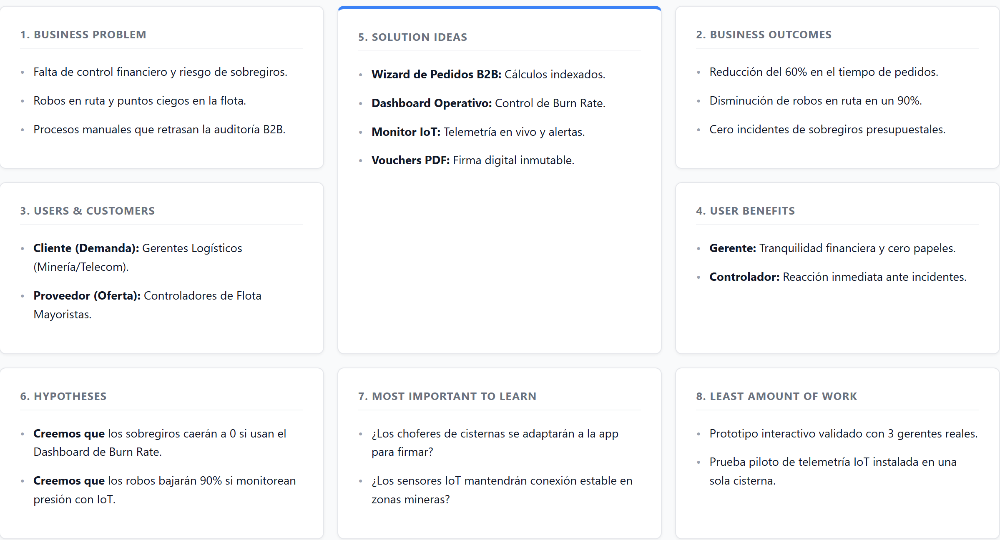

# Capítulo I: Introducción

## 1.1. Startup Profile

### 1.1.1. Descripción de la Startup

**FuelTrack** es una startup tecnológica fundada por estudiantes de la Universidad Peruana de Ciencias Aplicadas (UPC), orientada a transformar la gestión de suministro de combustible en operaciones industriales críticas. A través de la integración de hardware IoT con una plataforma transaccional B2B, FuelTrack conecta a empresas solicitantes y proveedores mayoristas de hidrocarburos en un ecosistema digital unificado, brindando visibilidad en tiempo real sobre cada galón despachado, desde el tanque de la cisterna hasta el punto de entrega final.

A diferencia de las soluciones de software tradicionales, FuelTrack incorpora sensores embebidos en las unidades de transporte para monitorear de forma continua el nivel de combustible, la presión del tanque y la ubicación GPS de la flota. Esta telemetría se integra directamente con el flujo de pedidos, aprobaciones y comprobantes digitales de la plataforma, eliminando los puntos ciegos logísticos que hoy generan mermas, robos en tránsito y sobregiros presupuestales en sectores como minería, telecomunicaciones e infraestructura.

**Misión:**
Desarrollar soluciones tecnológicas que integren IoT y software transaccional para digitalizar y asegurar la cadena de suministro de hidrocarburos, eliminando la informalidad operativa y brindando trazabilidad total a empresas y proveedores en entornos industriales críticos.

**Visión:**
Convertirnos en el estándar de gestión inteligente de combustible B2B en Latinoamérica, siendo la plataforma de referencia para operaciones que exigen visibilidad financiera, control logístico y seguridad de carga en tiempo real.

### 1.1.2. Perfiles de integrantes del equipo

| Foto                                          | Nombre completo               | Código     | Carrera                | Habilidades técnicas y rol                                   |
|-----------------------------------------------|-------------------------------|------------|------------------------|--------------------------------------------------------------|
|  | Aguirre Castillo, Sergio Cesar | U202310425 | Ingeniería de Software | Desarrollo Backend, Gestión de APIs RESTful, Arquitectura DDD |
|  | Alumno    | xxxx | Ingeniería de Software | Desarrollo Frontend (Vue/React), UI/UX, Integración de servicios externos |
|            | Bryan Ronald Espejo Gamarra     | U202213278 | Ingeniería de Software | Backend, Base de Datos, DevOps, Coordinación técnica del proyecto |
|            | Alumno     | xxxxx | Ingeniería de Software | Desarrollo Móvil Nativo (Kotlin/Swift), Testing y QA          |
|             | Renzo Andres Luque Minaya       | U20221C275 | Ingeniería de Software | Desarrollo Frontend, Cloud Deployment, Seguridad y Autenticación |

## 1.2. Solution Profile

### 1.2.1 Antecedentes y problemática

**Descripción del problema**
 
El sector de distribución de hidrocarburos en entornos industriales críticos —como minería, telecomunicaciones e infraestructura— enfrenta una paradoja operativa: a pesar de mover millones de dólares en combustible anualmente, la gestión de sus despachos sigue dependiendo de métodos informales como llamadas telefónicas, correos electrónicos y aplicaciones de mensajería. Esta desconexión entre el flujo físico del combustible y los sistemas de gestión genera pérdidas económicas significativas, riesgos de desabastecimiento y una opacidad financiera que dificulta la toma de decisiones en tiempo real.
 
La ausencia de telemetría integrada en las cisternas de transporte agrava el problema: los proveedores no pueden detectar mermas ni robos en ruta, los clientes no tienen visibilidad del estado real de su pedido, y los gerentes de logística operan con información desfasada que aumenta el riesgo de sobregiros presupuestales. La incorporación de tecnologías IoT representa la evolución natural para cerrar esta brecha entre el mundo físico y el sistema de gestión.
 
---
 
**Técnica 5W + 2H**
 
**What? (¿Qué?)**
La problemática central es la ausencia de un sistema integrado que conecte en tiempo real el estado físico de las cisternas de combustible —nivel de tanque, presión, ubicación GPS— con el flujo transaccional de pedidos, aprobaciones y comprobantes digitales entre empresas solicitantes y proveedores mayoristas. Esta desconexión genera mermas no detectadas, errores en la conciliación financiera y una trazabilidad prácticamente inexistente por despacho realizado.
 
**When? (¿Cuándo?)**
El problema se manifiesta de forma continua a lo largo de todo el ciclo de vida de un despacho: desde la generación manual del pedido hasta la entrega en campo, pasando por la validación del pago, la asignación de la cisterna y el monitoreo de la ruta. Se agudiza especialmente en operaciones nocturnas o en zonas remotas sin supervisión presencial, donde el riesgo de robo en tránsito es mayor.
 
**Where? (¿Dónde?)**
El problema ocurre principalmente en operaciones industriales ubicadas en zonas remotas o de difícil acceso —campamentos mineros, nodos de telecomunicaciones, obras de infraestructura— donde la infraestructura de control es limitada y la dependencia del combustible como insumo crítico es total. También afecta las bases logísticas de los proveedores mayoristas, donde la coordinación de despachos se realiza de forma manual y fragmentada.
 
**Who? (¿Quién?)**
Los principales afectados son los gerentes de logística y jefes de operaciones de empresas clientes, quienes carecen de visibilidad financiera en tiempo real; los controladores de flota y despachadores de proveedores mayoristas, que no pueden monitorear el estado de sus cisternas en ruta; y los choferes, que operan sin respaldo digital ante cualquier incidente durante el traslado.
 
**Why? (¿Por qué?)**
El problema persiste porque los métodos actuales de coordinación —correo, WhatsApp, papel— no tienen capacidad de integrarse con el estado físico real del combustible en tránsito. No existe un canal único que conecte la solicitud del cliente, la aprobación financiera, el monitoreo IoT de la cisterna y la generación automática del comprobante de entrega. Cada etapa opera de forma aislada, multiplicando los puntos de falla.
 
**How? (¿Cómo?)**
El problema se materializa cuando una cisterna sale a ruta sin que ningún sistema registre en tiempo real la variación del nivel de combustible. Cualquier pérdida —sea por robo, fuga o error de despacho— solo se detecta al comparar manualmente el volumen de salida con el de llegada, proceso que puede tomar horas o días. Paralelamente, el cliente no recibe actualizaciones automáticas del estado de su pedido y debe confirmar la recepción mediante llamadas o fotos enviadas por WhatsApp, lo que retrasa la facturación y la conciliación financiera.
 
**How Much? (¿Cuánto?)**
La magnitud del problema es considerable en términos económicos y operativos:
- El robo de combustible en tránsito (*"ordeño"*) representa pérdidas anuales de millones de dólares para las empresas de transporte en Latinoamérica.
- Más del 60% de los gerentes logísticos reportan dificultades para auditar el consumo exacto de combustible frente a lo presupuestado, debido a la fragmentación de la información en papel y canales dispersos.
- Las paradas no planificadas por desabastecimiento en operaciones extractivas o de infraestructura pueden costar decenas de miles de dólares por hora de inactividad.
- Se estima que la integración de telemetría y sistemas de gestión de flotas (FMS) puede reducir los tiempos de inactividad operativa hasta en un 25% y disminuir las mermas inexplicables en ruta de forma significativa.

### 1.2.2 Lean UX Process

#### 1.2.2.1. Lean UX Problem Statements

**Problem Statement 1: Procesos Operativos Manuales y Descoordinados**
Las empresas con operaciones críticas en campo y sus distribuidores mayoristas enfrentan serias dificultades al gestionar la solicitud y validación de despachos de combustible utilizando métodos manuales e informales (papel, correos, WhatsApp). Esta falta de estandarización genera retrasos, errores en la comunicación y cuellos de botella en la cadena de suministro.
*¿Cómo podemos crear una plataforma transaccional corporativa que elimine el uso de papel y automatice el flujo de solicitudes y aprobaciones de despachos de combustible entre clientes y proveedores, mejorando la eficiencia operativa?*

**Problem Statement 2: Riesgo de Sobregiros y Falta de Control Financiero**
Los gerentes de logística y operaciones tienen una visibilidad limitada y desfasada del "Burn Rate" (ritmo de gasto) frente a las líneas de crédito preaprobadas. Esta carencia de información en tiempo real aumenta significativamente el riesgo de sobregiros presupuestales y paralizaciones por falta de energía.
*¿Cómo podemos proveer un dashboard financiero interactivo que calcule y muestre en tiempo real el consumo por centros de costo y el ritmo de gasto, permitiendo un control proactivo del presupuesto?*

**Problem Statement 3: Puntos Ciegos Logísticos y Robo de Combustible**
Los proveedores mayoristas sufren pérdidas económicas debido al robo de combustible en ruta (mermas) y carecen de visibilidad sobre los signos vitales de su flota de cisternas. La incapacidad de monitorear en vivo el volumen de los tanques y detectar caídas bruscas de presión limita la respuesta rápida ante incidentes.
*¿Cómo podemos desarrollar un monitor logístico integrado con telemetría IoT que proporcione visibilidad en tiempo real del estado de los vehículos y genere alertas automáticas ante anomalías o posibles robos en ruta?*

**Problem Statement 4: Carencia de Trazabilidad y Auditoría en Despachos**
Las empresas enfrentan problemas de auditoría y demoras en la facturación debido a la dificultad de sustentar cada galón despachado con su respectiva Orden de Compra (OC), Centro de Costos y firma de recepción. La falta de evidencia digital inmutable retrasa los flujos de pago B2B.
*¿Cómo podemos diseñar un sistema de trazabilidad que garantice que cada entrega genere un comprobante digital (Voucher PDF) firmado y enlazado a la documentación financiera correspondiente, asegurando la transparencia total?*

#### 1.2.2.2. Lean UX Assumptions

**Business Assumptions**
* **Necesidad de Solución Integral B2B:** Creemos que las empresas de infraestructura y minería, junto con sus proveedores, necesitan urgentemente un software de Field Service Management que integre telemetría IoT, control financiero y logística en tiempo real.
* **Plataforma Web y Móvil Accesible:** Creemos que el valor se entregará a través de un portal web corporativo (Cockpit) para los gerentes y, a futuro, una aplicación móvil offline-first para los choferes en zonas sin cobertura.
* **Clientes Iniciales:** Nuestros clientes iniciales serán empresas del sector minero, telecomunicaciones y construcción (ej. Minera Yanacocha, Gilat Peru) y grandes distribuidores de hidrocarburos.
* **Valor Principal:** El valor #1 que buscan los clientes es la garantía de abastecimiento sin sobregiros presupuestales, y para los proveedores, la prevención de robos y la aceleración de la facturación mediante guías digitales.
* **Modelo de Ingresos:** Generaremos ingresos mediante un modelo SaaS Multitenant B2B, cobrando suscripciones por volumen de transacciones o licencias de flota a las empresas distribuidoras.
* **Competencia y Diferenciación:** Nos diferenciamos de simples e-commerce o ERPs tradicionales al integrar hardware (sensores IoT) con software transaccional, creando un ecosistema inmutable y en tiempo real.

**User Assumptions**
* **Quién es el Usuario:** Gerentes de logística, jefes de operaciones en campo y controladores de flota / despachadores de empresas mayoristas.
* **Dónde Encaja el Producto:** FuelTrack se convierte en la herramienta central de operaciones diarias en las oficinas de logística y en los centros de control de monitoreo vehicular.
* **Problemas del Producto:** Existe el riesgo de resistencia al cambio tecnológico por parte de los choferes de cisternas. Se mitigará mediante interfaces de divulgación progresiva extremadamente simples y capacitaciones.

**User Outcomes**
* **Para el Cliente Corporativo (Demanda):** Visibilidad financiera total, prevención de desabastecimiento mediante pedidos ágiles (Wizard) y auditoría perfecta de cada galón consumido.
* **Para el Proveedor (Oferta):** Control telemétrico absoluto sobre sus cisternas, reducción drástica de robos en ruta y automatización de la recolección de firmas digitales para facturar más rápido.

**Business Outcomes**
* **Eficiencia Operativa:** Reducción sustancial del Lead Time (tiempo desde aprobación hasta entrega) y cumplimiento riguroso de los Acuerdos de Nivel de Servicio (SLA).
* **Posicionamiento en el Mercado:** Convertir a FuelTrack en el estándar de gestión de hidrocarburos B2B en operaciones críticas y zonas remotas.

**Features Importantes:**
* Wizard de Pedidos Inteligente (con cálculos de precios indexados).
* Dashboard de Inteligencia Operativa (Burn Rate, Centros de Costo).
* Monitor IoT Telemétrico (Integración con sensores DUT-E CAN, motor, batería).
* Radar y Alertas (Bloqueo remoto y detección de robos).
* Exportación de Vouchers Legales en PDF con firma digital.

#### 1.2.2.3. Lean UX Hypothesis Statements

* **Creemos que** al implementar un "Wizard de Pedidos Inteligente" que automatice el cálculo financiero frente a líneas de crédito, los gerentes de logística realizarán sus requerimientos de manera más segura y rápida. **Sabremos que hemos tenido éxito cuando** el tiempo promedio para colocar y aprobar una orden de combustible se reduzca en un 60% frente a los métodos tradicionales (correos/WhatsApp).
* **Creemos que** al proveer un "Monitor IoT" con telemetría en vivo y alertas de caída brusca de presión a los controladores de flota, los proveedores podrán detectar y reaccionar ante posibles robos o fugas al instante. **Sabremos que hemos tenido éxito cuando** los reportes de mermas inexplicables o pérdidas de combustible en ruta disminuyan en un 90%.
* **Creemos que** al incluir un "Dashboard de Inteligencia Operativa" que cruce el volumen despachado con el presupuesto mensual (Burn Rate) por centro de costo, los clientes corporativos tendrán un mejor control financiero. **Sabremos que hemos tenido éxito cuando** los incidentes de sobregiros presupuestales por abastecimiento de energía se reduzcan a cero.
* **Creemos que** al digitalizar el proceso de entrega y generar un "Voucher Legal PDF" como evidencia transaccional e inmutable, los proveedores de combustible cerrarán sus ciclos logísticos de forma más limpia. **Sabremos que hemos tenido éxito cuando** el tiempo de validación para proceder con la facturación al cliente pase de días a minutos.

#### 1.2.2.4. Lean UX Canvas

*(A continuación se presenta el Lean UX Canvas que resume la estrategia y validación del modelo de negocio de FuelTrack).*

---

## 1.3. Segmentos objetivo

**1. El Cliente Corporativo (Demanda)**

* **Descripción General:** Empresas con operaciones críticas, pesadas o en zonas remotas que dependen del suministro continuo de hidrocarburos para mantener su productividad (minería, telecomunicaciones, infraestructura y construcción).
* **Características Demográficas y Profesionales:**
  * **Rol / Puesto:** Gerentes de Logística, Jefes de Operaciones, Supervisores de Campamento o Nodos.
  * **Edad:** Profesionales entre 35 y 55 años, con alta responsabilidad sobre la continuidad operativa.
  * **Género:** Mayoritariamente masculino en campo, aunque cada vez más equitativo en áreas gerenciales logísticas.
  * **Ubicación:** Oficinas corporativas en zonas urbanas (Lima) con constante comunicación hacia campamentos o nodos rurales/remotos (ej. Amazonas, zonas mineras).
* **Información Estadística de Sustento:**
  * **Impacto Operativo:** Según estudios de logística industrial, las paradas no planificadas por falta de energía pueden costar a empresas extractivas o de infraestructura decenas de miles de dólares por hora.
  * **Control de Presupuesto:** Más del 60% de los gerentes logísticos afirman tener dificultades para auditar el consumo exacto de combustible frente a lo presupuestado debido a la fragmentación de la información en papel.

**2. El Proveedor / Distribuidor (Oferta)**

* **Descripción General:** Empresas mayoristas dedicadas a la comercialización y transporte de hidrocarburos que poseen flotas de cisternas especializadas y buscan asegurar la integridad de su carga hasta el destino final.
* **Características Demográficas y Profesionales:**
  * **Rol / Puesto:** Controladores de Flota (Centro de Monitoreo), Despachadores, Gerentes Comerciales.
  * **Edad:** Entre 28 y 50 años.
  * **Nivel Técnico:** Alto uso de monitores de rastreo GPS, manejo de turnos y coordinación constante con choferes de ruta pesada.
  * **Ubicación:** Bases de operaciones logísticas, plantas de refinería o distribución en zonas industriales.
* **Información Estadística de Sustento:**
  * **Mermas y Robos:** El robo de combustible en tránsito (conocido coloquialmente como "ordeño") representa pérdidas anuales de millones de dólares para las empresas de transporte en Latinoamérica.
  * **Transformación Digital en Flotas:** Se estima que la integración de telemetría y sistemas de gestión de flotas (FMS) mejora la eficiencia de despachos y reduce tiempos de inactividad operativa hasta en un 25%, justificando la necesidad de un monitor IoT dedicado como el de FuelTrack.
