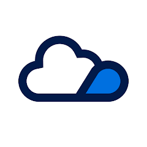
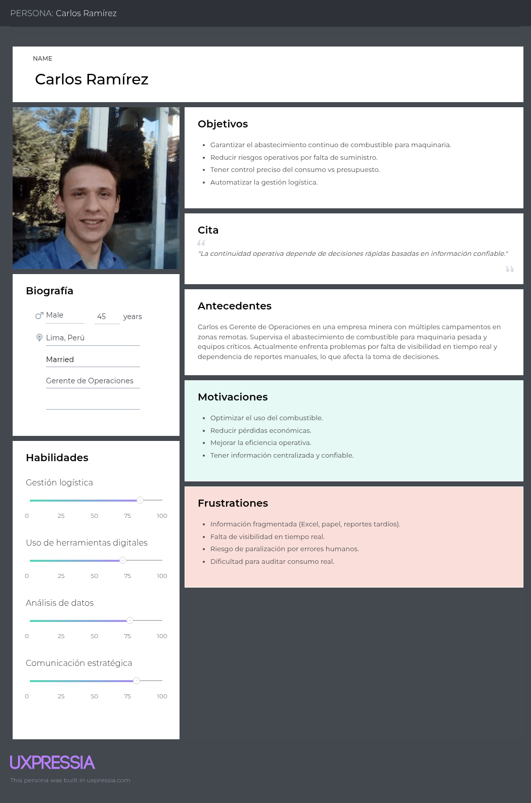
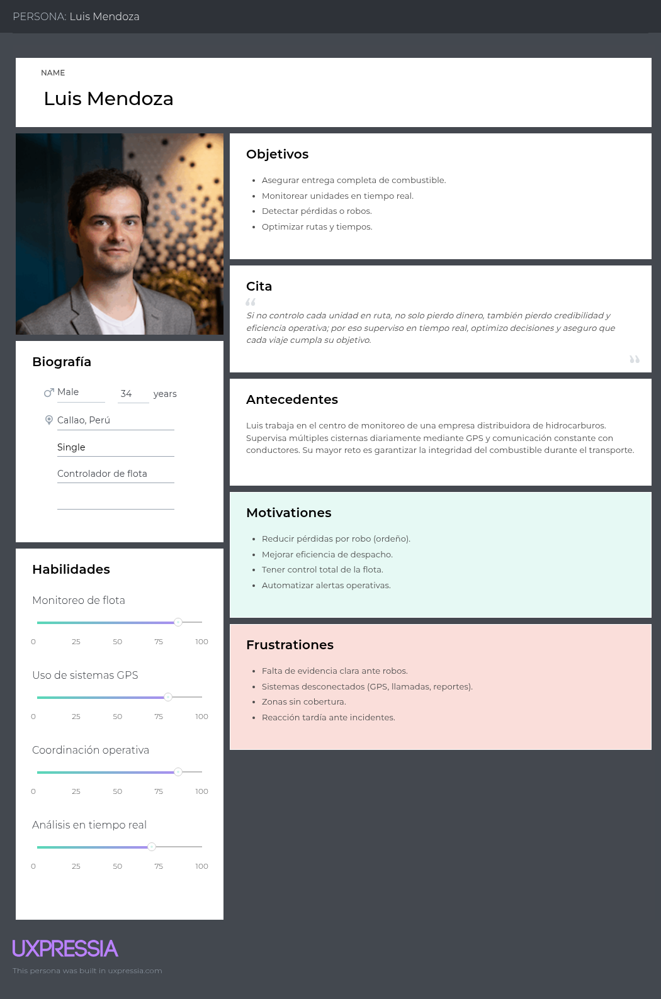
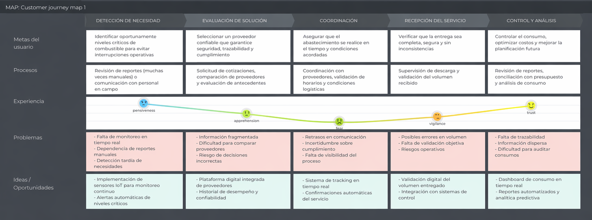
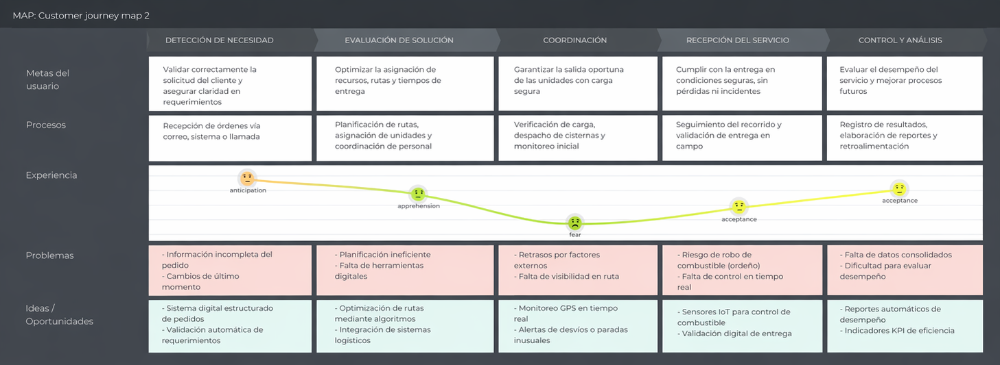
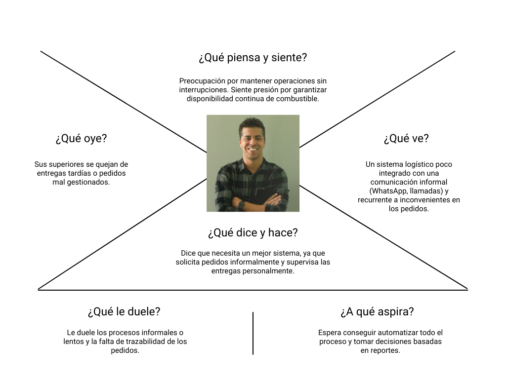
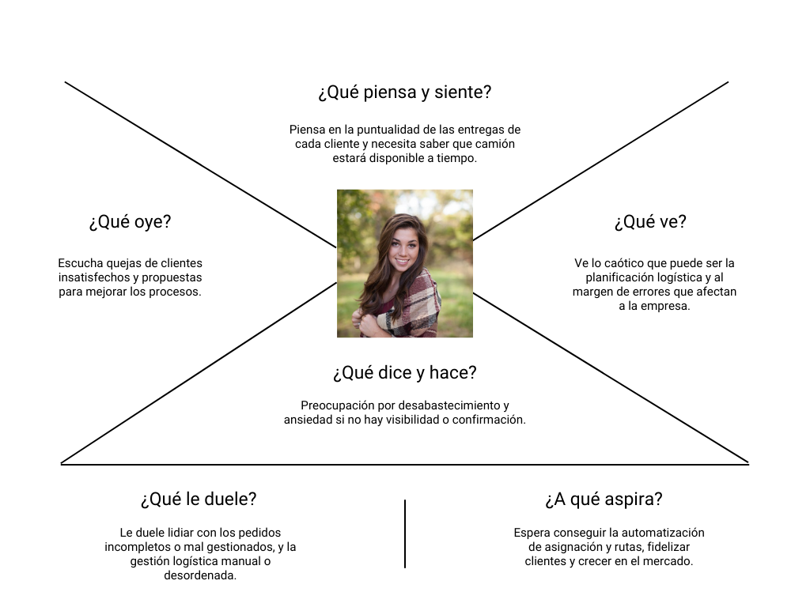
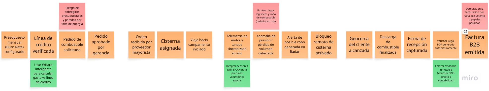

# Capítulo II: Requirements Elicitation & Analysis

## 2.1. Competidores

En el mercado actual, existen diversas soluciones orientadas a la gestión de combustible y logística, las cuales varían desde plataformas puramente de software hasta ecosistemas robustos de Internet de las Cosas (IoT). Para el contexto de **FuelTrack**, que ahora integra capacidades IoT (como sensores de nivel ultrasónicos o capacitivos en tanques para monitoreo en tiempo real y automatización de pedidos), hemos identificado a los siguientes competidores principales:

**Zavgar:** Es un software como servicio (SaaS) diseñado para la gestión de mantenimiento y consumo de combustible de flotas. Se integra con dispositivos de telemetría OBD-II (IoT) instalados en los vehículos para extraer datos precisos sobre el rendimiento y gasto de combustible. Aunque es muy fuerte en el monitoreo del consumo final, carece de un enfoque integral para la automatización de la cadena de suministro y pedidos directos a proveedores basándose en el nivel físico de los tanques.

**FuelCloud:** Es una solución tecnológica altamente orientada al IoT que combina hardware propietario y software basado en la nube para el control físico del despacho de combustible. Utilizan sensores y controladores conectados directamente en los tanques y surtidores para autorizar, medir y registrar en tiempo real cada gota de combustible extraída. Es un competidor directo en el ámbito de infraestructura, aunque su enfoque principal es el control interno (evitar robos o mermas) más que la optimización logística de pedidos B2B.

**Wialon:** Es una de las plataformas globales líderes en gestión de flotas y telemetría IoT. Permite la integración universal con miles de dispositivos GPS y sensores de nivel de combustible. Ofrece visualización en tiempo real, alertas automatizadas y reportes de consumo muy avanzados. Es un competidor indirecto muy fuerte; si bien no es un marketplace ni un gestor administrativo de pedidos, la infraestructura IoT que manejan resuelve una parte crítica de la logística de distribución que FuelTrack también busca optimizar.

### 2.1.1. Análisis competitivo

A continuación, se presenta el Competitive Analysis Landscape, el cual nos permite reconocer las fortalezas, debilidades, estrategias y el uso de tecnologías (especialmente IoT) de nuestros principales competidores, para así posicionar a FuelTrack estratégicamente en el mercado.

<table>
    <thead>
        <tr>
            <th colspan="6">Competitive Analysis Landscape</th>
        </tr>
        <tr>
            <th colspan="2">¿Por qué llevar a cabo este análisis?</th>
            <td colspan="4" style="text-align: justify">Este análisis se lleva a cabo para identificar las ventajas y desventajas de la integración IoT de FuelTrack frente a las soluciones existentes, comprendiendo cómo los competidores utilizan el hardware y software para el control de combustible, y así definir nuestra ventaja competitiva en la automatización de pedidos B2B.</td>
        </tr>
    </thead>
    <tbody style="text-align: left">
        <tr style="text-align: center">
            <th colspan="2">Competidores</th>
            <th>
                

                    <strong>FuelTrack</strong> 
                    
                

            </th>
            <th>
                

                    <strong>Zavgar</strong> 
                    
                

            </th>
            <th>
                

                    <strong>FuelCloud</strong> 
                    
                

            </th>
            <th>
                

                    <strong>Wialon</strong> 
                    
                

            </th>
        </tr>
        <tr>
            <th rowspan="2"><strong>Perfil</strong></th>
            <td>Overview</td>
            <td>Plataforma integral basada en web y telemetría IoT (sensores DUT-E CAN) en cisternas en ruta y control de presupuesto (Burn Rate) que digitaliza y automatiza el proceso completo de pedido de combustible entre empresas y proveedores, basándose en lecturas de stock en tiempo real.</td>
            <td>SaaS para la gestión de flotas que se integra con dispositivos telemáticos (OBD-II) para monitorear el consumo de combustible, enfocado en eficiencia y reducción de costos operativos.</td>
            <td>Solución integral de hardware IoT y software para el control físico del despacho de combustible en tanques propios, autorizando y midiendo el flujo en tiempo real.</td>
            <td>Plataforma global de telemetría IoT y gestión de flotas que se integra con sensores de nivel de combustible y GPS para ofrecer reportes operativos avanzados y prevención de robos.</td>
        </tr>
        <tr>
            <td>Ventaja competitiva ¿Qué valor ofrece a los clientes?</td>
            <td>Especialización en el flujo logístico B2B. Al integrar sensores IoT, elimina el error humano creando notificaciones y pedidos automáticos cuando el tanque llega a un nivel crítico, garantizando un abastecimiento ininterrumpido. Además, FuelTrack previene sobregiros financieros y robos en tránsito bloqueando vehículos remotamente, cerrando el ciclo con Vouchers PDF firmados digitalmente</td>
            <td>Implementación sin necesidad de hardware propietario pesado; centraliza la información de mantenimiento y gasto de combustible de la flota en un solo dashboard analítico.</td>
            <td>Control físico extremadamente riguroso mediante hardware instalado en el surtidor. Evita mermas y robos autorizando extracciones mediante PIN o tarjetas RFID.</td>
            <td>Compatibilidad universal con más de 2,400 dispositivos IoT del mercado. Trazabilidad de rutas en tiempo real y análisis profundo de variaciones de nivel de combustible.</td>
        </tr>
        <tr>
            <th rowspan="2"><strong>Perfil de Marketing</strong></th>
            <td>Mercado objetivo</td>
            <td>Empresas (mineras, constructoras, agrícolas) con monitoreo de flotas de cisternas que requieren abastecimiento constante, y proveedores de combustible que buscan automatizar sus ventas.</td>
            <td>Empresas con flotas vehiculares (transporte, logística) que desean monitorear y reducir el consumo interno de combustible.</td>
            <td>Empresas con tanques de combustible de autoconsumo e infraestructura física que necesitan control estricto de su inventario.</td>
            <td>Empresas logísticas, proveedores de combustible, integradores de sistemas GPS y corporaciones de transporte pesado.</td>
        </tr>
        <tr>
            <td>Estrategias de Marketing</td>
            <td>
                <ul>
                    <li>Demostraciones piloto de la automatización IoT en tanques de clientes clave.</li>
                    <li>Alianzas estratégicas B2B con empresas proveedoras.</li>
                </ul>
            </td>
            <td>
                <ul>
                    <li>Marketing digital B2B y contenido SEO sobre reducción de costos logísticos.</li>
                    <li>Integraciones con tarjetas de red de estaciones de servicio.</li>
                </ul>
            </td>
            <td>
                <ul>
                    <li>Venta consultiva presencial y asistencia a ferias industriales.</li>
                    <li>Red de distribuidores e instaladores de hardware petrolero.</li>
                </ul>
            </td>
            <td>
                <ul>
                    <li>Alianzas masivas con fabricantes de hardware IoT a nivel global.</li>
                    <li>Conferencias técnicas propias orientadas a la telemetría.</li>
                </ul>
            </td>
        </tr>
        <tr>
            <th rowspan="3"><strong>Perfil del producto</strong></th>
            <td>Producto & servicios</td>
            <td>
                <ul>
                    <li><strong>Producto:</strong> Nodos IoT (sensores de nivel) instalados en tanques de clientes.</li>
                    <li><strong>Servicios:</strong> Plataforma web de trazabilidad, alertas automáticas de reabastecimiento y panel logístico para proveedores.</li>
                </ul>
            </td>
            <td>
                <ul>
                    <li><strong>Producto:</strong> Integración API con telemetría de vehículos.</li>
                    <li><strong>Servicios:</strong> Web app para reportes de consumo, gestión de mantenimiento y control de gastos.</li>
                </ul>
            </td>
            <td>
                <ul>
                    <li><strong>Producto:</strong> Controladores hardware IoT para válvulas y surtidores.</li>
                    <li><strong>Servicios:</strong> Software cloud para autorización de usuarios y control de inventario físico.</li>
                </ul>
            </td>
            <td>
                <ul>
                    <li><strong>Producto:</strong> Plataforma de software agnóstica a hardware.</li>
                    <li><strong>Servicios:</strong> Monitoreo GPS, alertas de robo, geocercas y análisis de sensores de nivel.</li>
                </ul>
            </td>
        </tr>
        <tr>
            <td>Precios y costos</td>
            <td>
                <ul>
                    <li>Costo único de adquisición/instalación del hardware IoT por tanque.</li>
                    <li>Suscripción mensual (SaaS) por acceso a la plataforma corporativa.</li>
                </ul>
            </td>
            <td>
                <ul>
                    <li>Modelo SaaS basado en el número de vehículos activos monitoreados en la plataforma.</li>
                </ul>
            </td>
            <td>
                <ul>
                    <li>Alta inversión inicial por el hardware IoT y su instalación especializada.</li>
                    <li>Licencia mensual/anual por el uso del software de gestión.</li>
                </ul>
            </td>
            <td>
                <ul>
                    <li>Modelo B2B modular basado en un pago por "activo conectado" al mes.</li>
                </ul>
            </td>
        </tr>
        <tr>
            <td>Canales de distribución</td>
            <td>
                <ul>
                    <li><strong>Web:</strong> Plataforma principal para la gestión corporativa y reportes.</li>
                    <li><strong>Físico:</strong> Instalación de sensores in-situ a través de técnicos.</li>
                </ul>
            </td>
            <td>
                <ul>
                    <li><strong>Web:</strong> Venta y onboarding 100% digital.</li>
                    <li><strong>Móvil:</strong> App de gestión y registro.</li>
                </ul>
            </td>
            <td>
                <ul>
                    <li><strong>Físico:</strong> Distribuidores de equipamiento industrial.</li>
                    <li><strong>Web/Móvil:</strong> Apps para visualizar la telemetría del tanque.</li>
                </ul>
            </td>
            <td>
                <ul>
                    <li><strong>Web:</strong> Red global de partners e integradores locales.</li>
                    <li><strong>Móvil:</strong> App para monitoreo en campo.</li>
                </ul>
            </td>
        </tr>
        <tr>
            <th rowspan="4"><strong>Análisis SWOT</strong></th>
            <td>Fortalezas</td>
            <td>
                <ul>
                    <li>Integra hardware IoT directamente en el proceso administrativo B2B.</li>
                    <li>Automatiza el flujo completo, eliminando quiebres de stock.</li>
                    <li>Diseño UX moderno frente a interfaces industriales antiguas.</li>
                </ul>
            </td>
            <td>
                <ul>
                    <li>Implementación ágil al ser puramente software.</li>
                    <li>Gran capacidad analítica y reportes financieros automáticos.</li>
                </ul>
            </td>
            <td>
                <ul>
                    <li>Control físico irrefutable del surtidor de combustible.</li>
                    <li>Hardware muy robusto adaptado a entornos hostiles.</li>
                </ul>
            </td>
            <td>
                <ul>
                    <li>Líder global con plataforma altamente estable.</li>
                    <li>Agnóstico: compatible con casi cualquier hardware IoT existente.</li>
                </ul>
            </td>
        </tr>
        <tr>
            <td>Debilidades</td>
            <td>
                <ul>
                    <li>Dependencia de la instalación de infraestructura física (sensores).</li>
                    <li>El reto de introducir tecnología IoT en empresas muy tradicionales.</li>
                </ul>
            </td>
            <td>
                <ul>
                    <li>No gestiona el pedido ni la comunicación con el proveedor mayorista.</li>
                    <li>Depende de la veracidad de datos de terceros.</li>
                </ul>
            </td>
            <td>
                <ul>
                    <li>Altos costos de barrera de entrada por el hardware.</li>
                    <li>Sobredimensionado para clientes que solo buscan gestionar la facturación logística.</li>
                </ul>
            </td>
            <td>
                <ul>
                    <li>Curva de aprendizaje muy pronunciada; requiere especialistas para configurarlo.</li>
                    <li>No resuelve la gestión de compra-venta comercial.</li>
                </ul>
            </td>
        </tr>
        <tr>
            <td>Oportunidades</td>
            <td>
                <ul>
                    <li>El Internet Industrial de las Cosas (IIoT) está ganando terreno rápidamente en el país.</li>
                    <li>Posibilidad de usar datos de sensores para predecir demanda (Big Data).</li>
                </ul>
            </td>
            <td>
                <ul>
                    <li>Mayor presión corporativa por reducir la huella de carbono y gastos de flota.</li>
                </ul>
            </td>
            <td>
                <ul>
                    <li>Nuevas normativas de OSINERGMIN que exijan trazabilidad volumétrica obligatoria.</li>
                </ul>
            </td>
            <td>
                <ul>
                    <li>Expansión de redes celulares NB-IoT y 5G que facilitan el despliegue de sensores remotos.</li>
                </ul>
            </td>
        </tr>
        <tr>
            <td>Amenazas</td>
            <td>
                <ul>
                    <li>Sistemas ERP tradicionales que desarrollen sus propios módulos IoT nativos.</li>
                    <li>Problemas de conectividad rural que impidan la transmisión de datos de los sensores.</li>
                </ul>
            </td>
            <td>
                <ul>
                    <li>Fabricantes de vehículos que incluyan estos SaaS de fábrica.</li>
                </ul>
            </td>
            <td>
                <ul>
                    <li>Entrada de hardware IoT asiático de bajo costo y fácil instalación.</li>
                </ul>
            </td>
            <td>
                <ul>
                    <li>Startups de nicho que ofrezcan soluciones más sencillas y directas sin funciones innecesarias.</li>
                </ul>
            </td>
        </tr>
    </tbody>
</table>

### 2.1.2. Estrategias y tácticas frente a competidores.

Para definir nuestras estrategias frente a competidores como Zavgar, FuelCloud y Wialon, hemos desarrollado una **Matriz CAME** (Corregir, Afrontar, Mantener, Explotar) basada en nuestro análisis FODA competitivo. Esto nos permite trazar tácticas claras para aprovechar el entorno IoT y mitigar los riesgos del mercado y la competencia.

<table>
    <thead>
        <tr>
            <th colspan="3" style="text-align: center; font-size: 1.1em;">Matriz CAME para el desarrollo de estrategias en base al análisis FODA</th>
        </tr>
        <tr>
            <th style="width: 20%;">Análisis FODA cruzado</th>
            <th style="width: 40%;">Oportunidades (O)
                <ul style="font-weight: normal; text-align: left; font-size: 0.9em;">
                    <li>O1. Crecimiento del IIoT (Internet Industrial de las Cosas).</li>
                    <li>O2. Predicción de demanda mediante Big Data.</li>
                    <li>O3. Nuevas exigencias de trazabilidad de OSINERGMIN.</li>
                </ul>
            </th>
            <th style="width: 40%;">Amenazas (A)
                <ul style="font-weight: normal; text-align: left; font-size: 0.9em;">
                    <li>A1. Sistemas ERP desarrollando módulos IoT nativos.</li>
                    <li>A2. Baja conectividad de red en zonas rurales/mineras.</li>
                    <li>A3. Entrada de hardware IoT asiático de bajo costo.</li>
                </ul>
            </th>
        </tr>
    </thead>
    <tbody>
        <tr>
            <th>Fortalezas (F)
                <ul style="font-weight: normal; text-align: left; font-size: 0.9em;">
                    <li>F1. Integración B2B (Pedido logístico + IoT).</li>
                    <li>F2. Automatización total de stock y reabastecimiento.</li>
                    <li>F3. Diseño UX moderno y accesible.</li>
                </ul>
            </th>
            <td>
                <strong>Estrategia (FO) Ofensivas: Explotar</strong>
                <ul style="text-align: left; font-size: 0.95em;">
                    <li><strong>Especialización B2B impulsada por datos (F1, O2):</strong> Utilizar los datos recopilados por nuestros sensores IoT para ofrecer a los proveedores reportes predictivos de demanda. Esto nos diferencia de Wialon o Zavgar, que solo muestran el consumo pasado, permitiendo a nuestros clientes anticipar sus ventas.</li>
                    <li><strong>Cumplimiento normativo automatizado (F2, O3):</strong> Posicionar FuelTrack como la herramienta definitiva para cumplir con las regulaciones de trazabilidad de OSINERGMIN, utilizando nuestra plataforma web moderna (F3) para generar reportes automáticos basados en las lecturas reales de los tanques.</li>
                </ul>
            </td>
            <td>
                <strong>Estrategia (FA) Defensivas: Mantener</strong>
                <ul style="text-align: left; font-size: 0.95em;">
                    <li><strong>Robustez frente a la desconexión (F2, A2):</strong> Desarrollar tácticas de almacenamiento local (Edge Computing) en nuestros nodos IoT. Si se pierde la conectividad en una mina o zona rural, el sensor guarda el registro y actualiza el stock/pedido automáticamente al recuperar la señal, superando la fiabilidad de la competencia de bajo costo.</li>
                    <li><strong>Diferenciación por valor y soporte (F1, F3, A3):</strong> Frente a la amenaza del hardware barato asiático, enfocar la estrategia de marketing en el valor del ecosistema completo (SaaS amigable + hardware) y el soporte técnico B2B local, algo que los importadores de dispositivos genéricos no pueden ofrecer.</li>
                </ul>
            </td>
        </tr>
        <tr>
            <th>Debilidades (D)
                <ul style="font-weight: normal; text-align: left; font-size: 0.9em;">
                    <li>D1. Dependencia de instalación física en tanques.</li>
                    <li>D2. Resistencia tecnológica en empresas tradicionales.</li>
                </ul>
            </th>
            <td>
                <strong>Estrategia (DO) de Reorientación: Corregir</strong>
                <ul style="text-align: left; font-size: 0.95em;">
                    <li><strong>Instalación como servicio de adecuación (D1, O3):</strong> Para mitigar la fricción que causa la instalación de hardware físico (a diferencia de soluciones puramente software), empaquetaremos la instalación del sensor como un servicio de "Auditoría y Adecuación a normativas IIoT", agregando valor inmediato a la infraestructura del cliente.</li>
                    <li><strong>Pilotos de adopción tecnológica (D2, O1):</strong> Reducir la resistencia al cambio en el sector logístico ofreciendo programas piloto de 30 días. Demostraremos cómo el IoT elimina las fallas humanas en la medición manual, ganando su confianza antes de cobrar la suscripción completa.</li>
                </ul>
            </td>
            <td>
                <strong>Estrategia (DA) de Supervivencia: Afrontar</strong>
                <ul style="text-align: left; font-size: 0.95em;">
                    <li><strong>Alianzas de conectividad (D1, A2):</strong> Para asegurar el funcionamiento de nuestro hardware en zonas remotas, formaremos alianzas con proveedores de telecomunicaciones (tecnologías NB-IoT o LoRaWAN), garantizando a los clientes que su inversión no se perderá por falta de señal.</li>
                    <li><strong>Estrategia de API Abierta (D2, A1):</strong> Para evitar que las empresas tradicionales prefieran los módulos IoT nativos deficientes de sus propios ERP, FuelTrack ofrecerá integraciones sencillas (API REST). De este modo, en lugar de competir contra los ERP, nos convertiremos en una extensión especializada que alimenta de datos precisos a sus sistemas contables.</li>
                </ul>
            </td>
        </tr>
    </tbody>
</table>

## 2.2. Entrevistas
### 2.2.1. Diseño de entrevistas

Para comprender a profundidad las necesidades operativas y logísticas de nuestros segmentos objetivo, y validar la viabilidad de una solución basada en telemetría IoT y software transaccional, se han diseñado dos guías de entrevistas semiestructuradas. El objetivo principal es identificar los "puntos de dolor" en la cadena de suministro de hidrocarburos que el hardware y el software de FuelTrack buscan resolver.

---

#### A. Segmento: Empresas Solicitantes (Clientes Corporativos / Operaciones en Campo)

**Objetivo:** Identificar cómo la falta de visibilidad física del combustible afecta el presupuesto, la continuidad operativa y los procesos de auditoría financiera.

**Preguntas de exploración operativa:**
1. ¿Cómo gestionan actualmente la solicitud y recepción de combustible para sus operaciones en campo?
2. ¿Han sufrido paralizaciones o retrasos operativos por desabastecimiento de combustible? ¿Cómo impactó esto económicamente a la empresa?
3. ¿De qué manera monitorean hoy que el consumo de combustible no sobrepase el presupuesto mensual o la línea de crédito aprobada?
4. Al recibir una cisterna en campo, ¿qué método utilizan para validar que los galones facturados coincidan exactamente con lo ingresado a sus tanques?
5. ¿Qué nivel de visibilidad tienen sobre el trayecto del pedido desde que es aprobado hasta que llega al punto de entrega?
6. ¿Cómo manejan la documentación física (guías de remisión, vouchers) para sustentar el gasto ante el área de contabilidad?
7. ¿Qué tan complejo o lento es el proceso de conciliación mensual con su proveedor actual?
8. Si tuvieran un dashboard que mostrara en vivo la ubicación del combustible y su ritmo de gasto real (Burn Rate), ¿en qué medida mejoraría su toma de decisiones?

**Preguntas de perfil (Contexto):**
* ¿Cuál es su cargo y qué responsabilidad tiene sobre el suministro energético?
* ¿Qué edad tiene y cuál es su nivel de experiencia en el sector?
* ¿Qué herramientas digitales (ERPs, Excel, Apps móviles) utiliza con mayor frecuencia en su jornada laboral?

---

#### B. Segmento: Proveedores de Combustible (Distribuidores / Mayoristas)

**Objetivo:** Detectar pérdidas por mermas o robos en ruta, ineficiencias en la facturación por uso de papel y carencias en el monitoreo telemétrico de la flota.

**Preguntas de exploración logística:**
1. ¿Cómo monitorean actualmente el estado y la ubicación de sus cisternas una vez que salen de la planta de distribución?
2. ¿Han enfrentado incidentes de mermas inexplicables o robos de combustible ("ordeño") durante el tránsito? ¿Cómo logran detectar estos eventos?
3. ¿Cuentan actualmente con sensores que midan la presión o el nivel de los tanques de las cisternas en tiempo real?
4. ¿Cuánto tiempo transcurre en promedio desde que se realiza la entrega física hasta que el área administrativa recibe la confirmación firmada para facturar?
5. ¿De qué manera impacta el uso de documentos físicos (papel) en su flujo de caja y tiempos de cobranza?
6. Cuando un cliente solicita información sobre el estado de su pedido, ¿cuál es el proceso interno para darle una respuesta?
7. ¿Cómo reacciona su centro de control ante anomalías en ruta (paradas no programadas o desvios de trayectoria)?
8. ¿Estarían dispuestos a adoptar una solución que integre sensores IoT con una plataforma que automatice las guías digitales y elimine las mermas?

**Preguntas de perfil (Contexto):**
* ¿Cuál es su rol dentro de la estructura logística de la empresa?
* ¿Qué edad tiene y qué nivel de estudios posee?
* ¿Qué sistemas de rastreo GPS o gestión de flotas (FMS) utilizan actualmente?
* ¿Cómo describiría la apertura de su organización hacia la digitalización y el uso de hardware IoT?

### 2.2.2. Registro de entrevistas

**Segmento 1: El Cliente Corporativo (Demanda)**

<table border="1">
  <tr>
    <th>Entrevista</th>
    <td>1</td>
    <th>Nombre</th>
    <td>Maria Elena Muñoz</td>
  </tr>
  <tr>
    <th>Edad</th>
    <td>23</td>
    <th>Distrito</th>
    <td>Los Olivos</td>
  </tr>
  <tr>
    <th>Captura de la entrevista:</th>
    <td colspan="3">
      
    </td>
  </tr>
  <tr>
    <th>Resumen</th>
    <td colspan="3">
      La empresa gestiona el combustible de forma manual y sin control en tiempo real, lo que genera errores, desabastecimientos y pérdidas económicas. Además, existe poca visibilidad del transporte y problemas con la documentación, lo que dificulta la conciliación con proveedores. Una solución como FuelTech permitiría mejorar el control, optimizar la gestión y aumentar la eficiencia operativa.
    </td>
  </tr>
  <tr>
    <th>URL de la grabación</th>
    <td colspan="3">
      <a href="https://upcedupe-my.sharepoint.com/:v:/g/personal/u202310425_upc_edu_pe/IQCfkcUktPEWRauuu2W1srTQAboKi2wAirJeCJC7AZahiyY?e=MSTjfd">
        Ver grabación
      </a>
    </td>
  </tr>
  <tr>
    <th>Timing</th>
    <td colspan="3">
      00:00 - 05:48
    </td>
  </tr>
</table>
 

<table border="1">
  <tr>
    <th>Entrevista</th>
    <td>2</td>
    <th>Nombre</th>
    <td>Nicolas Pineda</td>
  </tr>
  <tr>
    <th>Edad</th>
    <td>22</td>
    <th>Distrito</th>
    <td>San Juan de Lurigancho</td>
  </tr>
  <tr>
    <th>Captura de la entrevista:</th>
<td colspan="3">
         
    </td>
  </tr>
  <tr>
    <th>URL de la grabación</th>
    <td colspan="3">
      <a href="https://upcedupe-my.sharepoint.com/:v:/g/personal/u20221c275_upc_edu_pe/IQBqzoHpq9JwQr67PhjmhAadAer3MCKj-SyvnfFnDt4Dvi4?e=ly8uH3&nav=eyJyZWZlcnJhbEluZm8iOnsicmVmZXJyYWxBcHAiOiJTdHJlYW1XZWJBcHAiLCJyZWZlcnJhbFZpZXciOiJTaGFyZURpYWxvZy1MaW5rIiwicmVmZXJyYWxBcHBQbGF0Zm9ybSI6IldlYiIsInJlZmVycmFsTW9kZSI6InZpZXcifX0%3D">
        Ver grabación
      </a>
    </td>
  </tr>

<tr>
    <th>Resumen</th>
    <td colspan="3">
La empresa de transporte gestiona su suministro de combustible mediante procesos semi-manuales en Excel, lo que ocasiona paradas operativas de la flota y sobrecostos por compras de emergencia. Además, enfrentan una visibilidad muy limitada sobre el trayecto de los camiones y manejan la documentación en formato físico, lo que hace que la conciliación mensual con el proveedor sea lenta, demandante y propensa a descuadres. La implementación de un dashboard en tiempo real permitiría monitorear el consumo exacto, optimizar los pedidos, reducir los gastos logísticos y garantizar una total transparencia para las auditorías.    </td>
  </tr>

  <tr>
   <th>Timing</th>
    <td colspan="3">
         00:00 - 10:23
    </td>
  </tr>
</table>
 

<table border="1">
  <tr>
    <th>Entrevista</th>
    <td>1</td>
    <th>Nombre</th>
    <td>Rosa Lopez</td>
  </tr>
  <tr>
    <th>Edad</th>
    <td>28</td>
    <th>Distrito</th>
    <td>San Martín de Porres</td>
  </tr>
  <tr>
    <th>Captura de la entrevista: </th>
    <td colspan="3">
        resumen.
    </td>
  </tr>
  <tr>
    <th>URL de la grabación</th>
    <td colspan="3">
      <a href="link---">
        Ver grabación
      </a>
    </td>
  </tr>
  <tr>
   <th>Timing</th>
    <td colspan="3">
         00:00 -5:48
    </td>
  </tr>
</table>
 

**Segmento 2: El Proveedor / Distribuidor (Oferta)**
<table border="1">
  <tr>
    <th>Entrevista</th>
    <td>1</td>
    <th>Nombre</th>
    <td>Rosa Lopez</td>
  </tr>
  <tr>
    <th>Edad</th>
    <td>28</td>
    <th>Distrito</th>
    <td>San Martín de Porres</td>
  </tr>
  <tr>
    <th>Captura de la entrevista: </th>
    <td colspan="3">
        resumen.
    </td>
  </tr>
  <tr>
    <th>URL de la grabación</th>
    <td colspan="3">
      <a href="link---">
        Ver grabación
      </a>
    </td>
  </tr>
  <tr>
   <th>Timing</th>
    <td colspan="3">
         00:00 -5:48
    </td>
  </tr>
</table>
 

<table border="1">
  <tr>
    <th>Entrevista</th>
    <td>1</td>
    <th>Nombre</th>
    <td>Rosa Lopez</td>
  </tr>
  <tr>
    <th>Edad</th>
    <td>28</td>
    <th>Distrito</th>
    <td>San Martín de Porres</td>
  </tr>
  <tr>
    <th>Captura de la entrevista: </th>
    <td colspan="3">
        resumen.
    </td>
  </tr>
  <tr>
    <th>URL de la grabación</th>
    <td colspan="3">
      <a href="link---">
        Ver grabación
      </a>
    </td>
  </tr>
  <tr>
   <th>Timing</th>
    <td colspan="3">
         00:00 -5:48
    </td>
  </tr>
</table>
 

<table border="1">
  <tr>
    <th>Entrevista</th>
    <td>1</td>
    <th>Nombre</th>
    <td>Rosa Lopez</td>
  </tr>
  <tr>
    <th>Edad</th>
    <td>28</td>
    <th>Distrito</th>
    <td>San Martín de Porres</td>
  </tr>
  <tr>
    <th>Captura de la entrevista: </th>
    <td colspan="3">
        resumen.
    </td>
  </tr>
  <tr>
    <th>URL de la grabación</th>
    <td colspan="3">
      <a href="link---">
        Ver grabación
      </a>
    </td>
  </tr>
  <tr>
   <th>Timing</th>
    <td colspan="3">
         00:00 -5:48
    </td>
  </tr>
</table>
 

### 2.2.3. Análisis de entrevistas

| Nombre                            | Preferencias y Recomendaciones |
|----------------------------------|--------------------------------|
|  Maria Elena Muñoz  | La entrevista evidencia una gestión ineficiente del combustible, basada en procesos manuales y herramientas reactivas, lo que incrementa el riesgo de errores, pérdidas y paralizaciones operativas. La falta de visibilidad en tiempo real y la baja trazabilidad logística limitan la toma de decisiones y generan sobrecostos. Estos hallazgos validan la necesidad de implementar una solución IoT como FuelTech, que optimice el control, mejore la transparencia y permita una gestión más eficiente y preventiva. |
|              |  |
|      | |
|                |  |
|  |  |
|              |  |

## 2.3. Needfinding

En el siguiente apartado, analizaremos a nuestros segmentos objetivos para identificar sus necesidades y en base a esto ofrecerles soluciones óptimas a sus problemas.

### 2.3.1. User Personas

**Segmento 1: El Cliente Corporativo (Demanda)**

_Imagen (N°2). Elaboración propia. Realizado en UXPressia_

**Segmento 2: El Proveedor / Distribuidor (Oferta)**

_Imagen (N°3). Elaboración propia. Realizado en UXPressia_
  

### 2.3.2. User Task Matrix

En esta sección se presenta el *User Task Matrix*, el cual identifica y organiza las principales tareas que realizan los segmentos definidos (Cliente Corporativo y Proveedor/Distribuidor) para cumplir sus objetivos operativos.  

Asimismo, se incorpora el enfoque de IoT (Internet of Things), donde dichas tareas se ven influenciadas por la disponibilidad de datos en tiempo real provenientes de sensores.

**Segmento 1: Cliente Corporativo (Operaciones y Logística)**

| **Task Matrix**                                                                 | **Frecuencia** | **Importancia** |
|---------------------------------------------------------------------------------|----------------|-----------------|
| Monitorear niveles de combustible en tanques (sensor ultrasónico)              | Alta           | Alta            |
| Supervisar consumo de combustible en tiempo real (flow meter)                  | Alta           | Alta            |
| Detectar variaciones anómalas en consumo                                       | Alta           | Alta            |
| Verificar condiciones del combustible (temperatura)                            | Media          | Media           |
| Coordinar pedidos de abastecimiento basados en datos reales                    | Media          | Alta            |
| Validar volumen recibido vs volumen despachado                                 | Alta           | Alta            |
| Supervisar presión del sistema durante descarga                                | Media          | Media           |
| Evaluar eficiencia del uso de combustible (análisis histórico)                 | Baja           | Alta            |
| Gestionar incidencias operativas relacionadas al suministro                    | Media          | Alta            |
| Comunicar estado del abastecimiento a la gerencia                              | Media          | Media           |
| Revisar alertas de bajo nivel o consumo irregular                              | Alta           | Alta            |
| Auditar consumo vs presupuesto                                                 | Baja           | Alta            |

 

---

**Segmento 2: Proveedor / Distribuidor (Control de Flota y Transporte)**

| **Task Matrix**                                                                 | **Frecuencia** | **Importancia** |
|---------------------------------------------------------------------------------|----------------|-----------------|
| Monitorear ubicación de cisternas en tiempo real (GPS)                          | Alta           | Alta            |
| Supervisar volumen de combustible transportado (flow meter)                     | Alta           | Alta            |
| Detectar pérdidas o robos durante el transporte                                 | Alta           | Alta            |
| Recibir alertas por caídas de presión o anomalías                               | Alta           | Alta            |
| Coordinar rutas y tiempos de entrega                                            | Alta           | Alta            |
| Validar volumen entregado vs volumen registrado                                 | Alta           | Alta            |
| Supervisar condiciones del combustible durante el transporte (temperatura)      | Media          | Media           |
| Registrar incidencias en ruta                                                   | Media          | Media           |
| Comunicarse con conductores para seguimiento operativo                          | Alta           | Media           |
| Analizar desempeño de rutas y unidades                                          | Baja           | Media           |
| Controlar el proceso de despacho de combustible                                 | Alta           | Alta            |
| Revisar alertas de desviación en ruta o consumo                                 | Alta           | Alta            |

 

### 2.3.3. User Journey Mapping

En esta sección se presenta el *User Journey Mapping* para los segmentos identificados, con el objetivo de visualizar las acciones (Doing), pensamientos (Thinking) y emociones (Feeling) de los usuarios a lo largo del proceso de abastecimiento de combustible.  

Se considera un entorno mejorado mediante IoT, donde la información en tiempo real permite reducir incertidumbre, optimizar la toma de decisiones y mejorar la experiencia general del usuario.

**Segmento 1: El Cliente Corporativo (Demanda)**

_Imagen (N°2). Elaboración propia. Realizado en UXPressia_

**Segmento 2: El Proveedor / Distribuidor (Oferta)**

_Imagen (N°3). Elaboración propia. Realizado en UXPressia_
  

### 2.3.4. Empathy Mapping

## 2.4. Big Picture EventStorming

Nos reunimos para realizar una lluvia de ideas preliminar sobre los eventos que tendría nuestro proyecto.

## 2.5. Ubiquitous Language

| Término | Definición | Segmentos relacionados |
|---------|------------|------------------------|
| **Requester (Solicitante)** | Usuario representante de una empresa requiere abastecimiento de combustible | Solicitante |
| **Supplier (Proveedor)** | Empresa que ofrece combustibles al por mayor y compite mediante precios, descuentos y promociones. | Proveedor |
| **Fuel (Combustible)** | Recurso energético que es ofertado por los proveedores. Ejemplos: gasohol, diésel, GNV. | Solicitante, Proveedor |
| **Plant (Planta)** | Punto de distribución del combustible perteneciente a al proveedor. | Solicitante, Proveedor |
| **Price per gallon (Precio por galón)** | Valor económico que el proveedor establece por cada galón de combustible. Puede variar según planta, tipo de combustible, etc. | Solicitante, Proveedor |
| **Discount (Descuento)** | Reducción aplicada sobre el precio ofrecido, ya sea por volumen, fidelización u otras condicioens. | Solicitante, Proveedor |
| **Quotation (Cotización)** | Propuesta formal que un proveedor genera detallando precios, productos, entre otras condiciones | Solicitante, Proveedor |
| **Price Table (Tabla de precios)** | Grilla o tabla que muestra los precios ofrecidos por planta, proveedor y tipo de combustible. | Solicitante |
| **Negotiation (Negociación)**   | Intercambio de condiciones entre solicitante y proveedor para alcanzar un acuerdo favorable para ambas partes. | Solicitante, Proveedor |
| **Consumption Volume (Volumen de consumo)** | Cantidad de combustible estimada que una empresa solicita regularmente en un periodo determinado. | Solicitante |
| **Purchase History (Historial de compras)** | Registro de cotizaciones y compras o pedidos previos hechos por el solicitante dentro del sistema. | Solicitante |
