# Capítulo IV: Solution Software Design

## 4.1. Strategic-Level Domain-Driven Design

### 4.1.1. Design-Level EventStorming
Se llevó a cabo un proceso de Event Storming para identificar los Bounded Contexts de nuestro sistema. Durante este proceso, se siguieron los pasos que se describen a continuación:

## Collect Domain Events

Se plantean eventos importantes de todos los grupos funcionales en tiempo pasado y nomenclatura en inglés.

## Timeline

## Pain and Pivotal Points
En este paso se resaltan con un diamante los eventos por aclarar o que requieren de más conocimientos de especialistas. Por otro lado, los pivotal points son puntos de cambios que se marcan con una barra vertical. Por otro lado, los pivotal points son puntos de cambios que se marcan con una barra vertical.

#### 4.1.1.1 Candidate Context Discovery

### 4.1.1.2 Domain Message Flows Modeling

Dado el diagrama de eventos de EventStorming y el descubrimiento de contextos candidatos, el siguiente paso es modelar los flujos de mensajes. A través de la técnica de **Domain Storytelling**, hemos mapeado cómo colaboran los Bounded Contexts para resolver los casos de uso principales del negocio, detallando la coreografía de comandos, eventos, sistemas y políticas.

A continuación, se presentan los escenarios clave que garantizan la trazabilidad desde la solicitud comercial hasta la interacción física con el hardware de la cisterna:

**Escenario 1: Creación y Validación del Pedido.** En este escenario, el actor (Cliente Corporativo) interactúa con la plataforma mediante el comando `Create order`. Este flujo es capturado por el contexto de *Order & Payment*, el cual, a través de sus políticas internas, verifica la disponibilidad de stock y se comunica con el sistema externo bancario (*Bank System*). Solo cuando se emite el evento `Payment validated`, la política de negocio autoriza que el pedido pase a la fase de despacho logístico.

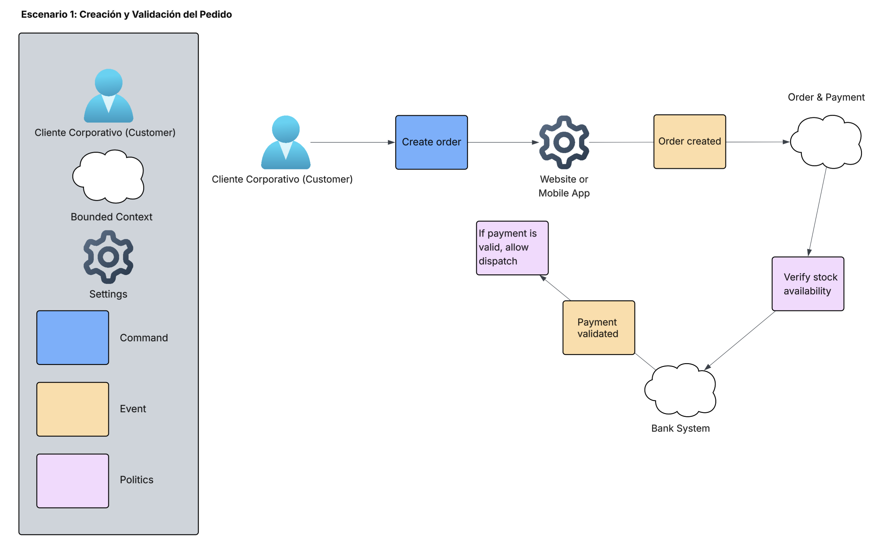

**Escenario 2: Despacho y Telemetría IoT.** Una vez que el pedido está validado, el contexto de *Logistics & IoT Telemetry* inicia el proceso con el comando `Start dispatch`. Al emitirse el evento de despacho, se activa la política de rastreo en vivo (`Activate live tracking`), la cual interactúa directamente con el hardware (*GPS IoT Device*). A medida que el dispositivo transmite su ubicación, la política de distancia evalúa las coordenadas. Al cumplirse la condición, se dispara el evento `Geofence entered`, el cual es consumido por el contexto de *Fulfillment* para ejecutar finalmente el comando físico de `Unlock valve` en el hardware de la cisterna, asegurando una descarga controlada y sin mermas.

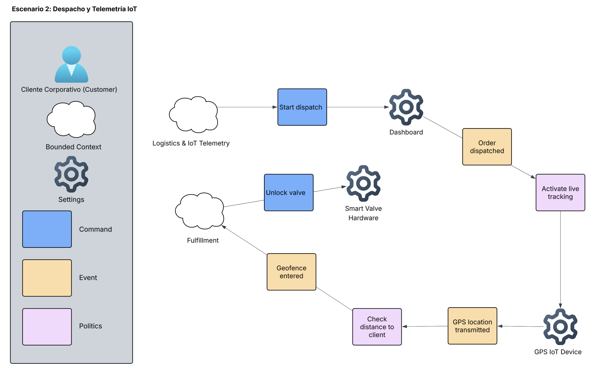

### 4.1.1.3 Bounded Context Canvases

Se crearon lienzos de Bounded Context (Canvases) para cada uno de los contextos identificados en el proceso de EventStorming. La elaboración de estos lienzos siguió un proceso iterativo que incluye la definición general del contexto, destilación de reglas de negocio, captura del lenguaje ubicuo y el análisis de capacidades y dependencias. 

Estos lienzos ayudan a definir los límites de cada contexto, sus responsabilidades y las interacciones formales con otros contextos en el ecosistema de FuelTrack.

 

<table border="1" style="width:100%; border-collapse: collapse; text-align: left;">
  <tr>
    <td style="width:50%; padding: 10px;"><b>Name:</b> Order & Payment</td>
    <td style="width:50%; padding: 10px;"><b>Model Traits:</b> Draft, execute, audit, gateway</td>
  </tr>
  <tr>
    <td style="padding: 10px;">
      <b>Description:</b> 
      <small>Summary of purposes and responsibilities</small> 
      Este contexto se encarga de la captura inicial de la solicitud comercial del cliente, la verificación de inventario disponible y la interacción con la pasarela bancaria para validar fondos.
    </td>
    <td style="padding: 10px;" rowspan="3">
      <b>Messages Consumed and Produced:</b>  
      <i>Messages Consumed:</i> 
      - <b>Command:</b> Create order 
      - <b>Command:</b> Validate payment  
      <i>Messages Produced:</i> 
      - <b>Event:</b> Order created 
      - <b>Event:</b> Payment validated
    </td>
  </tr>
  <tr>
    <td style="padding: 10px;">
      <b>Strategic Classification:</b> 
      <small>Domain: Core | Business Model: Compliance | Evolution: Custom built</small>
    </td>
  </tr>
  <tr>
    <td style="padding: 10px;">
      <b>Business Decisions:</b> 
      <small>Key business rules, policies, and decisions</small> 
      - <b>Policy:</b> Verify stock availability. 
      - <b>Policy:</b> If payment is valid, allow dispatch.
    </td>
  </tr>
  <tr>
    <td style="padding: 10px;">
      <b>Ubiquitous Language:</b> 
      <small>Key domain terminology</small> 
      <code>Order</code>, <code>Payment</code>, <code>Stock</code>, <code>Bank System</code>
    </td>
    <td style="padding: 10px;">
      <b>Dependencies and Relationships:</b> 
      - <b>Message Suppliers:</b> Bank System (Provides payment confirmation) 
      - <b>Message Consumers:</b> Logistics & IoT Telemetry (Consumes validation to start dispatch)
    </td>
  </tr>
</table>

 

<table border="1" style="width:100%; border-collapse: collapse; text-align: left;">
  <tr>
    <td style="width:50%; padding: 10px;"><b>Name:</b> Logistics & IoT Telemetry</td>
    <td style="width:50%; padding: 10px;"><b>Model Traits:</b> Execute, monitor, track</td>
  </tr>
  <tr>
    <td style="padding: 10px;">
      <b>Description:</b> 
      <small>Summary of purposes and responsibilities</small> 
      Es el núcleo operativo. Gestiona la asignación de la flota y procesa en tiempo real la telemetría (ubicación GPS) enviada por los sensores IoT para evaluar geocercas y prevenir mermas en ruta.
    </td>
    <td style="padding: 10px;" rowspan="3">
      <b>Messages Consumed and Produced:</b>  
      <i>Messages Consumed:</i> 
      - <b>Command:</b> Start dispatch 
      - <b>Event:</b> Payment validated 
      - <b>Event:</b> GPS location transmitted  
      <i>Messages Produced:</i> 
      - <b>Event:</b> Vehicle assigned 
      - <b>Event:</b> Order dispatched 
      - <b>Event:</b> Geofence entered
    </td>
  </tr>
  <tr>
    <td style="padding: 10px;">
      <b>Strategic Classification:</b> 
      <small>Domain: Core | Business Model: Core differentiator | Evolution: Custom built</small>
    </td>
  </tr>
  <tr>
    <td style="padding: 10px;">
      <b>Business Decisions:</b> 
      <small>Key business rules, policies, and decisions</small> 
      - <b>Policy:</b> Activate live tracking upon dispatch. 
      - <b>Policy:</b> Check distance to client constantly.
    </td>
  </tr>
  <tr>
    <td style="padding: 10px;">
      <b>Ubiquitous Language:</b> 
      <small>Key domain terminology</small> 
      <code>Vehicle</code>, <code>Dispatch</code>, <code>Telemetry</code>, <code>Live Tracking</code>, <code>Geofence</code>
    </td>
    <td style="padding: 10px;">
      <b>Dependencies and Relationships:</b> 
      - <b>Message Suppliers:</b> Order & Payment, GPS IoT Device, Geofencing System 
      - <b>Message Consumers:</b> Fulfillment (Depends on Geofence entered event)
    </td>
  </tr>
</table>

 

<table border="1" style="width:100%; border-collapse: collapse; text-align: left;">
  <tr>
    <td style="width:50%; padding: 10px;"><b>Name:</b> Fulfillment</td>
    <td style="width:50%; padding: 10px;"><b>Model Traits:</b> Execute, physical interaction</td>
  </tr>
  <tr>
    <td style="padding: 10px;">
      <b>Description:</b> 
      <small>Summary of purposes and responsibilities</small> 
      Ejecuta de forma segura la entrega física en campo. Interpreta la llegada a la geocerca para interactuar directamente con el hardware de la cisterna, evitando descargas no autorizadas.
    </td>
    <td style="padding: 10px;" rowspan="3">
      <b>Messages Consumed and Produced:</b>  
      <i>Messages Consumed:</i> 
      - <b>Event:</b> Geofence entered 
      - <b>Event:</b> Discharge flow registered  
      <i>Messages Produced:</i> 
      - <b>Command:</b> Unlock valve 
      - <b>Event:</b> Order delivered
    </td>
  </tr>
  <tr>
    <td style="padding: 10px;">
      <b>Strategic Classification:</b> 
      <small>Domain: Core | Business Model: Core differentiator | Evolution: Custom built</small>
    </td>
  </tr>
  <tr>
    <td style="padding: 10px;">
      <b>Business Decisions:</b> 
      <small>Key business rules, policies, and decisions</small> 
      - <b>Policy:</b> Unlock valve ONLY if inside geofence. 
      - <b>Policy:</b> Mark order completed when flow stops.
    </td>
  </tr>
  <tr>
    <td style="padding: 10px;">
      <b>Ubiquitous Language:</b> 
      <small>Key domain terminology</small> 
      <code>Smart Valve</code>, <code>Flowmeter</code>, <code>Discharge Flow</code>, <code>Fulfillment</code>
    </td>
    <td style="padding: 10px;">
      <b>Dependencies and Relationships:</b> 
      - <b>Message Suppliers:</b> Logistics & IoT Telemetry, IoT Flowmeter 
      - <b>Message Consumers:</b> Smart Valve Hardware, Reporting
    </td>
  </tr>
</table>

 

<table border="1" style="width:100%; border-collapse: collapse; text-align: left;">
  <tr>
    <td style="width:50%; padding: 10px;"><b>Name:</b> Reporting</td>
    <td style="width:50%; padding: 10px;"><b>Model Traits:</b> Audit, summary, notification</td>
  </tr>
  <tr>
    <td style="padding: 10px;">
      <b>Description:</b> 
      <small>Summary of purposes and responsibilities</small> 
      Contexto de soporte encargado de recopilar la data transaccional y telemétrica final para generar los resúmenes de consumo, métricas de negocio y notificar a los clientes.
    </td>
    <td style="padding: 10px;" rowspan="3">
      <b>Messages Consumed and Produced:</b>  
      <i>Messages Consumed:</i> 
      - <b>Event:</b> Order delivered  
      <i>Messages Produced:</i> 
      - <b>Event:</b> Consumption report generated 
      - <b>Event:</b> Notification sent
    </td>
  </tr>
  <tr>
    <td style="padding: 10px;">
      <b>Strategic Classification:</b> 
      <small>Domain: Supporting | Business Model: Engagement | Evolution: Commodity</small>
    </td>
  </tr>
  <tr>
    <td style="padding: 10px;">
      <b>Business Decisions:</b> 
      <small>Key business rules, policies, and decisions</small> 
      - <b>Policy:</b> Generate final metrics based on delivered orders.
    </td>
  </tr>
  <tr>
    <td style="padding: 10px;">
      <b>Ubiquitous Language:</b> 
      <small>Key domain terminology</small> 
      <code>Consumption Report</code>, <code>Metrics</code>, <code>Notification</code>, <code>Dashboard</code>
    </td>
    <td style="padding: 10px;">
      <b>Dependencies and Relationships:</b> 
      - <b>Message Suppliers:</b> Fulfillment (Provides delivery confirmation) 
      - <b>Message Consumers:</b> Client / External Notification Services
    </td>
  </tr>
</table>

### 4.1.2. Context Mapping
### 4.1.3. Software Architecture
#### 4.1.3.1. Software Architecture System Landscape Diagram

#### 4.1.3.2. Software Architecture Context Level Diagrams
En esta sección se presenta el diagrama de contexto de la arquitectura de software, el cual ilustra a FuelTrack en el centro de las operaciones, interactuando de manera directa con sus usuarios objetivo y los sistemas físicos (hardware) de los que depende para su funcionamiento. Este primer nivel del modelo C4 nos permite tener una visión de alto nivel del alcance del ecosistema.

#### 4.1.3.3. Software Architecture Container Level Diagrams
En esta sección se presenta el diagrama de contenedores de la solución propuesta. Este diagrama detalla los contenedores de software y sus interrelaciones, proporcionando una visión general de la estructura interna del sistema.

#### 4.1.3.4. Software Architecture Deployment Diagrams

El diagrama de despliegue muestra cómo se distribuyen los distintos componentes de software en su entorno de ejecución. El sistema está compuesto por una aplicación web (Vue.js) y una aplicación móvil (Flutter), las cuales se ejecutan en los navegadores y dispositivos de los usuarios. Estas aplicaciones se comunican mediante JSON/HTTPS con un API Gateway en la nube, el cual enruta las peticiones hacia un clúster de microservicios (IAM, Órdenes, Vouchers e IoT Monitoring) desarrollados en Python/FastAPI. Paralelamente, en el entorno físico de las cisternas, opera una Edge Application (C++) embebida que captura los datos de los sensores y los transmite vía MQTT hacia el backend. Todos los servicios internos realizan operaciones de lectura y escritura sobre un servidor de base de datos PostgreSQL centralizado. Además, la arquitectura se integra con sistemas en la nube externos como Google Maps para validación de rutas y geocercas, y Mercado Pago para procesar las transacciones B2B.

## 4.2. Tactical-Level Domain-Driven Design
El Tactical-Level Domain-Driven Design permite profundizar en el diseño detallado de cada bounded context identificado durante el Strategic-Level Design, definiendo la estructura interna de cada contexto delimitado mediante sus respectivas capas arquitectónicas, entidades de dominio, servicios y patrones de implementación específicos para FuelTrack.

Esta fase táctica se enfoca en la implementación concreta de los bounded contexts, aplicando patrones DDD como Domain Layer, encargada de la lógica de negocio pura; Interface Layer, responsable de controladores y DTOs; Application Layer, orientada a la orquestación de casos de uso; e Infrastructure Layer, encargada de la persistencia, mensajería e integración con servicios externos. Cada contexto mantiene su autonomía e integridad, comunicándose con otros mediante interfaces bien definidas que preservan los límites del dominio.

### 4.2.1. Bounded Context: Order & Payment Context

#### 4.2.1.1. Domain Layer

La Domain Layer del bounded context **Order & Payment** contiene la lógica de negocio relacionada con la creación de pedidos de combustible, validación del presupuesto disponible, aprobación de órdenes y asignación de rutas de despacho dentro del sistema FuelTrack.

**Aggregate Root:**

- **FuelOrder:** Representa el pedido de combustible y actúa como raíz del agregado. Controla el ciclo de vida de la orden desde su creación hasta su aprobación, tránsito, entrega o rechazo.

**Entities:**

- **DispatchRoute:** Representa la ruta asignada para el despacho del pedido. Incluye información como el identificador de ruta, placa del camión y hora estimada de llegada.

**Value Objects:**

- **FuelVolume:** Representa el volumen solicitado de combustible, compuesto por una cantidad y una unidad de medida.
- **Money:** Representa el costo total del pedido, compuesto por monto y moneda.
- **OrderStatus:** Define los estados posibles de una orden: PENDING, APPROVED, IN_TRANSIT, DELIVERED y REJECTED.

**Domain Services:**

- **OrderValidationService:** Verifica que la orden cumpla con las condiciones necesarias para ser creada.
- **BudgetValidationService:** Valida que el presupuesto disponible del cliente sea suficiente para aprobar la orden.
- **RouteAssignmentService:** Gestiona la asignación de una ruta de despacho a una orden aprobada.

#### 4.2.1.2. Interface Layer

La Interface Layer expone las funcionalidades del contexto mediante controladores REST, permitiendo que los clientes corporativos creen pedidos, consulten su estado y visualicen la ruta asignada.

**Controllers:**

- **OrderController:** Gestiona la creación, consulta, aprobación y actualización del estado de las órdenes.
- **DispatchRouteController:** Permite consultar o asignar rutas de despacho asociadas a una orden.

**DTOs:**

- **CreateOrderRequest / CreateOrderResponse**
- **ApproveOrderRequest / ApproveOrderResponse**
- **AssignRouteRequest / AssignRouteResponse**
- **OrderStatusResponse**

#### 4.2.1.3. Application Layer

La Application Layer orquesta los casos de uso relacionados con la gestión de pedidos y asignación logística, coordinando la interacción entre controladores, agregados de dominio y repositorios.

**Command Handlers:**

- **CreateOrderCommandHandler:** Procesa la creación de una nueva orden de combustible.
- **ValidateBurnRateCommandHandler:** Valida el presupuesto disponible antes de aprobar la orden.
- **ApproveOrderCommandHandler:** Cambia el estado de la orden a aprobada cuando cumple las reglas de negocio.
- **AssignRouteCommandHandler:** Asigna una ruta de despacho a una orden aprobada.

**Application Services:**

- **OrderApplicationService:** Coordina el ciclo de vida de la orden de combustible.
- **DispatchApplicationService:** Coordina la asignación y actualización de rutas de despacho.

#### 4.2.1.4. Infrastructure Layer

La Infrastructure Layer implementa la persistencia de datos y la comunicación con componentes técnicos necesarios para almacenar órdenes y rutas.

**Repositories:**

- **OrderRepository:** Gestiona la persistencia de las órdenes en la tabla `FUEL_ORDERS`.
- **DispatchRouteRepository:** Gestiona la persistencia de las rutas en la tabla `DISPATCH_ROUTES`.

**Database Tables:**

- **FUEL_ORDERS:** Almacena la información principal de cada pedido, incluyendo cliente, volumen, costo, moneda, estado y fecha de creación.
- **DISPATCH_ROUTES:** Almacena las rutas asignadas a los pedidos, incluyendo placa del camión, hora estimada de llegada y fecha de despacho.

**External Services:**

- **CustomerBudgetService:** Permite validar el presupuesto disponible del cliente.
- **RoutingService:** Apoya la asignación de rutas para el despacho del combustible.

#### 4.2.1.5. Bounded Context Software Architecture Component Level Diagrams.

En esta sección, se aplica el Nivel 3 del Modelo C4 para visualizar la estructura interna del contenedor **Order API Application** perteneciente al *Order & Dispatch Context*. 

El diseño de los componentes sigue los principios de la **Arquitectura Limpia (Clean Architecture)**. Como se observa en el diagrama, el flujo de dependencias es estrictamente unidireccional. Las solicitudes HTTP ingresan a través de la capa de interfaz (`Order Controller`), son orquestadas por el servicio de aplicación (`Order Application Service`), y este finalmente delega la ejecución de las reglas corporativas al núcleo del sistema (`FuelOrder Aggregate`) y la persistencia de datos al repositorio (`Order Repository`). Esta separación garantiza que la lógica del negocio B2B sea completamente independiente del framework web y de la base de datos PostgreSQL.

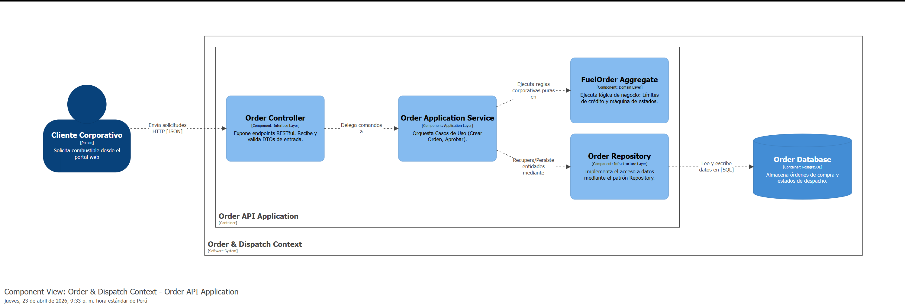

#### 4.2.1.6. Bounded Context Software Architecture Code Level Diagrams.

En este nivel de abstracción (Nivel 4 del Modelo C4), nos adentramos en el diseño táctico del **Order & Dispatch Context**. Para garantizar un modelo de software robusto y evitar el antipatrón de "modelo anémico", aplicamos los principios de Domain-Driven Design (DDD).

##### 4.2.1.6.1. Bounded Context Domain Layer Class Diagrams.

A continuación, se presenta el modelo de dominio interno. El *Aggregate Root* principal es `FuelOrder`, el cual actúa como límite transaccional para la creación y aprobación de pedidos B2B. Para asegurar la integridad de los datos financieros y de medición, se implementan *Value Objects* inmutables como `FuelVolume` y `Money`. Finalmente, la entidad `DispatchRoute` gestiona la asignación logística del camión.

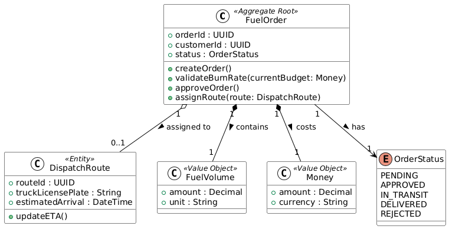

##### 4.2.1.6.2. Bounded Context Database Design Diagram.

Bajo el principio arquitectónico de *Database-per-Service*, este contexto administra su propia persistencia. El modelo físico en PostgreSQL refleja las entidades del dominio, optimizado para consultas transaccionales de pedidos de hidrocarburos.

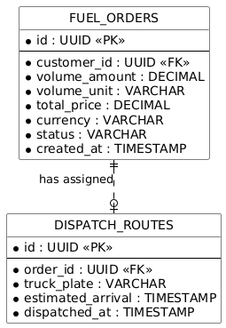

### 4.2.2. Bounded Context: IoT & Telemetry Context

#### 4.2.2.1. Domain Layer

La Domain Layer del contexto **IoT & Telemetry** gestiona la lógica relacionada con el monitoreo en tiempo real de las unidades de transporte mediante sensores IoT, permitiendo el registro de mediciones, análisis de anomalías y generación de alertas.

**Aggregate Root:**

- **TruckTelemetry:** Actúa como raíz del agregado y es responsable de registrar lecturas de sensores y analizar posibles anomalías en el comportamiento del vehículo.

**Entities:**

- **SensorReading:** Representa cada lectura capturada por los sensores del vehículo, incluyendo información temporal y estado de procesamiento.
- **TelemetryAlert:** Representa una incidencia detectada (por ejemplo, caída de presión o posible robo de combustible), almacenando su tipo, severidad y estado.

**Value Objects:**

- **GeoLocation:** Representa la ubicación geográfica del vehículo mediante latitud y longitud.
- **FuelVolume:** Representa el volumen de combustible y presión del tanque.
- **EngineStatus:** Representa el estado del motor, incluyendo si está encendido y el nivel de batería.

**Domain Services:**

- **AnomalyDetectionService:** Detecta eventos anómalos como caídas abruptas de combustible o comportamientos fuera de lo esperado.
- **GeofenceService:** Verifica si el vehículo se encuentra dentro de zonas permitidas.
- **TelemetryProcessingService:** Procesa las lecturas de sensores y coordina su análisis dentro del dominio.

#### 4.2.2.2. Interface Layer

La Interface Layer permite la recepción de datos provenientes de dispositivos IoT y la consulta de información de monitoreo por parte de los usuarios.

**Components:**

- **IoTEventConsumer:** Recibe y decodifica datos enviados desde sensores mediante el protocolo MQTT.
- **TelemetryController:** Expone endpoints para consultar el estado del vehículo, historial de lecturas y alertas generadas.

**DTOs:**

- **TelemetryDataDTO**
- **TelemetryResponseDTO**
- **AlertResponseDTO**

#### 4.2.2.3. Application Layer

La Application Layer orquesta el flujo de procesamiento de datos IoT, desde la recepción de lecturas hasta la generación de alertas.

**Application Services:**

- **TelemetryApplicationService:** Procesa eventos IoT, registra lecturas y coordina el análisis de datos.
- **AlertManagementService:** Gestiona la creación, almacenamiento y resolución de alertas.

#### 4.2.2.4. Infrastructure Layer

La Infrastructure Layer gestiona la comunicación con dispositivos físicos, mensajería y persistencia de datos optimizada para series de tiempo.

**Repositories:**

- **TelemetryRepository:** Gestiona la persistencia de lecturas en la tabla `SENSOR_READINGS`.
- **AlertRepository:** Gestiona la persistencia de alertas en la tabla `TELEMETRY_ALERTS`.
- **TrackingRepository:** Gestiona el estado actual del vehículo en la tabla `TRUCK_TRACKING`.

**Database Design:**

El diseño de la base de datos para este microservicio está optimizado para **series de tiempo (Time-Series Data)**.

- **SENSOR_READINGS:** Tabla de tipo *write-heavy*, donde se almacenan de forma inmutable todas las lecturas de sensores (ubicación, combustible, presión, estado del motor).
- **TELEMETRY_ALERTS:** Tabla que registra las incidencias detectadas, incluyendo tipo de alerta, severidad y estado de resolución.
- **TRUCK_TRACKING:** Tabla que mantiene el estado actual del vehículo y su última actualización.

**External Services:**

- **MQTTBrokerService:** Gestiona la comunicación con dispositivos IoT.
- **GPSIntegrationService:** Proporciona soporte para procesamiento de coordenadas y geolocalización.

#### 4.2.2.5. Bounded Context Software Architecture Component Level Diagrams.

En esta sección, se aplica el Nivel 3 del Modelo C4 para visualizar la estructura interna del contenedor **Telemetry Service Application** perteneciente al *IoT & Telemetry Context*.

Al igual que en el resto del sistema, los componentes se organizan bajo los principios de la **Arquitectura Limpia (Clean Architecture)**. En este contexto altamente transaccional, el flujo de entrada principal es manejado por un consumidor de eventos (`IoT Event Consumer`) que escucha las tramas enviadas por los sensores de hardware. Estas tramas son procesadas por el servicio de aplicación (`Telemetry App Service`), el cual delega la detección de anomalías (como mermas de combustible o salidas de ruta) al modelo de dominio puro (`TruckTelemetry Aggregate`). Finalmente, el estado se persiste a través del repositorio (`Telemetry Repository`) en una base de datos optimizada. Este diseño aísla la compleja lógica matemática del dominio de la infraestructura externa de mensajería.

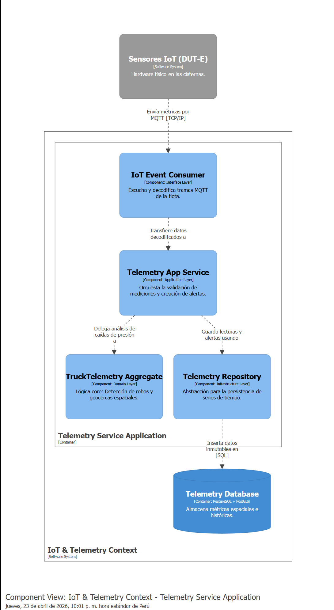

#### 4.2.2.6. Bounded Context Software Architecture Code Level Diagrams.

En este nivel (C4 Model - Nivel 4), detallamos el diseño táctico del **IoT & Telemetry Context**. Dado que este módulo procesa flujos masivos de datos en tiempo real (Event-Driven), el modelo de dominio está diseñado para ser altamente resiliente y reactivo.

##### 4.2.2.6.1. Bounded Context Domain Layer Class Diagrams.

El núcleo de este contexto es el *Aggregate Root* `TruckTelemetry`, responsable de consolidar y analizar el flujo de datos. Para garantizar la inmutabilidad de las mediciones físicas, se emplean *Value Objects* como `GeoLocation` (coordenadas GPS), `FuelVolume` (galones y presión) y `EngineStatus`. Una característica avanzada de este diseño es la emisión de *Domain Events* (ej. `FuelDropDetectedEvent`) cuando la lógica matemática detecta una anomalía severa, como una caída abrupta de presión que sugiere un robo de hidrocarburos.

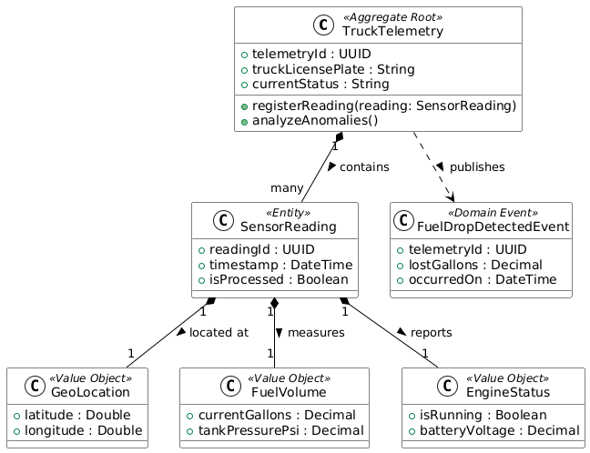

##### 4.2.2.6.2. Bounded Context Database Design Diagram.

El diseño de la base de datos exclusiva para este microservicio está optimizado para series de tiempo (Time-Series Data). La tabla `SENSOR_READINGS` es de solo inserción (Write-Heavy) para registrar el histórico inmutable, mientras que `TELEMETRY_ALERTS` almacena la auditoría de las incidencias detectadas.

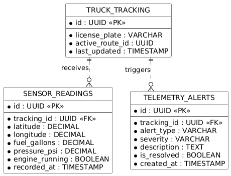

### 4.2.3. Bounded Context: Financial & Billing Context

#### 4.2.3.1. Domain Layer

La Domain Layer del contexto **Financial & Billing** gestiona la lógica financiera del sistema, incluyendo el control de saldo del cliente, validación de crédito, cálculo de consumo y generación de comprobantes de facturación.

**Aggregate Root:**

- **FinancialAccount:** Actúa como raíz del agregado y gestiona el saldo disponible del cliente, la exposición crediticia y la validación de capacidad de pago.

**Entities:**

- **BillingVoucher:** Representa el comprobante de facturación generado a partir de una orden, incluyendo el monto total y los impuestos asociados.

**Value Objects:**

- **Money:** Representa valores monetarios mediante monto y tipo de moneda.
- **BurnRate:** Representa la tasa de consumo del cliente, incluyendo consumo promedio diario y proyección de días restantes de combustible.
- **CreditLimit:** Representa el límite de crédito del cliente y su exposición actual.

**Domain Services:**

- **CreditValidationService:** Valida si el cliente cuenta con suficiente crédito disponible.
- **BillingCalculationService:** Calcula montos totales, impuestos y generación de vouchers.
- **FinancialMonitoringService:** Analiza el consumo del cliente y su comportamiento financiero.

#### 4.2.3.2. Interface Layer

La Interface Layer expone las funcionalidades financieras a través de endpoints REST, permitiendo la consulta de estados financieros, generación de comprobantes y monitoreo de consumo.

**Controllers:**

- **BillingController:** Expone endpoints para facturación, consulta de saldos y reportes financieros.

**DTOs:**

- **CreateInvoiceRequest / Response**
- **BillingSummaryResponse**
- **CreditValidationResponse**
- **TransactionHistoryResponse**

#### 4.2.3.3. Application Layer

La Application Layer orquesta los casos de uso financieros, coordinando la generación de comprobantes, validación de crédito y registro de transacciones.

**Application Services:**

- **BillingApplicationService:** Gestiona la generación de vouchers y cálculo de consumo.
- **FinancialAccountService:** Coordina operaciones sobre cuentas financieras.
- **TransactionManagementService:** Registra y consulta transacciones financieras.

4.2.3.4. Infrastructure Layer

La Infrastructure Layer gestiona la persistencia de datos financieros y la integración con sistemas externos.

**Repositories:**

- **BillingRepository:** Gestiona la persistencia de comprobantes en la tabla `INVOICES`.
- **AccountRepository:** Gestiona la información de cuentas en la tabla `BILLING_ACCOUNTS`.
- **TransactionRepository:** Gestiona el historial de transacciones en la tabla `TRANSACTION_LOGS`.

**Database Design**

El diseño de la base de datos sigue el principio de **Database-per-Service**, donde este contexto administra su propia persistencia financiera.

- **BILLING_ACCOUNTS:** Almacena el saldo actual, límite de crédito y última conciliación del cliente.
- **INVOICES:** Registra los comprobantes generados por cada orden, incluyendo montos totales, impuestos y estado.
- **TRANSACTION_LOGS:** Mantiene un historial inmutable de todas las transacciones financieras realizadas.

**External Services**

- **ERP Gateway:** Actúa como una capa anticorrupción (ACL) para integrarse con sistemas contables externos (ej. SAP).
- **PaymentIntegrationService:** Permite la validación de operaciones financieras externas.

#### 4.2.3.5. Bounded Context Software Architecture Component Level Diagrams.

En esta sección, se aplica el Nivel 3 del Modelo C4 para visualizar la estructura interna del contenedor **Billing API Application** perteneciente al *Financial & Billing Context*.

Este módulo crítico está diseñado bajo los principios de la **Arquitectura Limpia (Clean Architecture)**. Las peticiones relacionadas con la facturación y el monitoreo de presupuesto ingresan por la capa de interfaz (`Billing Controller`). La orquestación es manejada por el servicio de aplicación (`Billing App Service`), el cual delega el cálculo del *Burn Rate* y la validación de saldos al modelo de dominio (`Financial Aggregate`). 

Una característica clave de este contenedor es la inclusión de un adaptador (`ERP Gateway`) en la capa de infraestructura, el cual funciona como una Capa Anticorrupción (ACL) para comunicarse con los sistemas contables externos de los clientes (ej. SAP). Finalmente, los comprobantes inmutables se almacenan a través del repositorio (`Billing Repository`). Este diseño asegura que el núcleo financiero de FuelTrack no se acople a integraciones de terceros.

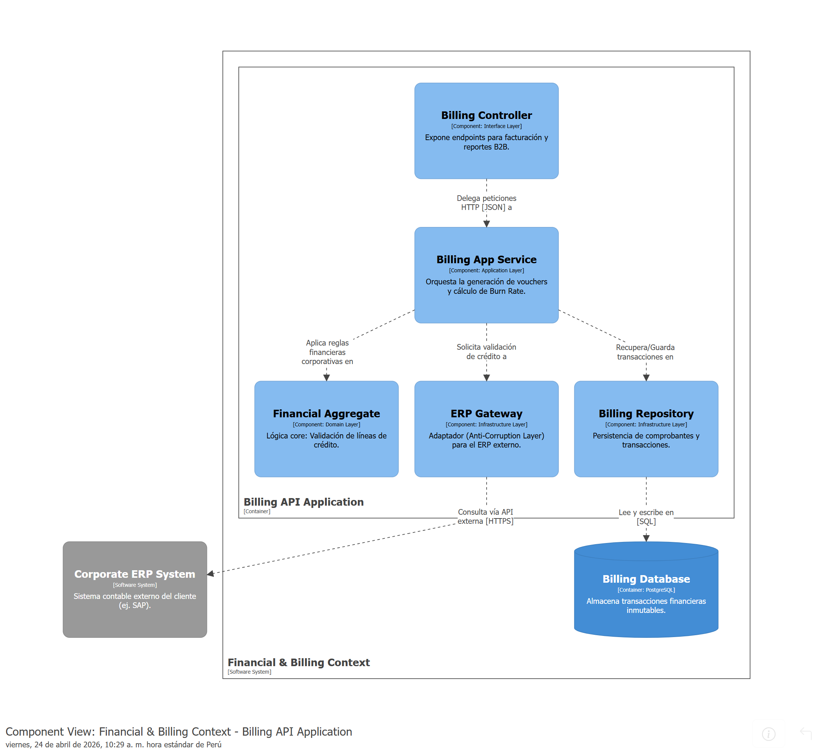

#### 4.2.3.5. Bounded Context Software Architecture Component Level Diagrams.

En esta sección, se aplica el Nivel 3 del Modelo C4 para visualizar la estructura interna del contenedor **Billing API Application** perteneciente al *Financial & Billing Context*.

Este módulo crítico está diseñado bajo los principios de la **Arquitectura Limpia (Clean Architecture)**. Las peticiones relacionadas con la facturación y el monitoreo de presupuesto ingresan por la capa de interfaz (`Billing Controller`). La orquestación es manejada por el servicio de aplicación (`Billing App Service`), el cual delega el cálculo del *Burn Rate* y la validación de saldos al modelo de dominio (`Financial Aggregate`). 

Una característica clave de este contenedor es la inclusión de un adaptador (`ERP Gateway`) en la capa de infraestructura, el cual funciona como una Capa Anticorrupción (ACL) para comunicarse con los sistemas contables externos de los clientes (ej. SAP). Finalmente, los comprobantes inmutables se almacenan a través del repositorio (`Billing Repository`). Este diseño asegura que el núcleo financiero de FuelTrack no se acople a integraciones de terceros.

#### 4.2.3.6. Bounded Context Software Architecture Code Level Diagrams.

En este nivel de diseño técnico (Nivel 4 del Modelo C4), se detalla la lógica de implementación del **Financial & Billing Context**. El diseño se centra en la precisión de los cálculos financieros y la integridad de los comprobantes de pago generados.

##### 4.2.3.6.1. Bounded Context Domain Layer Class Diagrams.

El diseño del dominio está centrado en el Aggregate Root `FinancialAccount`, el cual gestiona el saldo y la exposición crediticia del cliente. Se utilizan *Value Objects* para encapsular la lógica de cálculo del `BurnRate` (tasa de consumo) y el `CreditLimit`. La entidad `BillingVoucher` representa el documento legal de facturación generado tras un despacho exitoso. Este modelo asegura que no existan inconsistencias entre el combustible despachado y el monto facturado.

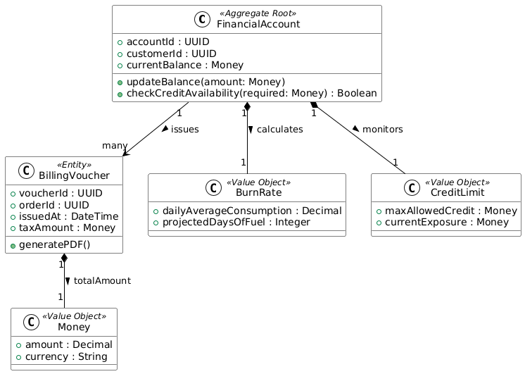

##### 4.2.3.6.2. Bounded Context Database Design Diagram.

El esquema de base de datos para este contexto está diseñado para mantener un historial de transacciones inmutable. La tabla `BILLING_ACCOUNTS` almacena los saldos actuales, mientras que `INVOICES` y `TRANSACTION_LOGS` registran cada movimiento financiero con marcas de tiempo precisas para fines de auditoría.

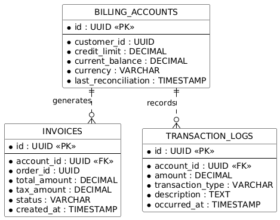

### 4.2.4. Bounded Context: Identity & Access Context

#### 4.2.4.1. Domain Layer

La Domain Layer del contexto **Identity & Access** gestiona la lógica relacionada con la autenticación, autorización y control de acceso de los usuarios dentro del sistema FuelTrack.

**Aggregate Root:**

- **UserAccount:** Actúa como raíz del agregado y es responsable de la autenticación del usuario, asignación de roles y validación de permisos.

**Entities:**

- **Role:** Representa los roles asignados a los usuarios del sistema, incluyendo su nombre y descripción.

**Value Objects:**

- **EmailAddress:** Representa el correo electrónico del usuario, incluyendo validación de formato y verificación.
- **PasswordHash:** Representa la contraseña encriptada del usuario, incluyendo el hash y el salt, así como la lógica de verificación.
  
**Domain Services:**

- **AuthenticationService:** Gestiona la validación de credenciales de acceso.
- **AuthorizationService:** Verifica permisos y roles del usuario (RBAC).
- **PasswordPolicyService:** Define reglas de seguridad para contraseñas. 

#### 4.2.4.2. Interface Layer

La Interface Layer permite la interacción de los usuarios con el sistema mediante endpoints REST para autenticación y validación de acceso.

**Controllers:**

- **AuthController:** Expone endpoints para login, validación de tokens y control de acceso.

**DTOs:**

- **LoginRequest / LoginResponse**
- **TokenValidationRequest / Response**
- **UserAuthResponse**

#### 4.2.4.3. Application Layer

La Application Layer orquesta los procesos de autenticación, emisión de tokens y validación de permisos.

**Application Services:**

- **IdentityApplicationService:** Coordina el proceso de autenticación y generación de tokens JWT.
- **AccessControlService:** Gestiona la validación de roles y permisos.

#### 4.2.4.4. Infrastructure Layer

La Infrastructure Layer gestiona la persistencia de usuarios, roles y credenciales, así como la generación de tokens de acceso.

**Repositories:**

- **AuthRepository:** Gestiona la persistencia de usuarios, roles y credenciales en la base de datos.

**Database Design**

El diseño de la base de datos sigue el principio de **Database-per-Service**, donde este contexto administra su propia persistencia de identidad y acceso.

- **AUTH_DATABASE:** Almacena información de usuarios, roles y credenciales encriptadas.
- Los datos incluyen identificadores de usuario, roles asignados y hashes de contraseñas con sus respectivos mecanismos de seguridad.

**External Services**

- **TokenService:** Generación y validación de tokens JWT.
- **EncryptionService:** Manejo de hashing y verificación de contraseñas.

#### 4.2.4.5. Bounded Context Software Architecture Component Level Diagrams.

En esta sección, se aplica el Nivel 3 del Modelo C4 para visualizar la estructura interna del contenedor **Auth API Application** perteneciente al *Identity & Access Context*.

Este módulo fundamental sigue los lineamientos de la **Arquitectura Limpia (Clean Architecture)** para centralizar la seguridad de FuelTrack. Las solicitudes de autenticación y validación de tokens ingresan mediante la capa de interfaz (`Auth Controller`). El servicio de aplicación (`Identity App Service`) orquesta la emisión de tokens JWT y delega la validación de contraseñas y permisos granulares (RBAC) al modelo de dominio (`User & Role Aggregate`). Finalmente, las credenciales encriptadas se gestionan a través del repositorio (`Auth Repository`). Esta separación garantiza que la lógica de seguridad y el control de accesos sean invulnerables y agnósticos al resto de los microservicios.

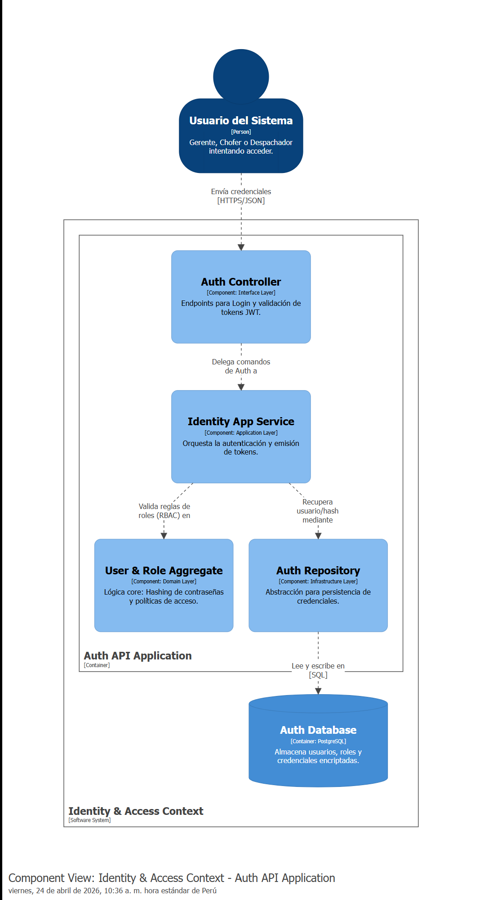

#### 4.2.4.6. Bounded Context Software Architecture Code Level Diagrams.

En este último apartado de diseño táctico (Nivel 4 del Modelo C4), nos enfocamos en el **Identity & Access Context**. El diseño de este módulo está estrictamente aislado del resto de Bounded Contexts para garantizar que la seguridad, autenticación y autorización sean transversales e inviolables.

##### 4.2.4.6.1. Bounded Context Domain Layer Class Diagrams.

El modelo de dominio pivota sobre el *Aggregate Root* `UserAccount`. Para aplicar una seguridad robusta desde el diseño, la contraseña jamás se maneja como un texto plano, sino que se encapsula en un *Value Object* inmutable llamado `PasswordHash` que contiene la lógica de verificación criptográfica. Asimismo, se implementa la entidad `Role` para gestionar el Control de Acceso Basado en Roles (RBAC), permitiendo diferenciar los permisos de gerentes corporativos, despachadores y choferes de cisternas.

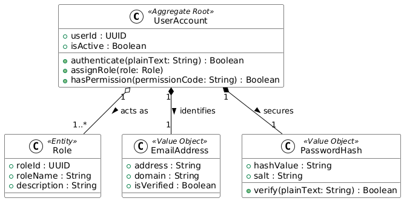

##### 4.2.4.6.2. Bounded Context Database Design Diagram.

El esquema físico en PostgreSQL para el contexto de identidad está altamente normalizado para soportar la asignación dinámica de roles y permisos. Se emplean tablas intermedias (`USER_ROLES` y `ROLE_PERMISSIONS`) para resolver las relaciones de muchos a muchos inherentes a una arquitectura RBAC completa.

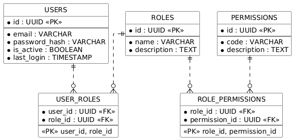
